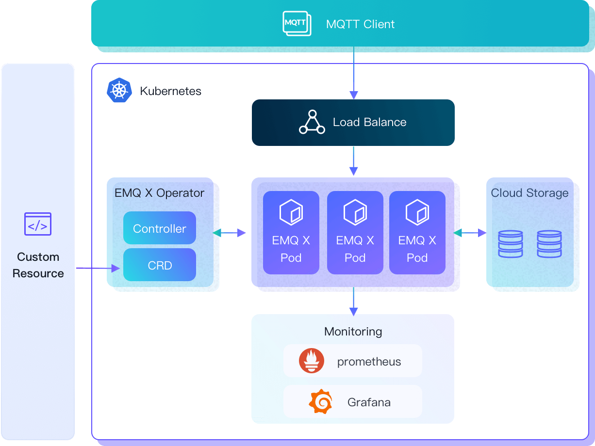

****# EMQX Operator

[](https://github.com/emqx/emqx-operator/releases)
[](https://hub.docker.com/r/emqx/emqx-operator-controller)
[](https://codecov.io/gh/emqx/emqx-operator)

A Kubernetes Operator for [EMQX](https://www.emqx.io)

## Overview

The EMQX Operator provides [Kubernetes](https://kubernetes.io/) native deployment and management of [EMQX](https://www.emqx.io/), including EMQX Broker and EMQX Enterprise. The purpose of this project is to simplify and automate the configuration of the EMQX cluster.

The EMQX Operator includes, but is not limited to, the following features:


* **Simplified Deployment EMQX**: Declare EMQX clusters with EMQX custom resources and deploy them quickly. For more details, please check [Quick Start](./docs/en_US/getting-started/getting-started.md).

* **Manage EMQX Cluster**: Automate operations and maintenance for EMQX, including cluster upgrades, runtime data persistence, updating Kubernetes resources based on the status of EMQX, etc. For more details, please check [Manage EMQX](./docs/en_US/tasks/overview.md).



## EMQX and EMQX Operator compatibility

### EMQX Enterprise

|  EMQX Enterprise Version   |              EMQX Operator Version              |                          APIVersion                          |      Kind      |
| :------------------------: | :---------------------------------------------: | :----------------------------------------------------------: | :------------: |
|  4.3.x (included) ～ 4.4   |               1.2.1, 1.2.2, 1.2.3               | [apps.emqx.io/v1beta3](./docs/en_US/reference/v1beta3-reference.md) | EmqxEnterprise |
| 4.4.6 (included) ～ 4.4.8  |                      1.2.5                      | [apps.emqx.io/v1beta3](./docs/en_US/reference/v1beta3-reference.md) | EmqxEnterprise |
| 4.4.8 (included) ～ 4.4.14 | 1.2.6, 1.2.7, 1.2.8, 2.0.0, 2.0.1, 2.0.2, 2.0.3 | [apps.emqx.io/v1beta3](./docs/en_US/reference/v1beta3-reference.md) | EmqxEnterprise |
| 4.4.14 (included) or higher 4.4.x   |                  2.1.0, 2.1.1                   | [apps.emqx.io/v1beta4](./docs/en_US/reference/v1beta4-reference.md) | EmqxEnterprise |
|      5.0.0 (included) ~ 5.0.23        |    2.0.0, 2.0.1, 2.0.2, 2.0.3, 2.1.0, 2.1.1     | [apps.emqx.io/v2alpha1](./docs/en_US/reference/v2alpha1-reference.md) |      EMQX      |
|      5.1.1 or higher       |    2.2.0                                        | [apps.emqx.io/v2alpha2](./docs/en_US/reference/v2alpha2-reference.md) |      EMQX      |

### EMQX Open Source

|      EMQX Open Source Version      |     EMQX Operator Version                            |     APIVersion    |    Kind    |
|:----------------------:|:-----------------:|-------------------|:-----------------:|
| 4.3.x (included) ～ 4.4 | 1.2.1, 1.2.2, 1.2.3                                 |  [apps.emqx.io/v1beta3](./docs/en_US/reference/v1beta3-reference.md)          |  EmqxBroker  |
| 4.4.6 (included) ～ 4.4.8 | 1.2.5                                                 | [apps.emqx.io/v1beta3](./docs/en_US/reference/v1beta3-reference.md)          | EmqxBroker |
| 4.4.8 (included) ～ 4.4.14 | 1.2.6, 1.2.7, 1.2.8, 2.0.0, 2.0.1, 2.0.2, 2.0.3   |  [apps.emqx.io/v1beta3](./docs/en_US/reference/v1beta3-reference.md)          | EmqxBroker |
| 4.4.14 or higher 4.4.x | 2.1.0, 2.1.1                                                 |  [apps.emqx.io/v1beta4](./docs/en_US/reference/v1beta4-reference.md)          | EmqxBroker |
| 5.0.6 (included) ～ 5.0.8 | 2.0.0, 2.0.1, 2.0.3                                |  [apps.emqx.io/v2alpha1](./docs/en_US/reference/v2alpha1-reference.md)         |  EMQX     |
| 5.0.8 (included) ～  5.0.14 | 2.0.2                                            |  [apps.emqx.io/v2alpha1](./docs/en_US/reference/v2alpha1-reference.md)         |  EMQX     |
| 5.0.14 (included)  ~ 5.0.23 | 2.1.0, 2.1.1                                                | [apps.emqx.io/v2alpha1](./docs/en_US/reference/v2alpha1-reference.md)         | EMQX     |
|      5.1.1 or higher       |    2.2.0                                        | [apps.emqx.io/v2alpha2](./docs/en_US/reference/v2alpha2-reference.md) |      EMQX      |

## How to selector Kubernetes version

The EMQX Operator requires a Kubernetes cluster of version `>=1.24`.

| Kubernetes Versions     | EMQX Operator Compatibility                                  | Notes                                                        |
| ----------------------- | ------------------------------------------------------------ | ------------------------------------------------------------ |
| 1.24 or higher          | All functions supported                                      |                                                              |
| 1.22 (included) ～ 1.23 | Supported, except [MixedProtocolLBService](https://kubernetes.io/docs/reference/command-line-tools-reference/feature-gates/) | EMQX cluster can only use one protocol in `LoadBalancer` type of Service, for example TCP or UDP. |
| 1.21 (included) ～ 1.22 | Supported, except  [pod-deletion-cost](https://kubernetes.io/docs/concepts/workloads/controllers/replicaset/#pod-deletion-cost) | When using EMQX Core + Replicant mode cluster, updating the EMQX cluster cannot accurately delete Pods. |
| 1.20 (included) ～ 1.21 | Supported, manual `.spec.ports[].nodePort` assignment required if using `NodePort` type of Service | For more details, please refer to [Kubernetes changelog](https://github.com/kubernetes/kubernetes/blob/master/CHANGELOG/CHANGELOG-1.20.md#bug-or-regression-4). |
| 1.16 (included) ～ 1.20 | Supported, not recommended due to lack of testing            |                                                              |
| Lower than 1.16         | Not supported                                                | `apiextensions/v1` APIVersion is not supported.              |

## CustomResourceDefinitions

A core feature of the EMQX Operator is to monitor the Kubernetes API server for changes to specific objects and ensure that the running EMQX deployments match these objects.
The Operator acts on the following [custom resource definitions (CRDs)](https://kubernetes.io/docs/tasks/access-kubernetes-api/extend-api-custom-resource-definitions/).

For more details on EMQX, please check the [reference document](https://github.com/emqx/emqx-operator/blob/main/docs/en_US/reference/v2alpha1-reference.md).

The EMQX Operator automatically detects changes on any of the above custom resource objects and ensures that running deployments are kept in sync with the changes.

## Getting Start

For more information on getting started, see the [getting started](docs/en_US/getting-started/getting-started.md).

## Public Cloud Platform Deployment Guide

|  Public Cloud Platform   | Deployment Guide                                         |
|--------------------------|----------------------------------------------------------|
|    AWS                   | [Deploy EMQX On Amazon Elastic Kubernetes Service](docs/en_US/deployment/on-aws-eks.md)       |
|    Azure                 | [Deploy EMQX on Azure Kubernetes Service](docs/en_US/deployment/on-azure-aks.md)       |
|    Google Cloud          | [Deploy EMQX on Google Cloud GKE](docs/en_US/deployment/on-gcp-gke.md)       |
|    Alibaba Cloud         | [Deploy EMQX on Alibaba Cloud ACK](docs/zh_CN/deployment/on-alibaba-cloud.md)    |
|    Huawei Cloud          | [Deploy EMQX on Huawei Cloud CCE](docs/zh_CN/deployment/on-huawei-cloud.md)           |
|    Tencent Cloud         | [Deploy EMQX on Tencent Cloud TKE](docs/zh_CN/deployment/on-tencent-cloud.md)   |


## Development

### Prerequisites

- Golang environment
- docker (used for creating container images, etc.)
- Kubernetes cluster
- teleperence

### Install Teleperence for once
```shell
make telepresence
```

### Connect to cluster
```shell
./bin/telepresence connect
```

## Contributing
Many files (API, config, controller, hack,...) in this repository are auto-generated.
Before proposing a pull request:

1. Commit your changes.
2. `make` and `make manifests`
3. Commit the generated changes.

## Troubleshooting
Check the [troubleshooting documentation](docs/en_US/faq/faq.md) for common issues and frequently asked questions (FAQ).
