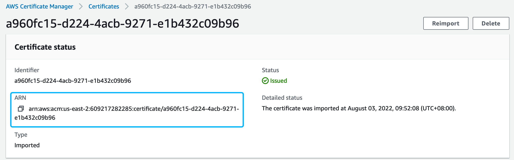

# This article mainly introduces how to deploy EMQX cluster on AWS EKS with EMQX Operator. The main contents including:


## Terminology explanation

EMQX: The most scalable open-source MQTT broker for IoT, For details: [EMQX docs](https://github.com/emqx/emqx) 

EMQX Operator: A Kubernetes Operator for EMQX, For details: [EMQX Operator docs](https://github.com/emqx/emqx-operator)

EKS:  Amazon Elastic Kubernetes Service , For details: [EKS docs](https://docs.aws.amazon.com/eks/latest/userguide/what-is-eks.html) 

NLB：AWS LoadBalancer

## Create EKS Cluster

Log in AWS EKS console and enter the page for creating EKS Cluster. The EMQX Operator requires a Kubernetes cluster of version >=1.20.0, so we select Kubernetes 1.22. Network and other resource information can be customized according to your needs. For details: [Create EKS cluster](https://docs.aws.amazon.com/eks/latest/userguide/create-cluster.html) 

## Access Kubernetes cluster

For details: [kubeconfig](https://docs.aws.amazon.com/eks/latest/userguide/create-kubeconfig.html)  

## LoadBalancer configurations

[Load Balancer introduction](https://docs.aws.amazon.com/eks/latest/userguide/network-load-balancing.html) 

[Load Balancer Controller install](https://docs.aws.amazon.com/eks/latest/userguide/aws-load-balancer-controller.html) 

[Annotations](https://kubernetes-sigs.github.io/aws-load-balancer-controller/v2.4/guide/service/annotations/) 

## StorageClass configurations

[Permission configuration reference](https://docs.aws.amazon.com/eks/latest/userguide/csi-iam-role.html) 
[EBS CSI driver](https://docs.aws.amazon.com/eks/latest/userguide/managing-ebs-csi.html) 
storageclass  yaml example(using ebs) 

```yaml
apiVersion: storage.k8s.io/v1
kind: StorageClass
metadata:
  name: ebs-sc
provisioner: ebs.csi.aws.com
volumeBindingMode: Immediate
parameters:
  csi.storage.k8s.io/fstype: xfs
  type: io1
  iopsPerGB: "500"
  encrypted: "true"
allowedTopologies:
- matchLabelExpressions:
  - key: topology.ebs.csi.aws.com/zone
    values:
    - us-east-2c
```

Execute the following command

```shell
kubectl apply -f storageclass.yaml
```

## EMQX cluster creation

[Operator installation reference](https://github.com/emqx/emqx-operator/blob/main/docs/en_US/getting-started/getting-started.md) 

After Operator is installed, deploy EMQX cluster in AWS EKS console using the following yaml

```yaml
cat << "EOF" | kubectl apply -f -
apiVersion: apps.emqx.io/v1beta3
kind: EmqxEnterprise
metadata:
  name: emqx-ee
  labels:
    "foo": "bar"
  annotations:
    service.beta.kubernetes.io/aws-load-balancer-type: "external"
    service.beta.kubernetes.io/aws-load-balancer-nlb-target-type: "ip"
    service.beta.kubernetes.io/aws-load-balancer-scheme: internet-facing
    service.beta.kubernetes.io/aws-load-balancer-attributes: load_balancing.cross_zone.enabled=true
    service.beta.kubernetes.io/aws-load-balancer-target-group-attributes: preserve_client_ip.enabled=true
    service.beta.kubernetes.io/aws-load-balancer-attributes: deletion_protection.enabled=true
spec:
  replicas: 3
  persistent:
     storageClassName: ebs-sc
     resources:
       requests:
         storage: 4Gi
     accessModes:
     - ReadWriteOnce
  emqxTemplate:
    image: emqx/emqx-ee:4.4.6
    serviceTemplate:
      spec:
        type: LoadBalancer
EOF
```

## TLS termination  
We recommend that you choose to do TLS termination on NLB, which you can do in following steps:


### Importing a certificate

Import relevant certificates in [AWS Console](https://us-east-2.console.aws.amazon.com/acm/home), then enter the details page by clicking the certificate ID,  after that copy ARN, just as shown in the picture below:

### Upadte the deployment yaml

```yaml
cat << "EOF" | kubectl apply -f -
apiVersion: apps.emqx.io/v1beta3
kind: EmqxEnterprise
metadata:
  name: emqx-ee
  labels:
    "foo": "bar"
  annotations:
    service.beta.kubernetes.io/aws-load-balancer-type: "external"
    service.beta.kubernetes.io/aws-load-balancer-nlb-target-type: "ip"
    service.beta.kubernetes.io/aws-load-balancer-scheme: internet-facing
    service.beta.kubernetes.io/aws-load-balancer-attributes: load_balancing.cross_zone.enabled=true
    service.beta.kubernetes.io/aws-load-balancer-ssl-cert: arn:aws:acm:us-west-2:arn:arn:aws:acm:us-east-1:609217282285:certificate/326649a0-f3b3-4bdb-a478-5691b4ba0ef3
    service.beta.kubernetes.io/aws-load-balancer-backend-protocol: tcp
    service.beta.kubernetes.io/aws-load-balancer-ssl-ports: 1883,mqtt-tls
    service.beta.kubernetes.io/aws-load-balancer-target-group-attributes: preserve_client_ip.enabled=true
    service.beta.kubernetes.io/aws-load-balancer-attributes: deletion_protection.enabled=true
spec:
  replicas: 3
  persistent:
     storageClassName: ebs-sc
     resources:
       requests:
         storage: 4Gi
     accessModes:
     - ReadWriteOnce
  emqxTemplate:
    image: emqx/emqx-ee:4.4.6
    serviceTemplate:
      spec:
        type: LoadBalancer
EOF
```

In using NLB to terminate TLS, we have added several annotations. The value of service.beta.kubernetes.io/aws-load-balancer-ssl-cert is the ARN information we copied in step 1.

```shell
service.beta.kubernetes.io/aws-load-balancer-ssl-cert: arn:aws:acm:us-west-2:arn:arn:aws:acm:us-east-1:609217282285:certificate/326649a0-f3b3-4bdb-a478-5691b4ba0ef3
service.beta.kubernetes.io/aws-load-balancer-backend-protocol: tcp
service.beta.kubernetes.io/aws-load-balancer-ssl-ports: 1883,mqtt-tls
```