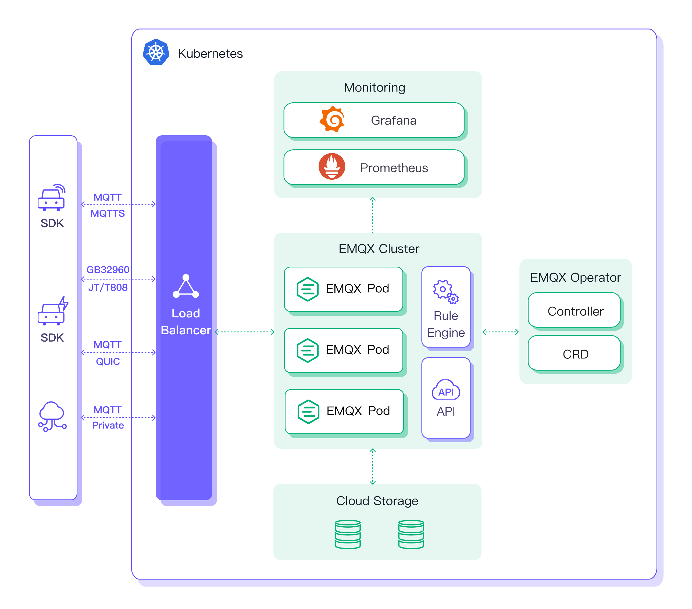

## Overview

EMQX Operator provides [Kubernetes](https://kubernetes.io/) native deployment and management of [EMQX](https://www.emqx.io/), including EMQX Broker and EMQX Enterprise. The purpose of this project is to simplify and automate the configuration of the EMQX cluster.

EMQX Operator requires Kubernetes 1.24 or higher.

EMQX Operator includes, but is not limited to, the following features:

* **Simplified Deployment EMQX**: Declare EMQX clusters with EMQX custom resources and deploy them quickly. For more details, please check [Getting Started](./getting-started/getting-started.md).

* **Manage EMQX Cluster**: Automate operations and maintenance for EMQX, including cluster upgrades, runtime data persistence, updating Kubernetes resources based on the status of EMQX, etc. For more details, please check [Manage EMQX](./tasks/overview.md).

## EMQX and EMQX Operator compatibility

Current EMQX Operator release series 2.3.x are compatible with the following EMQX releases:
- EMQX 5.9
- EMQX 5.10
- EMQX 6.0 and higher

Following APIVersions are supported:
- [apps.emqx.io/v2](./reference/v2-reference.md)
- [apps.emqx.io/v2beta1](./reference/v2beta1-reference.md) (partially deprecated)

For older EMQX releases please refer to the compatibility matrix below.

* **EMQX Enterprise**

|  EMQX Enterprise Version     |    EMQX Operator Version   |                          APIVersion                          |      Kind      |
| :--------------------------: | :------------------------: | :----------------------------------------------------------: | :------------: |
| 5.1.1 or higher              | 2.2.x                      | [apps.emqx.io/v2beta1](./reference/v2beta1-reference.md)     |      EMQX      |
| 5.0.0 ~ 5.0.23               | 2.0.x, 2.1.0, 2.1.1        | [apps.emqx.io/v2alpha1](./reference/v2alpha1-reference.md)   |      EMQX      |
| 4.4.14 or higher 4.4.x       | 2.1.0, 2.1.1               | [apps.emqx.io/v1beta4](./reference/v1beta4-reference.md)     | EmqxEnterprise |
| 4.4.8 ~ 4.4.14               | 1.2.6, 1.2.7, 1.2.8, 2.0.x | [apps.emqx.io/v1beta3](./reference/v1beta3-reference.md)     | EmqxEnterprise |
| 4.4.6 ~ 4.4.8                | 1.2.5                      | [apps.emqx.io/v1beta3](./reference/v1beta3-reference.md)     | EmqxEnterprise |
| 4.3.x ~ 4.4                  | 1.2.1, 1.2.2, 1.2.3        | [apps.emqx.io/v1beta3](./reference/v1beta3-reference.md)     | EmqxEnterprise |

* **EMQX Open Source**

|  EMQX Open Source Version  |     EMQX Operator Version    |     APIVersion                                             |    Kind    |
| :------------------------: | :--------------------------: | :--------------------------------------------------------: | :--------: |
| 5.1.1 ~ 5.8.7              | 2.2.x                        | [apps.emqx.io/v2beta1](./reference/v2beta1-reference.md)   | EMQX       |
| 5.0.14 ~ 5.0.23            | 2.1.0, 2.1.1                 | [apps.emqx.io/v2alpha1](./reference/v2alpha1-reference.md) | EMQX       |
| 5.0.8 ~ 5.0.14             | 2.0.2                        | [apps.emqx.io/v2alpha1](./reference/v2alpha1-reference.md) | EMQX       |
| 5.0.6 ~ 5.0.8              | 2.0.0, 2.0.1, 2.0.3          | [apps.emqx.io/v2alpha1](./reference/v2alpha1-reference.md) | EMQX       |
| 4.4.14 or higher 4.4.x     | 2.1.0, 2.1.1                 | [apps.emqx.io/v1beta4](./reference/v1beta4-reference.md)   | EmqxBroker |
| 4.4.8 ~ 4.4.14             | 1.2.6, 1.2.7, 1.2.8, 2.0.x   | [apps.emqx.io/v1beta3](./reference/v1beta3-reference.md)   | EmqxBroker |
| 4.4.6 ~ 4.4.8              | 1.2.5                        | [apps.emqx.io/v1beta3](./reference/v1beta3-reference.md)   | EmqxBroker |
| 4.3.x ~ 4.4                | 1.2.1, 1.2.2, 1.2.3          | [apps.emqx.io/v1beta3](./reference/v1beta3-reference.md)   | EmqxBroker |
