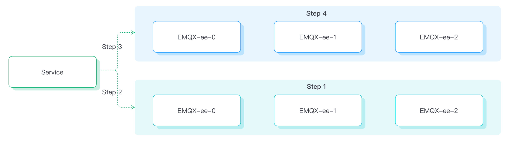

# Configure Blue-Green Upgrade (EMQX 4 Enterprise)

## Task target

How to gracefully upgrade an EMQX cluster using blue-green deployment.

## Why Need Blue-Green Upgrade

Traditional rolling upgrades may face the following issues in a production environment:

1. During the upgrade process, old nodes are destroyed one by one and new ones are created, which may result in repeated interruptions for clients (in the worst case, the number of interruptions is equal to the number of nodes).

2. When the cluster is heavily connected and a node is destroyed, the connections on that node will be immediately disconnected, with clients retrying to reconnect. When the number of connections on a single node is large, a large number of client retries may put pressure on the server and cause overload.

3. After the upgrade is complete, the load may be uneven between nodes.

4. Due to using StatefulSets for deployment, there will be one node less providing services during the upgrade process than the actual number of nodes.

Therefore, EMQX Operator implements blue-green deployment based on the Node Evacuation feature of EMQX Enterprise to solve the above issues.

The EMQX node evacuation function is used to evacuate all connections in a node, manually or automatically moving client connections and sessions to other nodes or clusters in the cluster. For more details on EMQX node evacuation, refer to the documentation: [Node Evacuation](https://docs.emqx.com/en/enterprise/v4.4/advanced/rebalancing.html#evacuation).

:::tip

The node evacuation function is only available after version 4.4.12 of EMQX Enterprise.

:::

## Blue-Green Deployment Process



The upgrade process can be roughly divided into the following steps:

1. We will first create a node with the same specifications and add it to the existing cluster during the upgrade.

2. When all the new nodes are ready, we will redirect the service to the newly created nodes, and the new ones will start receiving new connection requests.

3. Remove the old nodes from the service. The old ones will no longer receive new connection requests.

4. Use the EMQX node evacuation function to gradually migrate the connections on each node in a controllable manner until all connections are successfully migrated. Then the old ones can be destroyed.

## How to Use Blue-Green Upgrade

### Configure blue-green deployment parameters

The CRD for EMQ X Enterprise in EMQ X Operator is EmqxEnterprise. EmqxEnterprise supports configuring the blue-green upgrade of EMQX Enterprise through the `.spec.blueGreenUpdate` field. For the specific description of the blueGreenUpdate fields, please refer to [blueGreenUpdate](https://github.com/emqx/emqx-operator/blob/main-2.1/docs/en_US/reference/v1beta4-reference.md#evacuationstrategy).

```yaml
apiVersion: apps.emqx.io/v1beta4
kind: EmqxEnterprise
metadata:
  name: emqx-ee
spec:
  blueGreenUpdate:
    initialDelaySeconds: 60
    evacuationStrategy:
      waitTakeover: 5
      connEvictRate: 200
      sessEvictRate: 200
  template:
    spec:
      emqxContainer:
        image:
          repository: emqx/emqx-ee
          version: 4.4.14
```

`initialDelaySeconds`: The waiting time (second) before starting the node evacuation process after all nodes are ready.

`waitTakeover`: Amount of time in seconds (count/second) to wait before starting session evacuation

`connEvictRate`: Client disconnection rate (count/second)

`sessEvictRate`: Client evacuation rate (count/second)

Save the above content as `emqx.yaml`, execute the following command to deploy the EMQX Enterprise cluster:

```bash
kubectl apply -f emqx.yaml
```

The output is similar to:

```
emqxenterprise.apps.emqx.io/emqx-ee created
```

Check whether the EMQX Enterprise cluster is ready

```bash
$ kubectl get emqxenterprises

NAME      STATUS   AGE
emqx-ee   Running  8m33s
```

## Use MQTT X CLI to Connect EMQX Cluster

MQTT X CLI is an open-source MQTT 5.0 CLI Client that supports automatic reconnection, and it is also a pure command-line mode MQTT X. Designed to help develop and debug MQTT services and applications faster without using a graphical interface. For documentation about MQTT X CLI, please refer to [MQTTX CLI](https://mqttx.app/docs/cli).

Execute the following command to connect to the EMQX cluster:

```bash
mqttx bench conn -h ${IP} -p ${PORT} -c 3000
```

This article uses the NodePort mode to expose services when deploying the EMQX cluster.

`-h`: The IP address of the host where the EMQX Pod is located.

`-p`: The NodePort port.

`-c`: The number of connections created.

The output is similar to:

```bash
[10:05:21 AM] › ℹ Start the connect benchmarking, connections: 3000, req interval: 10ms
✔ success [3000/3000] - Connected
[10:06:13 AM] › ℹ Done, total time: 31.113s
```

### Trigger EMQX Operator to Perform Blue-Green Upgrade

Modifying any content of the `.spec.template` field of the EmqxEnterprise object will trigger EMQX Operator to perform a blue-green upgrade. In this article, we trigger the upgrade by modifying the EMQX Container Name, and users can modify it according to their actual needs.

```bash
kubectl patch EmqxEnterprise emqx-ee --type='merge' -p '{"spec": {"template": {"spec": {"emqxContainer": {"name": "emqx-ee-a"}} }}}'
```

The output is similar to:

```
emqxenterprise.apps.emqx.io/emqx-ee patched
```

- Check the status of the blue-green upgrade

    ```bash
    kubectl get emqxEnterprise emqx-ee -o json | jq ".status.blueGreenUpdateStatus.evacuationsStatus"
    ```

    The output is similar to:

    ```bash
    [
    {
        "connection_eviction_rate": 200,
        "node": "emqx-ee@emqx-ee-54fc496fb4-2.emqx-ee-headless.default.svc.cluster.local",
        "session_eviction_rate": 200,
        "session_goal": 0,
        "connection_goal": 22,
        "session_recipients": [
        "emqx-ee@emqx-ee-5d87d4c6bd-2.emqx-ee-headless.default.svc.cluster.local",
        "emqx-ee@emqx-ee-5d87d4c6bd-1.emqx-ee-headless.default.svc.cluster.local",
        "emqx-ee@emqx-ee-5d87d4c6bd-0.emqx-ee-headless.default.svc.cluster.local"
        ],
        "state": "waiting_takeover",
        "stats": {
        "current_connected": 0,
        "current_sessions": 0,
        "initial_connected": 33,
        "initial_sessions": 0
        }
    }
    ]
    ```

    `connection_eviction_rate`: Node eviction rate (count/second).

    `node`: The node that is currently being evacuated.

    `session_eviction_rate`: Session eviction rate for the node (count/second).

    `session_recipients`: List of recipients for the session evacuation.

    `state`: State of the node evacuation.

    `stats`: Evacuation node statistics, including current number of connections (current_connected), current number of sessions (current_sessions), initial number of connections (initial_connected), and initial number of sessions (initial_sessions).

- Waiting for upgrade to complete

    ```bash
    $ kubectl get emqxenterprises

    NAME      STATUS   AGE
    emqx-ee   Running  8m33s
    ```

    Please ensure that the `STATUS` is Running, this may take some time as we wait for the EMQX cluster to complete its upgrade.

    After the upgrade is completed, the old EMQX nodes can be observed to have been removed by the `$ kubectl get pods command`.


## Grafana Monitoring

The monitoring graph of the number of connections during the upgrade process is shown below (using 100,000 connections as an example).


sum: Total number of connections, represented by the top line in the graph.

emqx-ee-86d7758868: Three EMQX nodes before the upgrade.

emqx-ee-745858464d: Three EMQX nodes after the upgrade.

As shown in the figure above, we have implemented graceful upgrade in Kubernetes through EMQX Kubernetes Operator's blue-green deployment. Through this solution, the total number of connections did not have a significant shake (depending on migration rate, server reception rate, client reconnection policy, etc.) during the upgrade process, which can greatly ensure the smoothness of the upgrade process, effectively prevent server overload, reduce business perception, and improve the stability of the service.
