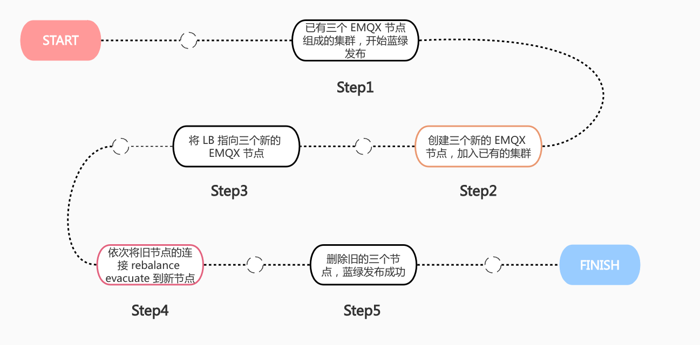
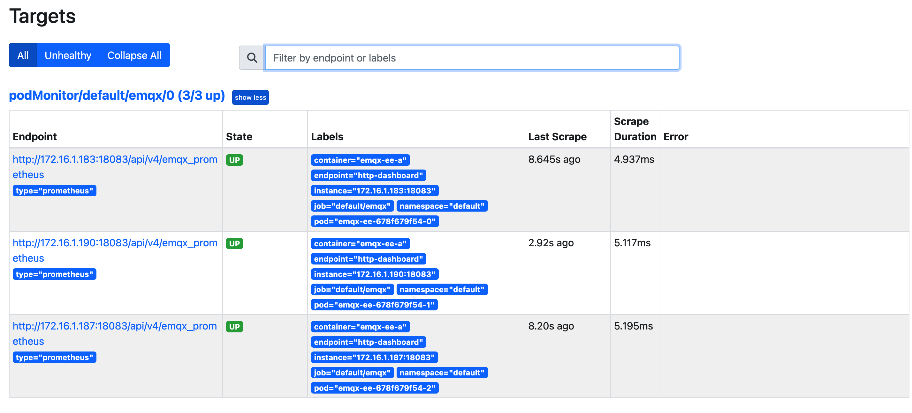
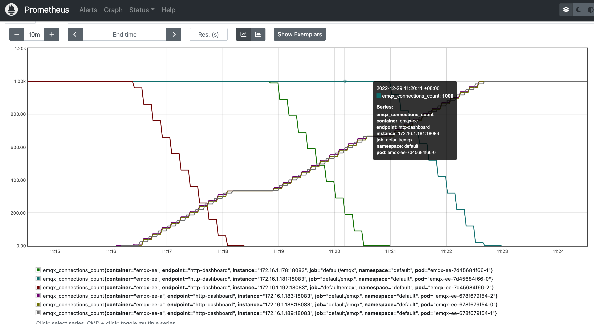

# Configure EMQX Enterprise Edition blue-green upgrade

## Task target

- How to use the blueGreenUpdate field to configure the blue-green upgrade of EMQX Enterprise Edition.

## Use the blueGreenUpdate field to configure blue-green update

EMQX provides a long-term connection service. In kubernets, the existing upgrade strategy requires restarting the EMQX service except for hot upgrade. This upgrade strategy will cause disconnection of the device. If the device has a reconnection mechanism, a large number of devices will appear Simultaneously requesting connections, which triggers an avalanche, eventually causing a large number of clients to be temporarily unserviced. Therefore, EMQX Operator implements a blue-green upgrade based on the Node Evacuation function of EMQX Enterprise Edition to solve the above problems. The blue-green upgrade process of EMQX Operator is shown in the figure below:



The EMQX node evacuation function is used to evacuate all connections in the node, and manually/automatically move client connections and sessions to other nodes in the cluster or other clusters. For a detailed introduction to EMQX node evacuation, please refer to the document: [Node Evacuation](https://docs.emqx.com/en/enterprise/v4.4/advanced/rebalancing.html#evacuation). **NOTE:** The node evacuation function is only available in EMQX Enterprise Edition 4.4.12.

- Configure EMQX cluster

The corresponding CRD of EMQX Enterprise Edition in EMQX Operator is EmqxEnterprise. EmqxEnterprise supports configuring the blue-green upgrade of EMQX Enterprise Edition through the `.spec.blueGreenUpdate` field. For the specific description of the blueGreenUpdate field, please refer to: [blueGreenUpdate](https://github.com/emqx/emqx-operator/blob/main-2.1/docs/en_US/reference/v1beta4-reference.md#evacuationstrategy).

```yaml
apiVersion: apps.emqx.io/v1beta4
kind: EmqxEnterprise
metadata:
   name: emqx-ee
spec:
   replicas: 3
   license:
     stringData: |
       -----BEGIN CERTIFICATE-----
       ...
       -----END CERTIFICATE-----
   blueGreenUpdate: 
    initialDelaySeconds: 5
    evacuationStrategy:
      waitTakeover: 5
      connEvictRate: 10
      sessEvictRate: 10
   template:
     spec:
       emqxContainer:
         image: 
           repository: emqx/emqx-ee
           version: 4.4.14
         ports:
           - name: "http-dashboard"
             containerPort: 18083
   serviceTemplate:
     spec:
       type: NodePort
       ports:
         - name: "mqtt-tcp-1883"
           protocol: "TCP"
           port: 1883
           targetPort: 1883
           nodePort: 32010
```

**NOTE:** `waitTakeover` indicates the waiting time (unit is second) before the current node starts session evacuation. `connEvictRate` indicates the client disconnection rate of the current node (unit: count/second). `sessEvictRate` indicates the current node client session evacuation rate (unit: count/second). The `.spec.license.stringData` field is filled with the content of the license certificate. In this article, the content of this field is omitted. Please fill it with the content of your own certificate.

Save the above content as: emqx-update.yaml, execute the following command to deploy the EMQX Enterprise Edition cluster:

```
kubectl apply -f emqx-update.yaml
```

The output is similar to:

```
emqxenterprise.apps.emqx.io/emqx-ee created
```

- Check whether the EMQX Enterprise Edition cluster is ready

```
kubectl get emqxenterprise emqx-ee -o json | jq ".status.emqxNodes"
```

The output is similar to:

```
[
   {
     "node": "emqx-ee@emqx-ee-54fc496fb4-1.emqx-ee-headless.default.svc.cluster.local",
     "node_status": "Running",
     "otp_release": "24.3.4.2/12.3.2.2",
     "version": "4.4.12"
   },
   {
     "node": "emqx-ee@emqx-ee-54fc496fb4-0.emqx-ee-headless.default.svc.cluster.local",
     "node_status": "Running",
     "otp_release": "24.3.4.2/12.3.2.2",
     "version": "4.4.12"
   },
   {
     "node": "emqx-ee@emqx-ee-54fc496fb4-2.emqx-ee-headless.default.svc.cluster.local",
     "node_status": "Running",
     "otp_release": "24.3.4.2/12.3.2.2",
     "version": "4.4.12"
   }
]
```

**NOTE:**`node` represents the unique identifier of the EMQX node in the cluster. `node_status` indicates the status of the EMQX node. `otp_release` indicates the version of Erlang used by EMQX. `version` indicates the EMQX version. EMQX Operator will pull up the EMQX cluster with three nodes by default, so when the cluster is running normally, you can see the information of the three running nodes. If you configure the `.spec.replicas` field, when the cluster is running normally, the number of running nodes displayed in the output should be equal to the value of replicas.

## Deploy Prometheus to collect EMQX statistical indicators

In order to better display the EMQX client connection status during the blue-green upgrade process, this article uses Prometheus to collect EMQX statistical indicators. The following is the process of deploying Prometheus:

- Deploy Prometheus

Prometheus deployment documentation can refer to: [Prometheus](https://github.com/prometheus-operator/prometheus-operator/blob/main/Documentation/user-guides/getting-started.md)

- Configure PodMonitor

A PodMonitor Custom Resource Definition (CRD) allows declaratively defining how a dynamic set of pods should be monitored. Use label selection to define which pods are selected for monitoring with the desired configuration, and its documentation can be found at: [PodMonitor](https://github.com/prometheus-operator/prometheus-operator/blob/main/Documentation/design.md #podmonitor)

```yaml
apiVersion: monitoring.coreos.com/v1
kind: PodMonitor
metadata:
   name: emqx
   namespace: default
   labels:
     app.kubernetes.io/name: emqx-ee
spec:
   podMetricsEndpoints:
   - interval: 10s
     port: http-dashboard
     scheme: http
     path: /api/v4/emqx_prometheus
     params:
       type:
         -prometheus
     basicAuth:
       password:
         name: emqx-basic-auth
         key: password
       username:
         name: emqx-basic-auth
         key: username
   jobLabel: emqx-scraping
   namespaceSelector:
     matchNames:
       - default
   selector:
     matchLabels:
       apps.emqx.io/instance: emqx-ee
```

Save the above content as: podMonitor.yaml and create a PodMonitor.

```bash
kubectl apply -f podMonitor.yaml
```

Create basicAuth to provide PodMonitor with the account and password information needed to access the EMQX interface.

```yaml
apiVersion: v1
kind: Secret
metadata:
   name: emqx-basic-auth
   namespace: default
type: kubernetes.io/basic-auth
stringData:
   username: admin
   password: public
```

Save the above content as: secret.yaml and create a Secret.

```
kubectl apply -f secret.yaml
```

- Check whether Prometheus can obtain EMQX cluster indicators normally

Use a browser to access the Prometheus web service, switch to Status -> Targets, as shown in the following figure:



It can be seen from the figure that the indicator data of all Pods in the EMQX cluster can be obtained normally.

## Test the blue-green upgrade of EMQX Enterprise Edition

- Use MQTT X CLI to connect to EMQX cluster

MQTT X CLI is an open source MQTT 5.0 CLI Client that supports automatic reconnection, and it is also a pure command-line mode MQTT X. Designed to help develop and debug MQTT services and applications faster without using a graphical interface. For documentation about MQTT X CLI, please refer to: [MQTTX CLI](https://mqttx.app/docs/cli).

Execute the following command to connect to the EMQX cluster:

```bash
mqttx bench conn -h 47.103.65.17 -p 32010 -c 3000
```

**NOTE:**`-h` indicates the IP of the host where the EMQX Pod is located. `-p` means nodePort port. `-c` indicates the number of connections to create. When deploying the EMQX cluster, this article usesThe NodePort pattern exposes services. If the service is exposed by LoadBalancer, `-h` should be the IP of LoadBalancer, and `-p` should be the EMQX MQTT service port.

The output is similar to:

```
[10:05:21 AM] › ℹ Start the connect benchmarking, connections: 3000, req interval: 10ms
✔ success [3000/3000] - Connected
[10:06:13 AM] › ℹ Done, total time: 31.113s
```

- Modify the EmqxEnterprise object to trigger EMQX Operator to perform blue-green upgrade

Modifying any content of the `.spec.template` field of the EmqxEnterprise object will trigger EMQX Operator to perform a blue-green upgrade. In this article, we modify the EMQX Container Name to trigger the upgrade, and users can modify it according to actual needs.

```
kubectl patch EmqxEnterprise emqx-ee --type='merge' -p '{"spec": {"template": {"spec": {"emqxContainer": {"name": "emqx-ee-a"}} }}}'
```

The output is similar to:

```
emqxenterprise.apps.emqx.io/emqx-ee patched
```

- Check the status of the blue-green upgrade

```bash
kubectl get emqxenterprise emqx-ee -o json | jq ".status.blueGreenUpdateStatus.evacuationsStatus"
```

The output is similar to:

```
[
  {
    "connection_eviction_rate": 10,
    "node": "emqx-ee@emqx-ee-54fc496fb4-2.emqx-ee-headless.default.svc.cluster.local",
    "session_eviction_rate": 10,
    "session_goal": 0,
    "connection_goal": 22,
    "session_recipients": [
      "emqx-ee@emqx-ee-5d87d4c6bd-2.emqx-ee-headless.default.svc.cluster.local",
      "emqx-ee@emqx-ee-5d87d4c6bd-1.emqx-ee-headless.default.svc.cluster.local",
      "emqx-ee@emqx-ee-5d87d4c6bd-0.emqx-ee-headless.default.svc.cluster.local"
    ],
    "state": "waiting_takeover",
    "stats": {
      "current_connected": 0,
      "current_sessions": 0,
      "initial_connected": 33,
      "initial_sessions": 0
    }
  }
]
```

**NOTE:**`connection_eviction_rate` indicates the rate of node evacuation(unit: count/second). `node` indicates the node currently being evacuated. `session_eviction_rate` indicates the rate of node session evacuation(unit: count/second). `session_recipients` represents the list of recipients for session evacuation. `state` indicates the node evacuation phase. `stats` indicates the statistical indicators of the evacuated node, including the current number of connections (current_connected), the number of current sessions (current_sessions), the number of initial connections (initial_connected), and the number of initial sessions (initial_sessions).

- Use Prometheus to view the client connection status during the blue-green upgrade process

Use a browser to access the Prometheus web service, click Graph, enter `emqx_connections_count` in the search box, and click Execute, as shown in the following figure:



It can be seen from the figure that there are two EMQX clusters, old and new, and each cluster has three EMQX nodes. After starting the blue-green upgrade, the connection of each node of the old cluster is disconnected at the configured rate and migrated to the nodes of the new cluster. Finally, all connections in the old cluster are completely migrated to the new cluster, which means the blue-green upgrade is complete .