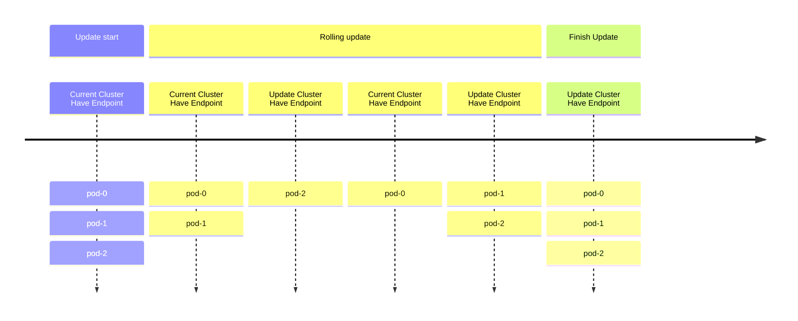
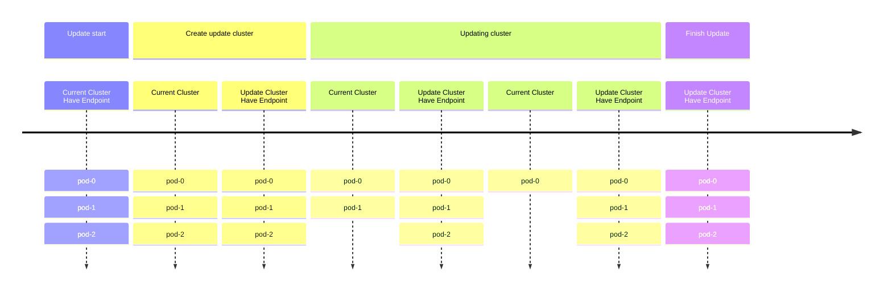
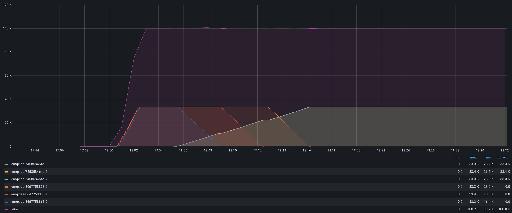

# Perform Blue-Green Upgrade of EMQX Cluster

## Objective

Perform a graceful upgrade of the EMQX cluster through blue-green deployment.

## Background

In traditional EMQX cluster deployment, StatefulSet's default rolling upgrade strategy is usually used to update EMQX Pods. However, this approach has the following two problems:

* During the rolling update, both new and old Pods are selected by the corresponding Service. This may cause MQTT clients to connect to old Pods that are being terminated, resulting in frequent disconnections and reconnections.
* During the rolling update process, only _N-1_ Pods can provide services at any given time because it takes some time for new Pods to start up and become ready. This may lead to a decrease in service availability.


```mermaid
timeline
				section Update start
					Current Cluster<br>Have Endpoint
						: pod-0
						: pod-1
						: pod-2
				section Rolling update
					Current Cluster<br>Have Endpoint
						: pod-0
						: pod-1
					Update Cluster<br>Have Endpoint
						: pod-2
					Current Cluster<br>Have Endpoint
						: pod-0
					Update Cluster<br>Have Endpoint
						: pod-1
						: pod-2
				section Finish Update
					Update Cluster<br>Have Endpoint
						: pod-0
						: pod-1
						: pod-2
```

## Solution

EMQX Operator performs blue-green deployment by default. When an EMQX cluster is updated through the corresponding EMQX CR, EMQX Operator initiates an upgrade.

The entire upgrade process is roughly divided into the following steps:

1. Create a set of new EMQX nodes with updated specifications.
2. Redirect the Service resources to the new set of nodes once they are ready, ensuring that no new connections are routed to the old set.
3. Safely migrate existing MQTT connections from the old set of nodes to the new set of nodes at a controlled rate to avoid reconnect storms.
4. Gradually scale down the old set of EMQX nodes.
5. Complete the upgrade.


```mermaid
timeline
				section Update start
					Current Cluster<br>Have Endpoint
						: pod-0
						: pod-1
						: pod-2
				section Create update cluster
					Current Cluster
						: pod-0
						: pod-1
						: pod-2
					Update Cluster<br>Have Endpoint
						: pod-0
						: pod-1
						: pod-2
				section Updating cluster
					Current Cluster
						: pod-0
						: pod-1
					Update Cluster<br>Have Endpoint
						: pod-0
						: pod-1
						: pod-2
					Current Cluster
						: pod-0
					Update Cluster<br>Have Endpoint
						: pod-0
						: pod-1
						: pod-2
				section Finish Update
					Update Cluster<br>Have Endpoint
						: pod-0
						: pod-1
						: pod-2
```

## Perform a Blue-Green Upgrade

### Configuration update strategy

- Create an `apps.emqx.io/v2` EMQX CR and configure the update strategy.

  ```yaml
  apiVersion: apps.emqx.io/v2
  kind: EMQX
  metadata:
    name: emqx-ee
  spec:
    image: emqx/emqx:6.0
    config:
      data: |
        license {
          key = "..."
        }
    updateStrategy:
      evacuationStrategy:
        # MQTT client evacuation rate, connections per second:
        connEvictRate: 1000
        # MQTT Session evacuation rate, sessions per second:
        sessEvictRate: 1000
        # Time to wait before deleting a Pod:
        waitTakeover: 10
      # Time to wait before starting the upgrade once all nodes are ready:
      initialDelaySeconds: 10
      type: Recreate
  ```

- Save the above content as `emqx-update.yaml` and deploy it using `kubectl apply`:

  ```bash
  $ kubectl apply -f emqx-update.yaml
  emqx.apps.emqx.io/emqx-ee created
  ```

- Check the status of the EMQX cluster.

  Make sure that `STATUS` is `Ready`. This may take a while.

  ```bash
  $ kubectl get emqx
  NAME      STATUS   AGE
  emqx-ee   Ready    8m33s
  ```

### Connect to EMQX cluster using MQTTX

[MQTTX](https://mqttx.app/cli) is an open-source MQTT 5.0 CLI Client that supports automatic reconnection. It aims to aid in developing and debugging MQTT services and applications.

Use MQTTX to connect to the EMQX cluster:

```bash
mqttx bench conn -h ${IP} -p ${PORT} -c 3000
[10:05:21 AM] › ℹ  Start the connect benchmarking, connections: 3000, req interval: 10ms
✔  success   [3000/3000] - Connected
[10:06:13 AM] › ℹ  Done, total time: 31.113s
```

### Trigger the upgrade

- Any modifications made to the Pod template will trigger the upgrade strategy of EMQX Operator.

  In this example, we trigger the upgrade by modifying the Pod's ImagePullPolicy.

  ```bash
  $ kubectl patch emqx emqx-ee --type=merge -p '{"spec": {"imagePullPolicy": "Never"}}'
  emqx.apps.emqx.io/emqx-ee patched
  ```

- Check the status of the upgrade process.

  ```bash
  $ kubectl get emqx emqx-ee -o json | jq ".status.nodeEvacuationsStatus"
  [
    {
      "nodeName": "emqx-ee@emqx-ee-54fc496fb4-2.emqx-ee-headless.default.svc.cluster.local",
      "state": "waiting_takeover",
      "sessionRecipients": [
        "emqx-ee@emqx-ee-5d87d4c6bd-2.emqx-ee-headless.default.svc.cluster.local",
        "emqx-ee@emqx-ee-5d87d4c6bd-1.emqx-ee-headless.default.svc.cluster.local",
        "emqx-ee@emqx-ee-5d87d4c6bd-0.emqx-ee-headless.default.svc.cluster.local"
      ],
      "sessionEvictionRate": 200,
      "connectionEvictionRate": 200,
      "initialSessions": 10,
      "initialConnections": 33
  ]
  ```

  | Field                   | Description                                                           |
  |-------------------------|-----------------------------------------------------------------------|
  | `nodeName`              | The node currently being evacuated.                                   |
  | `state`                 | Node evacuation phase.                                                |
  | `sessionRecipients`     | MQTT session recipients.                                              |
  | `sessionEvictionRate`   | MQTT session eviction rate on this node (sessions per second).        |
  | `connectionEvictionRate`| MQTT connection eviction rate on this node (connections per second).  |
  | `initialSessions`       | Initial number of sessions on this node.                              |
  | `initialConnections`    | Initial number of connections on this node.                           |


- Wait for the upgrade to complete.

  ```bash
  $ kubectl get emqx
  NAME      STATUS   AGE
  emqx-ee   Ready    8m33s
  ```

  Make sure that the `STATUS` is `Ready`. Depending on the number of MQTT clients and sessions, the upgrade process may take a while.

  After the upgrade is completed, you can verify that the old EMQX nodes have been deleted using `kubectl get pods`.

## Grafana Monitoring

The following monitoring graph shows the number of connections during the upgrade process, using 10,000 connections as an example.



| Label/Prefix            | Description                                         |
|-------------------------|-----------------------------------------------------|
| Total                   | Total number of connections; shown as the top line in the graph. |
| `emqx-ee-86f864f975`    | Name prefix for the set of 3 old EMQX nodes.    |
| `emqx-ee-648c45c747`    | Name prefix for the set of 3 upgraded EMQX nodes. |

This timeline illustrates how EMQX Operator performs a smooth blue-green upgrade. Throughout the process, the total number of connections remained stable (subject to factors such as migration rate, server capacity, and client reconnection strategy). This approach ensures minimal disruption, prevents server overload, and enhances overall service stability.
