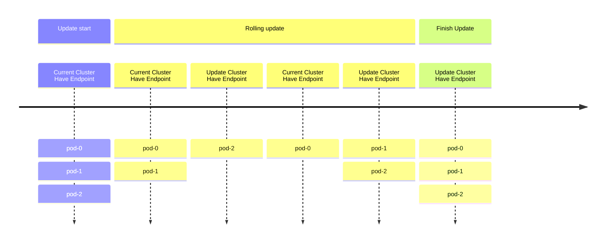
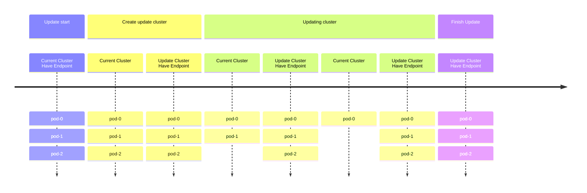

# Upgrade the EMQX cluster elegantly through blue-green deployment.

## Task objective

How to gracefully upgrade the EMQX cluster through blue-green deployment

:::tip

This feature only supports `apps.emqx.io/v1beta4 EmqxEnterprise` and `apps.emqx.io/v2alpha2 EMQX`.

:::

## 背景

1. In traditional EMQX cluster deployment, the default rolling upgrade strategy of StatefulSet is usually used to update EMQX Pods. However, this approach has the following two problems:

   1. During the rolling update, both new and old Pods are selected by the corresponding Service. This may cause MQTT clients to connect to the wrong Pod, resulting in frequent disconnections and reconnections.

   2. During the rolling update process, only N - 1 Pods can provide services because it takes some time for new Pods to start up and become ready. This may lead to a decrease in service availability.



## Solution

Regarding the issue of rolling updates mentioned in the previous text, EMQX Operator provides a blue-green deployment upgrade solution. When upgrading the EMQX cluster using EMQX custom resources, EMQX Operator will create a new EMQX cluster and redirect the Kubernetes Service to the new EMQX cluster after it is ready. It will then gradually delete Pods from the old EMQX cluster to achieve the purpose of updating the EMQX cluster.

When deleting Pods from the old EMQX cluster, EMQX Operator can also take advantage of the node evacuation feature of EMQX to transfer MQTT connections to the new cluster at a desired rate, avoiding issues with a large number of connections for a period of time.

The entire upgrade process can be roughly divided into the following steps:

1. Create a cluster with the same specifications.

2. After the new cluster is ready, redirect the service to the new cluster and remove the old cluster from the service. At this time, the new cluster starts to receive traffic, and existing connections in the old cluster are not affected.

3. (Only supported by EMQX Enterprise Edition) Use EMQX node evacuation function to evacuate connections on each node one by one.

4. Gradually scale down the old cluster to 0 nodes.

5. Complete the upgrade.



## How to update the EMQX cluster through blue-green deployment.

### Configuration update strategy

:::: tabs type:card
::: tab apps.emqx.io/v2alpha2

Create `apps.emqx.io/v2alpha2` EMQX and configure update strategy.

```yaml
apiVersion: apps.emqx.io/v2alpha2
kind: EMQX
metadata:
  name: emqx
spec:
  image: emqx:5.1
	updateStrategy:
    evacuationStrategy:
      connEvictRate: 1000
      sessEvictRate: 1000
      waitTakeover: 10
    initialDelaySeconds: 10
    type: Recreate
```

`initialDelaySeconds`:The waiting time before starting the update after all nodes are ready (unit: second).

`waitTakeover`: Interval time when deleting a Pod (unit: second)。

`connEvictRate`: MQTT client evacuation rate, only supported by EMQX Enterprise Edition (unit: count/second)。

`sessEvictRate`: MQTT Session evacuation rate, only supported by EMQX Enterprise Edition (unit: count/second)。

Save the above content as: `emqx-update.yaml`, execute the following command to deploy EMQX:

```bash
$ kubectl apply -f emqx-update.yaml

emqx.apps.emqx.io/emqx-ee created
```

Check the status of the EMQX cluster, please make sure that `STATUS` is `Ready`. This may require some time to wait for the EMQX cluster to be ready.

```bash
$ kubectl get emqx

NAME      STATUS   AGE
emqx-ee   Ready    8m33s
```

:::
::: tab apps.emqx.io/v1beta4

Create `apps.emqx.io/v1beta4 EmqxEnterprise` and configure update strategy.

```yaml
apiVersion: apps.emqx.io/v1beta4
kind: EmqxEnterprise
metadata:
  name: emqx-ee
spec:
  blueGreenUpdate:
    initialDelaySeconds: 60
    evacuationStrategy:
      waitTakeover: 5
      connEvictRate: 200
      sessEvictRate: 200
  template:
    spec:
      emqxContainer:
        image:
          repository: emqx/emqx-ee
          version: 4.4.14
```

`initialDelaySeconds`: The waiting time before the start node is evacuated after all nodes are ready (unit: second).

`waitTakeover`: The time to wait for the client to reconnect and take over the session after all connections are disconnected (unit: second).

`connEvictRate`: MQTT client evacuation rate (unit: count/second)。

`sessEvictRate`: MQTT Session evacuation speed (unit: count/second)。

Save the above content as: `emqx-update.yaml`, execute the following command to deploy EMQX Enterprise Edition cluster:

```bash
$ kubectl apply -f emqx-update.yaml

emqxenterprise.apps.emqx.io/emqx-ee created
```

Check the status of the EMQX cluster, please make sure that `STATUS` is `Running`. This may require some time to wait for the EMQX cluster to be ready.

```bash
$ kubectl get emqxenterprises

NAME      STATUS   AGE
emqx-ee   Running  8m33s
```

:::
::::

### Connect to EMQX cluster using MQTT X CLI.

MQTT X CLI is an open-source MQTT 5.0 CLI Client that supports automatic reconnection. It is also a pure command-line mode MQTT X. It aims to help develop and debug MQTT services and applications faster without using a graphical interface. For documentation about MQTT X CLI, please refer to: [MQTTX CLI](https://mqttx.app/cli).

Execute the following command to connect to the EMQX cluster:

```bash
mqttx bench conn -h ${IP} -p ${PORT} -c 3000
```

Output is similar to:

```bash
[10:05:21 AM] › ℹ  Start the connect benchmarking, connections: 3000, req interval: 10ms
✔  success   [3000/3000] - Connected
[10:06:13 AM] › ℹ  Done, total time: 31.113s
```

### Upgrade EMQX cluster.

- Any modifications made to the Pod Template will trigger the upgrade strategy of EMQX Operator.

  > In this article, we trigger the upgrade by modifying the Container ImagePullPolicy. Users can modify it according to their actual needs.

  ```bash
  $ kubectl patch emqx emqx-ee --type=merge -p '{"spec": {"imagePullPolicy": "Never"}}'

  emqx.apps.emqx.io/emqx-ee patched
  ```

- Check status.

  ```bash
  $ kubectl get emqx emqx-ee -o json | jq ".status.nodEvacuationsStatus"

  [
    {
      "connection_eviction_rate": 200,
      "node": "emqx-ee@emqx-ee-54fc496fb4-2.emqx-ee-headless.default.svc.cluster.local",
      "session_eviction_rate": 200,
      "session_goal": 0,
      "connection_goal": 22,
      "session_recipients": [
        "emqx-ee@emqx-ee-5d87d4c6bd-2.emqx-ee-headless.default.svc.cluster.local",
        "emqx-ee@emqx-ee-5d87d4c6bd-1.emqx-ee-headless.default.svc.cluster.local",
        "emqx-ee@emqx-ee-5d87d4c6bd-0.emqx-ee-headless.default.svc.cluster.local"
      ],
      "state": "waiting_takeover",
      "stats": {
        "current_connected": 0,
        "current_sessions": 0,
        "initial_connected": 33,
        "initial_sessions": 0
      }
    }
  ]
  ```

  `connection_eviction_rate`: Node evacuation rate (unit: count/second).

  `node`: The node being evacuated currently.

  `session_eviction_rate`: Node session evacuation rate (unit: count/second).

  `session_recipients`: Session evacuation recipient list.

  `state`: Node evacuation phase.

  `stats`: Evacuation node statistical indicators, including current number of connections (current_connected), current number of sessions (current_sessions), initial number of connections (initial_connected), and initial number of sessions (initial_sessions).

- Waiting for the upgrade to complete.

  ```bash
  $ kubectl get emqx

  NAME      STATUS   AGE
  emqx-ee   Ready    8m33s
  ```

  Please make sure that the STATUS is Running, which requires some time to wait for the EMQX cluster to complete the upgrade.

  After the upgrade is completed, you can observe that the old EMQX nodes have been deleted by using the command $ kubectl get pods.


## Grafana Monitoring

The monitoring graph of the number of connections during the upgrade process is shown below (using 100,000 connections as an example).


sum: Total number of connections, represented by the top line in the graph.

emqx-ee-86d7758868: Three EMQX nodes before the upgrade.

emqx-ee-745858464d: Three EMQX nodes after the upgrade.

As shown in the figure above, we have implemented graceful upgrade in Kubernetes through EMQX Kubernetes Operator's blue-green deployment. Through this solution, the total number of connections did not have a significant shake (depending on migration rate, server reception rate, client reconnection policy, etc.) during the upgrade process, which can greatly ensure the smoothness of the upgrade process, effectively prevent server overload, reduce business perception, and improve the stability of the service.
