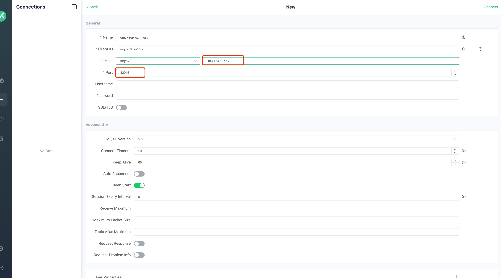
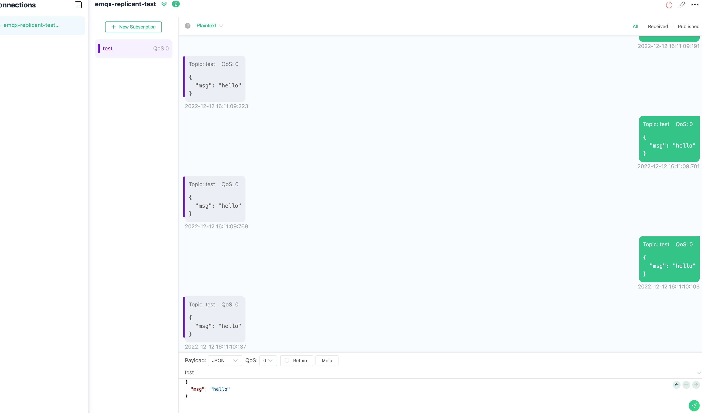

# Configure EMQX Core and Replicant nodes

## Task target

- How to configure the EMQX cluster Core node through the coreTemplate field.
- How to configure the EMQX cluster Replicant node through the replicantTemplate field.

## Configure EMQX cluster Core node

In EMQX 5.0, in order to realize the horizontal expansion capability of the cluster, the EMQX nodes in the cluster can be divided into two roles: core (Core) node and replication (Replicant) node. Its topology is shown in the figure below:


The behavior of Core nodes is consistent with that of EMQX 4.x nodes: Core nodes form a cluster in a fully connected manner, and each node can initiate transactions, hold locks, and so on. Therefore, EMQX 5.0 still requires Core nodes to be as reliable as possible in deployment. **Please note: There must be at least one Core node in the EMQX cluster**.

- Deploy EMQX cluster

EMQX CRD supports the configuration of EMQX cluster Core nodes through `.spec.coreTemplate` field, the specific description of coreTemplate field can refer to: [coreTemplate](https://github.com/emqx/emqx-operator/blob/2.0.2/docs/en_US/reference/v2alpha1-reference.md#emqxcoretemplate). Use the `.spec.replicantTemplate` field to configure the Replicant node of the EMQX cluster. The specific description of the replicantTemplate field can refer to: [emqxreplicanttemplate](https://github.com/emqx/emqx-operator/blob/2.0.2/docs/en_US/reference/v2alpha1-reference.md#emqxreplicanttemplate).

```yaml
apiVersion: apps.emqx.io/v2alpha1
kind: EMQX
metadata:
   name: emqx
spec:
   image: emqx/emqx:5.0.14
   coreTemplate:
     spec:
       replicas: 3
   replicantTemplate:
     spec:
       replicas: 0
   dashboardServiceTemplate:
     spec:
       type: NodePort
       ports:
         - name: "dashboard-listeners-http-bind"
           protocol: TCP
           port: 18083
           targetPort: 18083
           nodePort: 32015
   listenersServiceTemplate:
     spec:
       type: NodePort
       ports:
         - name: "tcp-default"
           protocol: TCP
           port: 1883
           targetPort: 1883
           nodePort: 32016
```

> If the EMQX cluster is configured with a Replicant node, the MQTT client's request will connect to the Rplicant node, otherwise it will connect to the Core node. The request to access EMQX Dashboard will only connect to the Core node. In `.spec.dashboardServiceTemplate`, we configured the way the EMQX cluster exposes the Dashboard service to the outside world as NodePort, and specified the nodePort corresponding to port 18083 of the EMQX Dashboard service as 32015 (the value range of nodePort is: 30000-32767). In `.spec.listenersServiceTemplate`, we configured the way the EMQX cluster listener exposes services to the outside world as NodePort, and specified the nodePort corresponding to port 1883 of the EMQX listener as 32016. **Please note: At least one Core node must be configured in the EMQX cluster**.

Save the above content as: emqx-core.yaml, and execute the following command to deploy the EMQX cluster:

```bash
kubectl apply -f emqx-core.yaml
```

The output is similar to:

```
emqx.apps.emqx.io/emqx created
```

- Check whether the EMQX cluster is ready

```bash
kubectl get emqx emqx -o json | jq '.status.conditions[] | select( .type == "Running" and .status == "True")'
```

```bash
{
   "lastTransitionTime": "2023-02-10T02:46:36Z",
   "lastUpdateTime": "2023-02-07T06:46:36Z",
   "message": "Cluster is running",
   "reason": "ClusterRunning",
   "status": "True",
   "type": "Running"
}
```

- Use MQTT X to connect to the EMQX cluster to send messages

MQTT X is a fully open source MQTT 5.0 cross-platform desktop client. Supports quick creation of multiple simultaneous online MQTT client connections, convenient for testing MQTT/TCP, MQTT/TLS, MQTT/WebSocket connection, publishing, subscribing functions and other MQTT protocol features. For more documentation on using MQTT X, please refer to: [MQTT X](https://mqttx.app/docs).

Click the button to create a new connection on the MQTT X page, and configure the EMQX cluster node information as shown in the figure. After configuring the connection information, click the connect button to connect to the EMQX cluster:



Then click the Subscribe button to create a new subscription, as shown in the figure, MQTT X has successfully connected to the EMQX cluster and successfully created the subscription:


After successfully connecting to the EMQX cluster and creating a subscription, we can send messages to the EMQX cluster, as shown in the following figure:



- Access EMQX cluster through Dashboard

Open the browser, enter the host `IP` and port `32015` where the EMQX Pod is located, log in to the EMQX cluster Dashboard (Dashboard default username: admin, default password: public), enter the Dashboard and click on the dashboard to see all nodes in the cluster information, as shown in the figure below:


It can be seen from the figure that there are currently 3 Core nodes in the EMQX cluster, and the number of connections and subscriptions are both 1.

## Configure EMQX cluster Replicant node

- Deploy EMQX cluster

```yaml
apiVersion: apps.emqx.io/v2alpha1
kind: EMQX
metadata:
   name: emqx
spec:
   image: emqx/emqx:5.0.14
   coreTemplate:
     spec:
       replicas: 3
   replicantTemplate:
     spec:
       replicas: 3
   dashboardServiceTemplate:
     spec:
       type: NodePort
       ports:
         - name: "dashboard-listeners-http-bind"
           protocol: TCP
           port: 18083
           targetPort: 18083
           nodePort: 32015
   listenersServiceTemplate:
     spec:
       type: NodePort
       ports:
         - name: "tcp-default"
           protocol: TCP
           port: 1883
           targetPort: 1883
           nodePort: 32016
```

Save the above content as: emqx-replicant.yaml, and execute the following command to deploy the EMQX cluster:

```bash
kubectl apply -f emqx-replicant.yaml
```

The output is similar to:

```
emqx.apps.emqx.io/emqx created
```

- Check whether the EMQX cluster is ready

```bash
kubectl get emqx emqx -o json | jq '.status.conditions[] | select( .type == "Running" and .status == "True")'
```

The output is similar to:

```bash
{
   "lastTransitionTime": "2023-02-10T02:46:36Z",
   "lastUpdateTime": "2023-02-07T06:46:36Z",
   "message": "Cluster is running",
   "reason": "ClusterRunning",
   "status": "True",
   "type": "Running"
}
```

- Use MQTT X to connect to the EMQX cluster to send messages

Click the button to create a new connection on the MQTT X page, and configure the EMQX cluster node information as shown in the figure. After configuring the connection information, click the connect button to connect to the EMQX cluster:


Then click the Subscribe button to create a new subscription, as shown in the figure, MQTT X has successfully connected to the EMQX cluster and successfully created the subscription:


After successfully connecting to the EMQX cluster and creating a subscription, we can send messages to the EMQX cluster, as shown in the following figure:


- Access EMQX cluster through Dashboard

Finally, open the browser, enter the host `IP` and port `32015` where the EMQX Pod is located, log in to the EMQX cluster Dashboard, and click the dashboard to view the EMQX cluster node information:


It can be seen from the figure that there are 3 Core nodes and 3 Replicant nodes in the current cluster, and the number of connections and subscriptions are both 1.