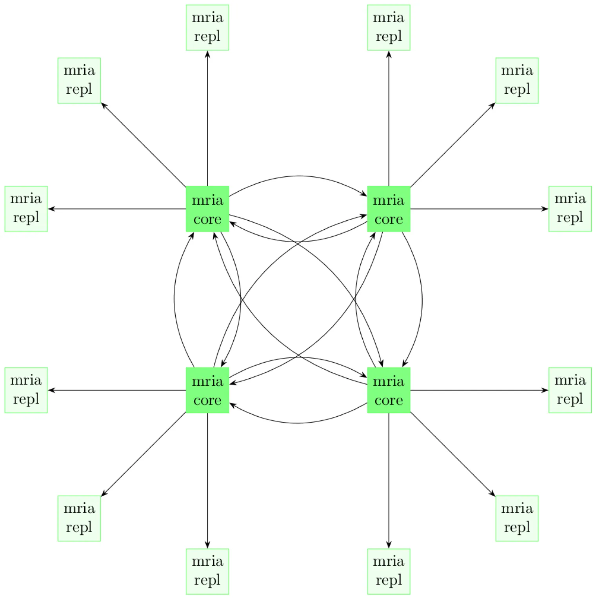

# Enable Core + Replicant Cluster (EMQX 5.x)

## Task Target

- How to configure the EMQX cluster Core node through the coreTemplate field.
- How to configure the EMQX cluster Replicant node through the replicantTemplate field.

## Core Nodes and Replicant Nodes

In EMQX 5.0, in order to realize the horizontal expansion capability of the cluster, the EMQX nodes in the cluster can be divided into two roles: core (Core) node and replication (Replicant) node. Its topology is shown in the figure below:

 

The behaviour of Core nodes is consistent with that of EMQX 4 nodes: Core nodes form a cluster in a fully connected manner, and each node can initiate transactions, hold locks, and so on. Therefore, EMQX 5.0 still requires Core nodes to be as reliable as possible in deployment.

EMQX CRD supports the configuration of EMQX cluster Core nodes through `.spec.coreTemplate` field, the specific description of the coreTemplate field can refer to [coreTemplate](https://github.com/emqx/emqx-operator/blob/2.0.2/docs/en_US/reference/v2alpha1-reference.md#emqxcoretemplate). Use the `.spec.replicantTemplate` field to configure the Replicant node of the EMQX cluster. The specific description of the `replicantTemplate` field can refer to [emqxreplicanttemplate](https://github.com/emqx/emqx-operator/blob/2.0.2/docs/en_US/reference/v2alpha1-reference.md#emqxreplicanttemplate).

:::tip
There must be at least one Core node in the EMQX cluster. For the purpose of high availability, EMQX Operator requires the EMQX cluster to have at least two Core nodes and two Replicant nodes.
:::

## Configure EMQX Cluster

```yaml
apiVersion: apps.emqx.io/v2alpha1
kind: EMQX
metadata:
   name: emqx
spec:
   image: emqx:5.0
   coreTemplate:
     spec:
       replicas: 2
   replicantTemplate:
     spec:
       replicas: 3
```

Save the above content as `emqx.yaml`, and execute the following command to deploy the EMQX cluster:

```bash
$ kubectl apply -f emqx.yaml
emqx.apps.emqx.io/emqx created
```

and wait until the EMQX cluster is ready, it will take a few minutes.

```bash
$ kubectl get emqx emqx
NAME   IMAGE      STATUS    AGE
emqx   emqx:5.0   Running   10m
```

## Verify the EMQX Cluster <!--not sure what this verify is-->

```bash
$ kubectl get emqx emqx -o json | jq .status.emqxNodes
[
  {
    "node": "emqx@10.244.4.56",
    "node_status": "running",
    "otp_release": "24.3.4.2-2/12.3.2.2",
    "role": "replicant",
    "version": "5.0.20"
  },
  {
    "node": "emqx@10.244.4.57",
    "node_status": "running",
    "otp_release": "24.3.4.2-2/12.3.2.2",
    "role": "replicant",
    "version": "5.0.20"
  },
  {
    "node": "emqx@10.244.4.58",
    "node_status": "running",
    "otp_release": "24.3.4.2-2/12.3.2.2",
    "role": "replicant",
    "version": "5.0.20"
  },
  {
    "node": "emqx@emqx-core-0.emqx-headless.default.svc.cluster.local",
    "node_status": "running",
    "otp_release": "24.3.4.2-2/12.3.2.2",
    "role": "core",
    "version": "5.0.20"
  },
  {
    "node": "emqx@emqx-core-1.emqx-headless.default.svc.cluster.local",
    "node_status": "running",
    "otp_release": "24.3.4.2-2/12.3.2.2",
    "role": "core",
    "version": "5.0.20"
  }
]
```
