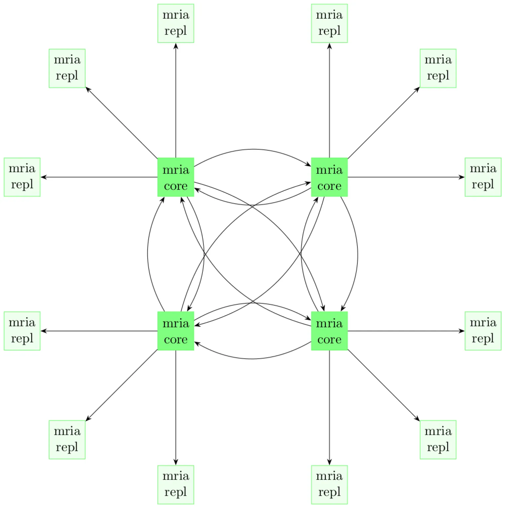

# Enable Core + Replicant Cluster

## Objective

- Configure EMQX cluster Core nodes through the `coreTemplate` field.
- Configure EMQX cluster Replicant nodes through the `replicantTemplate` field.

## Core and Replicant Nodes

Nodes in the EMQX cluster can have one of two roles: Core node and Replicant node.
* Core nodes are responsible for data persistence in the cluster and serve as the authoritative source for shared cluster state such as routing tables, MQTT client channels, retained messages, cluster configuration, alarms, Dashboard user credentials, etc.
* Replicant nodes are designed to be stateless and do not participate in database operations. Adding or deleting Replicant nodes will not affect the redundancy of the cluster data.

Communication between Core and Replicant nodes in a typical EMQX cluster is illustrated in the following diagram:

  <div style="text-align:center">
  
  </div>

For more information about the EMQX Core-Replicant architecture, refer to the [Cluster Architecture](https://docs.emqx.com/en/enterprise/latest/deploy/cluster/mria-introduction.html) documentation.

:::tip
There must be at least one Core node in the EMQX cluster. For the purpose of high availability, EMQX Operator recommends that the EMQX cluster have at least three Core nodes.
:::

## Configure EMQX Cluster

`apps.emqx.io/v2 EMQX` supports configuring Core nodes of the EMQX cluster through the `.spec.coreTemplate` field, and configuring Replicant nodes of the EMQX cluster through the `.spec.replicantTemplate` field.

- Save the following content as a YAML file and deploy using `kubectl apply`.

  ```yaml
  apiVersion: apps.emqx.io/v2
  kind: EMQX
  metadata:
    name: emqx
  spec:
    image: emqx/emqx:6.0
    config:
      data: |
        license {
          key = "..."
        }
    coreTemplate:
      spec:
        replicas: 2
        resources:
          requests:
            cpu: 250m
            memory: 512Mi
    replicantTemplate:
      spec:
        replicas: 3
        resources:
          requests:
            cpu: 250m
            memory: 1Gi
    dashboardServiceTemplate:
      spec:
        type: LoadBalancer
  ```

  > In the example above, the EMQX CR defines an EMQX cluster consisting of two Core nodes and three Replicant nodes.
  > Core nodes require a minimum of 512Mi of memory, and Replicant nodes require a minimum of 1Gi of memory. You can adjust these constraints according to the actual business load. Typically, Replicant nodes accept all client requests, so the resources required by Replicant nodes may be higher to accommodate many concurrent connections.

- Wait for the EMQX cluster to become ready.

  Check the status of the EMQX cluster with `kubectl get`, ensuring that `STATUS` is `Ready`. This may take some time.

  ```bash
  $ kubectl get emqx emqx
  NAME   STATUS   AGE
  emqx   Ready    10m
  ```

## Verify EMQX Cluster

You can view information about all nodes in the cluster by checking the `.status` field of the EMQX CR.

```bash
$ kubectl get emqx emqx -o json | jq .status.coreNodes
[
  {
    "name": "emqx@emqx-core-adcdef012-0.emqx-headless.default.svc.cluster.local",
    "podName": "emqx-core-adcdef012-0",
    "status": "running",
    "otpRelease": "27.2-3/15.2",
    "role": "core",
    "version": "6.0.0"
  },
  {
    "name": "emqx@emqx-core-adcdef012-1.emqx-headless.default.svc.cluster.local",
    "podName": "emqx-core-adcdef012-1",
    "status": "running",
    "otpRelease": "27.2-3/15.2",
    "role": "core",
    "version": "5.10.0"
  }
]
```


```bash
$ kubectl get emqx emqx -o json | jq .status.replicantNodes
[
  {
    "name": "emqx@10.244.4.56",
    "podName": "emqx-replicant-abcdef012-0",
    "status": "running",
    "otpRelease": "27.2-3/15.2",
    "role": "replicant",
    "version": "6.0.0"
  },
  {
    "name": "emqx@10.244.4.57",
    "podName": "emqx-replicant-abcdef012-1",
    "status": "running",
    "otpRelease": "27.2-3/15.2",
    "role": "replicant",
    "version": "6.0.0"
  },
  {
    "name": "emqx@10.244.4.58",
    "podName": "emqx-replicant-abcdef012-2",
    "status": "running",
    "otpRelease": "27.2-3/15.2",
    "role": "replicant",
    "version": "6.0.0"
  }
]
```
