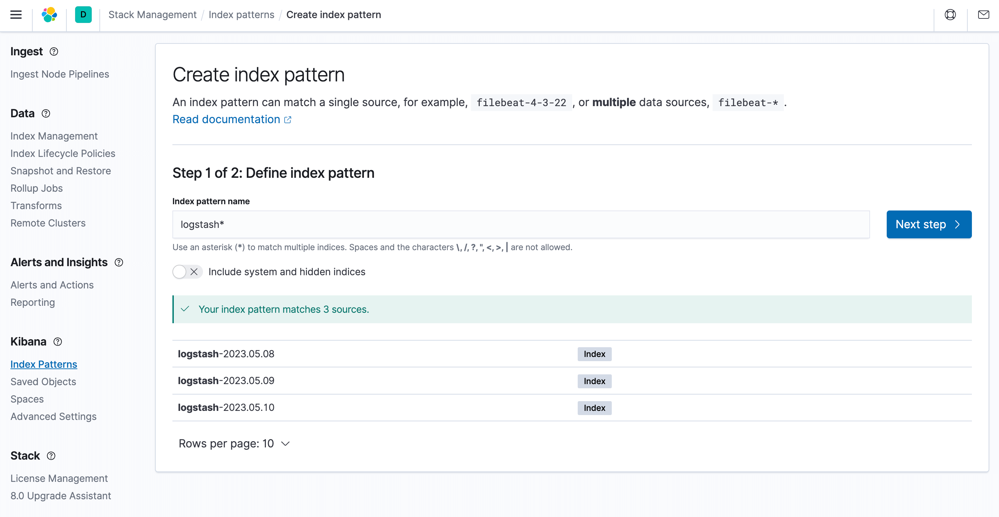
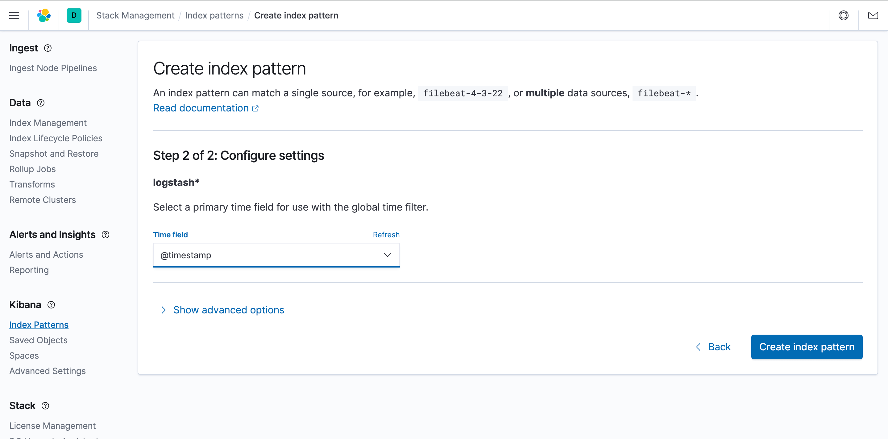
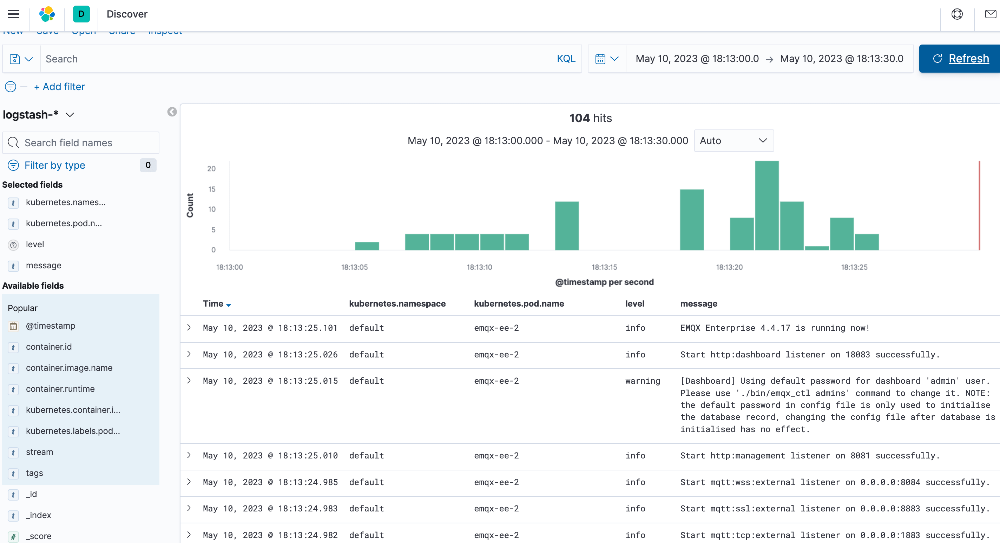

# Collect EMQX Logs In Kubernetes

## Task Target

Use ELK to collect EMQX cluster logs.

## Deploy ELK

ELK is the capitalized abbreviation of the three open source frameworks of Elasticsearch, Logstash, and Kibana, and is also known as the Elastic Stack. [Elasticsearch](https://www.elastic.co/elasticsearch/) is a near-real-time search platform framework based on Lucene, distributed, and interactive through Restful, also referred to as: es. [Logstash](https://www.elastic.co/logstash/) is the central data flow engine of ELK, which is used to collect data in different formats from different targets (files/data storage/MQ), and supports after filtering Output to different destinations (file/MQ/redis/elasticsearch/kafka, etc.). [Kibana](https://www.elastic.co/kibana/) can display es data on a page and provide real-time analysis functions.

### Deploy Elasticsearch On A Single Node

The method of deploying Elasticsearch on a single node is relatively simple. You can refer to the following YAML orchestration file to quickly deploy an Elasticsearch cluster.

- Save the following content as a YAML file and deploy it via the `kubectl apply` command

  ```yaml
  ---
  apiVersion: v1
  kind: Service
  metadata:
    name: elasticsearch-logging
    namespace: kube-logging
    labels:
      k8s-app: elasticsearch
      kubernetes.io/cluster-service: "true"
      addonmanager.kubernetes.io/mode: Reconcile
  spec:
    ports:
    - port: 9200
      protocol: TCP
      targetPort: db
    selector:
      k8s-app: elasticsearch
  ---
  apiVersion: v1
  kind: ServiceAccount
  metadata:
    name: elasticsearch-logging
    namespace: kube-logging
    labels:
      k8s-app: elasticsearch
      kubernetes.io/cluster-service: "true"
      addonmanager.kubernetes.io/mode: Reconcile
  ---
  kind: ClusterRole
  apiVersion: rbac.authorization.k8s.io/v1
  metadata:
    name: elasticsearch-logging
    labels:
      k8s-app: elasticsearch
      kubernetes.io/cluster-service: "true"
      addonmanager.kubernetes.io/mode: Reconcile
  rules:
  - apiGroups:
    - ""
    resources:
    - "services"
    - "namespaces"
    - "endpoints"
    verbs:
    - "get"
  ---
  kind: ClusterRoleBinding
  apiVersion: rbac.authorization.k8s.io/v1
  metadata:
    namespace: kube-logging
    name: elasticsearch-logging
    labels:
      k8s-app: elasticsearch
      kubernetes.io/cluster-service: "true"
      addonmanager.kubernetes.io/mode: Reconcile
  subjects:
  - kind: ServiceAccount
    name: elasticsearch-logging
    namespace: kube-logging
    apiGroup: ""
  roleRef:
    kind: ClusterRole
    name: elasticsearch
    apiGroup: ""
  ---
  apiVersion: apps/v1
  kind: StatefulSet
  metadata:
    name: elasticsearch-logging
    namespace: kube-logging
    labels:
      k8s-app: elasticsearch
      kubernetes.io/cluster-service: "true"
      addonmanager.kubernetes.io/mode: Reconcile
  spec:
    serviceName: elasticsearch-logging
    replicas: 1
    selector:
      matchLabels:
        k8s-app: elasticsearch
    template:
      metadata:
        labels:
          k8s-app: elasticsearch
      spec:
        serviceAccountName: elasticsearch-logging
        containers:
        - image: docker.io/library/elasticsearch:7.9.3
          name: elasticsearch-logging
            limits:
              cpu: 1000m
              memory: 1Gi
            requests:
              cpu: 100m
              memory: 500Mi
          ports:
          - containerPort: 9200
            name: db
            protocol: TCP
          - containerPort: 9300
            name: transport
            protocol: TCP
          volumeMounts:
          - name: elasticsearch-logging
            mountPath: /usr/share/elasticsearch/data/
          env:
          - name: "NAMESPACE"
            valueFrom:
              fieldRef:
                fieldPath: metadata.namespace
          - name: "discovery.type"
            value: "single-node"
          - name: ES_JAVA_OPTS
            value: "-Xms512m -Xmx2g"
        # Elasticsearch requires vm.max_map_count to be at least 262144.
        # If your OS already sets up this number to a higher value, feel free
        # to remove this init container.
        initContainers:
        - name: elasticsearch-logging-init
          image: alpine:3.6
          command: ["/sbin/sysctl", "-w", "vm.max_map_count=262144"]
          securityContext:
            privileged: true
        - name: increase-fd-ulimit
          image: busybox
          imagePullPolicy: IfNotPresent
          command: ["sh", "-c", "ulimit -n 65536"]
          securityContext:
            privileged: true
        - name: elasticsearch-volume-init
          image: alpine:3.6
          command:
            -chmod
            - -R
            - "777"
            - /usr/share/elasticsearch/data/
          volumeMounts:
          - name: elasticsearch-logging
            mountPath: /usr/share/elasticsearch/data/
    volumeClaimTemplates:
    - metadata:
        name: elasticsearch-logging
      spec:
        storageClassName: ${storageClassName}
        accessModes: [ "ReadWriteOnce" ]
        resources:
          requests:
            storage: 10Gi
  ```
  > The `storageClassName` field indicates the name of `StorageClass`, you can use the command `kubectl get storageclass` to get the StorageClass that already exists in the Kubernetes cluster, or you can create a StorageClass according to your own needs.

- Wait for the es to be ready, you can check the status of the es pod through the `kubectl get` command, make sure `STATUS` is `Running`

  ```bash
  $ kubectl get pod -n kube-logging -l "k8s-app=elasticsearch"
  NAME                        READY   STATUS             RESTARTS   AGE
  elasticsearch-0             1/1     Running            0          16m
  ```

### Deploy Kibana

This article uses `Deployment` to deploy Kibana to visualize the collected logs. `Service` uses `NodePort`.

- Save the following content as a YAML file and deploy it via the `kubectl apply` command

  ```yaml
  ---
  apiVersion: v1
  kind: Service
  metadata:
    name: kibana
    namespace: kube-logging
    labels:
      k8s-app: kibana
  spec:
    type: NodePort
    - port: 5601
      nodePort: 35601
      protocol: TCP
      targetPort: ui
    selector:
      k8s-app: kibana
  ---
  apiVersion: apps/v1
  kind: Deployment
  metadata:
    name: kibana
    namespace: kube-logging
    labels:
      k8s-app: kibana
      kubernetes.io/cluster-service: "true"
      addonmanager.kubernetes.io/mode: Reconcile
  spec:
    replicas: 1
    selector:
      matchLabels:
        k8s-app: kibana
    template:
      metadata:
        labels:
          k8s-app: kibana
        annotations:
          seccomp.security.alpha.kubernetes.io/pod: 'docker/default'
      spec:
        containers:
        -name: kibana
          image: docker.io/kubeimages/kibana:7.9.3
          resources:
            limits:
              cpu: 1000m
            requests:
              cpu: 100m
          env:
            # The access address of ES
            - name: ELASTICSEARCH_HOSTS
              value: http://elasticsearch-logging:9200
          ports:
          - containerPort: 5601
            name: ui
            protocol: TCP
  ```

- Wait for Kibana to be ready, you can check the status of the Kibana pod through the `kubectl get` command, make sure `STATUS` is `Running`

  ```bash
  $ kubectl get pod -n kube-logging -l "k8s-app=kibana"
  NAME                        READY   STATUS             RESTARTS   AGE
  kibana-b7d98644-48gtm       1/1     Running            0          17m
  ```

  Finally, in the browser, enter `http://{node_ip}:35601`, and you will enter the kibana web interface

### Deploy Filebeat

[Filebeat](https://www.elastic.co/beats/filebeat) is a lightweight eating log collection component, which is part of the Elastic Stack and can work seamlessly with Logstash, Elasticsearch and Kibana. Whether you're transforming or enriching logs and files with Logstash, throwing around some data analysis in Elasticsearch, or building and sharing dashboards in Kibana, Filebeat makes it easy to get your data where it matters most.

- Save the following content as a YAML file and deploy it via the `kubectl apply` command

  ```yaml
  ---
  apiVersion: v1
  kind: ConfigMap
  metadata:
    name: filebeat-config
    namespace: kube-system
    labels:
      k8s-app: filebeat
  data:
    filebeat.yml: |-
      filebeat.inputs:
      - type: container
        paths:
          # EMQX pod log file path
          - /var/log/containers/^emqx.*.log
        processors:
          - add_kubernetes_metadata:
              host: ${NODE_NAME}
              matchers:
              - logs_path:
                  logs_path: "/var/log/containers/"
      output.logstash:
        hosts: ["logstash:5044"]
        enabled: true
  ---
  apiVersion: v1
  kind: ServiceAccount
  metadata:
    name: filebeat
    namespace: kube-logging
    labels:
      k8s-app: filebeat
  ---
  apiVersion: rbac.authorization.k8s.io/v1beta1
  kind: ClusterRole
  metadata:
    name: filebeat
    labels:
      k8s-app: filebeat
  rules:
  - apiGroups: [""]
    resources:
    - namespaces
    - pods
    verbs:
    - get
    - watch
    - list
  ---
  apiVersion: rbac.authorization.k8s.io/v1beta1
  kind: ClusterRoleBinding
  metadata:
    name: filebeat
  subjects:
  - kind: ServiceAccount
    name: filebeat
    namespace: kube-logging
  roleRef:
    kind: ClusterRole
    name: filebeat
    apiGroup: rbac.authorization.k8s.io
  ---
  apiVersion: apps/v1
  kind: DaemonSet
  metadata:
    name: filebeat
    namespace: kube-logging
    labels:
      k8s-app: filebeat
  spec:
    selector:
      matchLabels:
        k8s-app: filebeat
    template:
      metadata:
        labels:
          k8s-app: filebeat
      spec:
        serviceAccountName: filebeat
        terminationGracePeriodSeconds: 30
        containers:
        - name: filebeat
          image: docker.io/kubeimages/filebeat:7.9.3
          args: [
            "-c", "/etc/filebeat.yml",
            "-e","-httpprof","0.0.0.0:6060"
          ]
          env:
          - name: NODE_NAME
            valueFrom:
              fieldRef:
                fieldPath: spec.nodeName
          - name: ELASTICSEARCH_HOST
            value: elasticsearch
          - name: ELASTICSEARCH_PORT
            value: "9200"
          securityContext:
            runAsUser: 0
          resources:
            limits:
              memory: 1000Mi
              cpu: 1000m
            requests:
              memory: 100Mi
              cpu: 100m
          volumeMounts:
          - name: config
            mountPath: /etc/filebeat.yml
            readOnly: true
            subPath: filebeat.yml
          - name: data
            mountPath: /usr/share/filebeat/data
          - name: varlibdockercontainers
            mountPath: /data/var/
            readOnly: true
          -name: varlog
            mountPath: /var/log/
            readOnly: true
          -name: timezone
            mountPath: /etc/localtime
        volumes:
        - name: config
          configMap:
            defaultMode: 0600
            name: filebeat-config
        - name: varlibdockercontainers
          hostPath:
            path: /data/var/
        -name: varlog
          hostPath:
            path: /var/log/
        - name: inputs
          configMap:
            defaultMode: 0600
            name: filebeat-inputs
        - name: data
          hostPath:
            path: /data/filebeat-data
            type: DirectoryOrCreate
        -name: timezone
          hostPath:
            path: /etc/localtime
  ```

- Wait for Filebeat to be ready, you can check the status of the Filebeat pod through the `kubectl get` command, make sure `STATUS` is `Running`

  ```bash
  $ kubectl get pod -n kube-logging -l "k8s-app=filebeat"
  NAME             READY   STATUS    RESTARTS   AGE
  filebeat-82d2b   1/1     Running   0          45m
  filebeat-vwrjn   1/1     Running   0          45m
  ```

### Deploy Logstash

This is mainly to combine business needs and secondary use of logs, so Logstash is added to clean logs, and you can adjust it according to your business needs.

- Save the following content as a YAML file and deploy it via the `kubectl apply` command

  ```yaml
  ---
  apiVersion: v1
  kind: Service
  metadata:
    name: logstash
    namespace: kube-system
  spec:
    ports:
    - port: 5044
      targetPort: beats
    selector:
      k8s-app: logstash
    clusterIP: None
  ---
  apiVersion: apps/v1
  kind: Deployment
  metadata:
    name: logstash
    namespace: kube-system
  spec:
    selector:
      matchLabels:
        k8s-app: logstash
    template:
      metadata:
        labels:
          k8s-app: logstash
      spec:
        containers:
        - image: docker.io/kubeimages/logstash:7.9.3
          name: logstash
          ports:
          - containerPort: 5044
            name: beats
          command:
          - logstash
          - '-f'
          - '/etc/logstash_c/logstash.conf'
          env:
          - name: "XPACK_MONITORING_ELASTICSEARCH_HOSTS"
            value: "http://elasticsearch-logging:9200"
          volumeMounts:
          - name: config-volume
            mountPath: /etc/logstash_c/
          - name: config-yml-volume
            mountPath: /usr/share/logstash/config/
          -name: timezone
            mountPath: /etc/localtime
          resources:
            limits:
              cpu: 1000m
              memory: 2048Mi
            requests:
              cpu: 512m
              memory: 512Mi
        volumes:
        - name: config-volume
          configMap:
            name: logstash-conf
            items:
            - key: logstash.conf
              path: logstash.conf
        -name: timezone
          hostPath:
            path: /etc/localtime
        - name: config-yml-volume
          configMap:
            name: logstash-yml
            items:
            - key: logstash.yml
              path: logstash.yml
  ---
  apiVersion: v1
  kind: ConfigMap
  metadata:
    name: logstash-conf
    namespace: kube-logging
    labels:
      k8s-app: logstash
  data:
    logstash.conf: |-
      input {
        beats {
          port => 5044
        }
      }
      filter {
        ruby {
          code => "
            ss = event.get('message').split(' ')
            len = ss. length()
            level = ''
            index = ''
            msg = ''
            if len == 0 || len < 2
              event.set('level','invaild')
              return
            end
            if ss[1][0] == '['
              l = ss[1].length()
              level = ss[1][1..l-2]
              index = 2
            else
              level = 'info'
              index = 0
            end
            event.set('level',level)
            for i in ss[index..len]
              msg = msg + i
              msg = msg + ' '
            end
            event.set('message',msg)
          "
        }
        if [level] == "invail" {
          drop {}
        }
      }
      output {
        elasticsearch {
          hosts => ["http://elasticsearch-logging:9200"]
          codec => json
          index => "logstash-%{+YYYY.MM.dd}"
        }
      }
  ---
  apiVersion: v1
  kind: ConfigMap
  metadata:
    name: logstash
    namespace: kube-logging
    labels:
      k8s-app: logstash
  data:
    logstash.yml: |-
      http.host: "0.0.0.0"
      xpack.monitoring.elasticsearch.hosts: http://elasticsearch-logging:9200
  ```

- Wait for Logstash to be ready, you can view the status of the Logstash pod through the `kubectl get` command, make sure `STATUS` is `Running`

  ```bash
  $ kubectl get pod -n kube-logging -l "k8s-app=logstash"
  NAME             READY   STATUS    RESTARTS   AGE
  filebeat-82d2b   1/1     Running   0          45m
  filebeat-vwrjn   1/1     Running   0          45m
  ```

## Deploy EMQX Cluster

To deploy EMQX cluster, please refer to the document [Deploy EMQX](../getting-started/getting-started.md)

## Verify Log Collection

- First log in to the Kibana interface, open the stack management module in the menu, click on the index management, you can find that there are already collected log indexes

  

- In order to be able to discover and view logs in Kibana, you need to set an index match, select index patterns, and click Create

  

  

- Finally verify whether the EMQX cluster logs are collected

  
