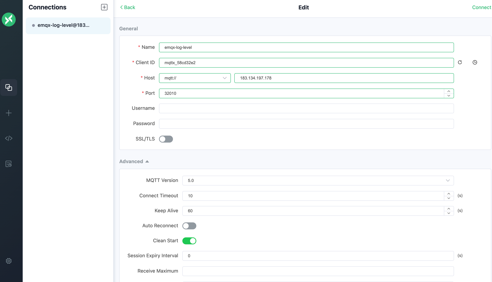
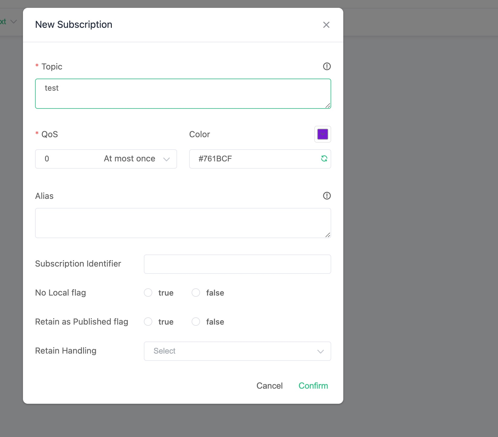
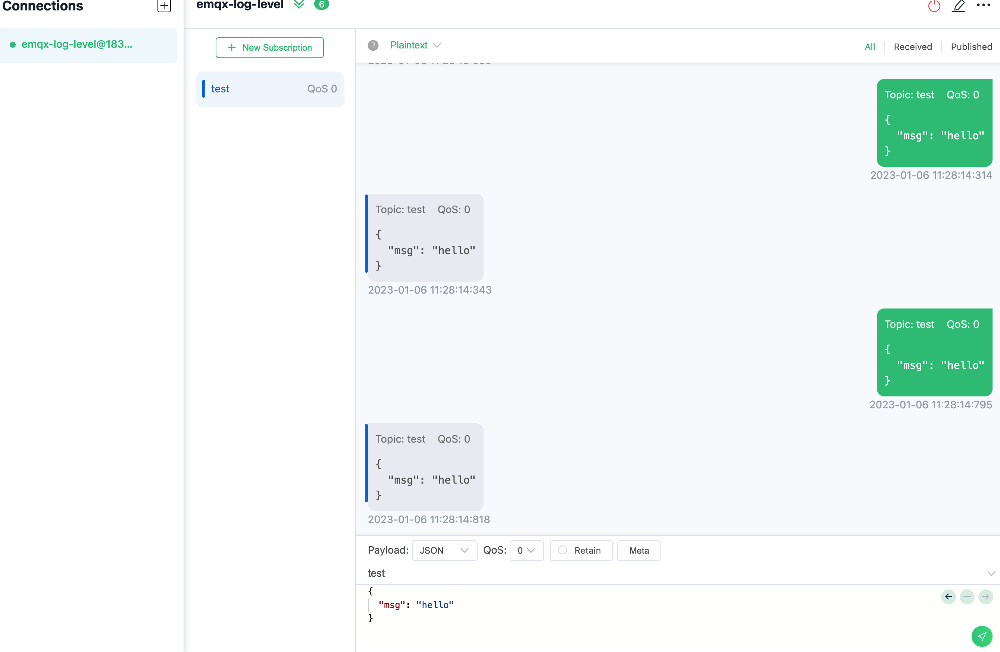
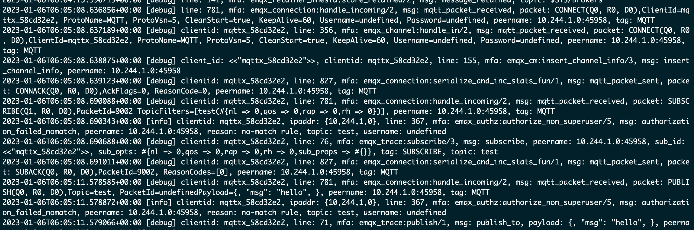

# Change EMQX Log Level

## Task target

How to configure the log level of EMQX cluster.

## Configure EMQX Cluster

Here are the relevant configurations for EMQX Custom Resource. You can choose the corresponding APIVersion based on the version of EMQX you wish to deploy. For specific compatibility relationships, please refer to [EMQX Operator Compatibility](../README.md):

:::: tabs type:card
::: tab v2alpha1

EMQX CRD supports the use of `.spec.bootstrapConfig` to configure the log level of the EMQX cluster. The configuration of bootstrapConfig can refer to the document: [bootstrapConfig](https://www.emqx.io/docs/en/v5.0/admin/cfg.html). This field is only allowed to be configured when creating an EMQX cluster, and does not support updating. 

:::tip

If you need to modify the cluster log level after creating EMQX, please modify it through EMQX Dashboard.

:::

```yaml
apiVersion: apps.emqx.io/v2alpha1
kind: EMQX
metadata:
  name: emqx
spec:
  image: emqx5.0
  bootstrapConfig: |
    log {
       console_handler {
          level  =  debug
        } 
    }
```

> The `.spec.bootstrapConfig` field configures the EMQX cluster log level to `debug`.

Save the above content as `emqx.yaml` and execute the following command to deploy the EMQX cluster:

```bash
$ kubectl apply -f emqx.yaml

emqx.apps.emqx.io/emqx created
```

Check the status of the EMQX cluster and make sure that `STATUS` is `Running`, which may take some time to wait for the EMQX cluster to be ready.

```bash
$ kubectl get emqx emqx

NAME   IMAGE      STATUS    AGE
emqx   emqx:5.0   Running   10m
```

:::
::: tab v1beta4

The corresponding CRD of EMQX Enterprise in EMQX Operator is EmqxEnterprise, and EmqxEnterprise supports configuring the log level of EMQX cluster through `.spec.template.spec.emqxContainer.emqxConfig` field. For the specific description of the emqxConfig field, please refer to: [emqxConfig](https://github.com/emqx/emqx-operator/blob/main-2.1/docs/en_US/reference/v1beta4-reference.md#emqxtemplatespec).

```yaml
apiVersion: apps.emqx.io/v1beta4
kind: EmqxEnterprise
metadata:
  name: emqx-ee
spec:
  template:
    spec:
      emqxContainer:
        image:
          repository: emqx/emqx-ee
          version: 4.4.14
        emqxConfig:
          log.level: debug
```

> The `.spec.template.spec.emqxContainer.emqxConfig` field configures the EMQX cluster log level to `debug`.

Save the above content as `emqx.yaml` and execute the following command to deploy the EMQX cluster:

```bash
$ kubectl apply -f emqx.yaml

emqxenterprise.apps.emqx.io/emqx-ee created
```

Check the status of the EMQX cluster and make sure that `STATUS` is `Running`, which may take some time to wait for the EMQX cluster to be ready.

```bash
$ kubectl get emqxenterprises

NAME      STATUS   AGE
emqx-ee   Running  8m33s
```

:::
::::

## Verify Log Level Change

Use MQTT X to connect to the EMQX cluster to send messages.

Click the button to create a new connection on the MQTT X page, and configure the EMQX cluster node information as shown in the figure. After configuring the connection information, click the connect button to connect to the EMQX cluster:



Then click the Subscribe button to create a new subscription, as shown in the figure, MQTT X has successfully connected to the EMQX cluster and successfully created the subscription:



After successfully connecting to the EMQX cluster and creating a subscription, we can send messages to the EMQX cluster, as shown in the following figure:



Use the command line to view EMQX cluster log information

```bash
kubectl logs emqx-core-0 -c emqx
```

The output is shown in the figure below:



From the figure, you can see the debug log information of connecting to the EMQX cluster using MQTT just now and sending messages.
