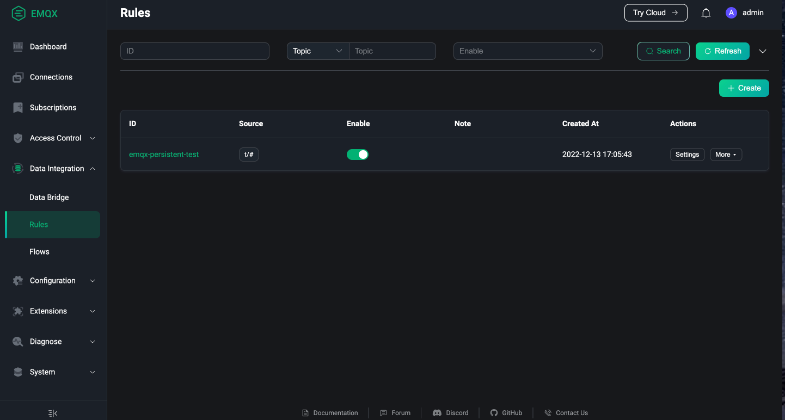

# Enable Persistence In EMQX Cluster

## Task Target

- Configure EMQX 4.x cluster persistence through `persistent` field.
- Configure EMQX 5.x cluster Core node persistence through `volumeClaimTemplates` field.

## Configure EMQX Cluster Persistence

The following is the relevant configuration of EMQX Custom Resource. You can choose the corresponding APIVersion according to the version of EMQX you want to deploy. For the specific compatibility relationship, please refer to [EMQX Operator Compatibility](../index.md):

:::: tabs type:card
::: tab apps.emqx.io/v2beta1

`apps.emqx.io/v2beta1 EMQX` supports configuration of EMQX cluster Core node persistence through `.spec.coreTemplate.spec.volumeClaimTemplates` field. The semantics and configuration of `.spec.coreTemplate.spec.volumeClaimTemplates` field are consistent with `PersistentVolumeClaimSpec` of Kubernetes, and its configuration can refer to the document: [PersistentVolumeClaimSpec](https://kubernetes.io/docs/reference/generated/kubernetes-api/v1.25/#persistentvolumeclaimspec-v1-core).

When the user configures the `.spec.coreTemplate.spec.volumeClaimTemplates` field, EMQX Operator will mount the `/opt/emqx/data` directory in the EMQX container to [StorageClass](https://kubernetes.io/docs/concepts/storage/storage-classes/) in the PV and PVC created, when the EMQX Pod is deleted, the PV and PVC will not be deleted, so as to achieve the purpose of saving EMQX runtime data. For more information about PV and PVC, refer to the document [Persistent Volumes](https://kubernetes.io/docs/concepts/storage/persistent-volumes/).

+ Save the following content as a YAML file and deploy it via the `kubectl apply` command

  ```yaml
  apiVersion: apps.emqx.io/v2beta1
  kind: EMQX
  metadata:
    name: emqx
  spec:
    image: emqx:5
    coreTemplate:
      spec:
        volumeClaimTemplates:
          storageClassName: standard
          resources:
            requests:
              storage: 20Mi
          accessModes:
            - ReadWriteOnce
        replicas: 3
    listenersServiceTemplate:
      spec:
        type: LoadBalancer
    dashboardServiceTemplate:
      spec:
        type: LoadBalancer
  ```

  > `storageClassName` field indicates the name of the StorageClass. You can use the command `kubectl get storageclass` to get the StorageClass that already exists in the Kubernetes cluster, or you can create a StorageClass according to your own needs.

+ Wait for EMQX cluster to be ready, you can check the status of the EMQX cluster through `kubectl get` command, please make sure `STATUS` is `Running`, this may take some time

  ```bash
  $ kubectl get emqx emqx
  NAME   IMAGE      STATUS    AGE
  emqx   emqx:5.1   Running   10m
  ```

+ Obtain the Dashboard External IP of the EMQX cluster and access the EMQX console

  EMQX Operator will create two EMQX Service resources, one is emqx-dashboard and the other is emqx-listeners, corresponding to EMQX console and EMQX listening port respectively.

  ```bash
  $ kubectl get svc emqx-dashboard -o json | jq '.status.loadBalancer.ingress[0].ip'

  192.168.1.200
  ```

  Access `http://192.168.1.200:18083` through a browser, and use the default username and password `admin/public` to login EMQX console.

:::
::: tab apps.emqx.io/v1beta4

`apps.emqx.io/v1beta4 EmqxEnterprise` supports configuring EMQX cluster persistence through the `.spec.persistent` field. The semantics and configuration of the `.spec.persistent` field are consistent with `PersistentVolumeClaimSpec` of Kubernetes, and its configuration can refer to the document: [PersistentVolumeClaimSpec](https://kubernetes.io/docs/reference/generated/kubernetes-api/v1.25/#persistentvolumeclaimspec-v1-core).

When the user configures the `.spec.persistent` field, EMQX Operator will mount the `/opt/emqx/data` directory in the EMQX container to [StorageClass](https://kubernetes.io/docs/concepts/storage/storage-classes/) in the PV and PVC created, when the EMQX Pod is deleted, the PV and PVC will not be deleted, so as to achieve the purpose of saving EMQX runtime data. For more information about PV and PVC, refer to the document [Persistent Volumes](https://kubernetes.io/docs/concepts/storage/persistent-volumes/).

+ Save the following content as a YAML file and deploy it via the `kubectl apply` command

  ```yaml
  apiVersion: apps.emqx.io/v1beta4
  kind: EmqxEnterprise
  metadata:
    name: emqx-ee
  spec:
    persistent:
      metadata:
        name: emqx-ee
      spec:
        storageClassName: standard
        resources:
          requests:
            storage: 20Mi
        accessModes:
          - ReadWriteOnce
    template:
      spec:
        emqxContainer:
          image:
            repository: emqx/emqx-ee
            version: 4.4.14
    serviceTemplate:
      spec:
        type: LoadBalancer
  ```

  > The `storageClassName` field indicates the name of the StorageClass. You can use the command `kubectl get storageclass` to get the StorageClass that already exists in the Kubernetes cluster, or you can create a StorageClass according to your own needs.

+ Wait for the EMQX cluster to be ready, you can check the status of the EMQX cluster through `kubectl get` command, please make sure `STATUS` is `Running`, this may take some time

  ```bash
  $ kubectl get emqxenterprises
  NAME      STATUS   AGE
  emqx-ee   Running  8m33s
  ```

+ Obtain the External IP of EMQX cluster and access EMQX console

  ```bash
  $ kubectl get svc emqx-ee -o json | jq '.status.loadBalancer.ingress[0].ip'

  192.168.1.200
  ```
  Access `http://192.168.1.200:18083` through a browser, and use the default username and password `admin/public` to login EMQX console.

:::
::::

## Verify EMQX Cluster Persistence

:::tip
The screenshots of the Dashboard below are from EMQX 5, [EMQX 4 Dashboard](https://docs.emqx.com/en/enterprise/v4.4/getting-started/dashboard-ee.html#dashboard) also supports the corresponding function, please operate by yourself.
:::

Verification scheme: 1) Passed in the old EMQX Dashboard creates a test rule; 2) Deletes the old cluster; 3) Recreates the EMQX cluster,and checks whether the previously created rule exists through the Dashboard.

+ Access EMQX Dashboard through browser to create test rules

  :::: tabs type:card
  ::: tab apps.emqx.io/v2beta1

  ```bash
  external_ip=$(kubectl get svc emqx-listeners -o json | jq '.status.loadBalancer.ingress[0].ip')
  ```
  :::
  ::: tab apps.emqx.io/v1beta4

  ```bash
  external_ip=$(kubectl get svc emqx-ee -o json | jq '.status.loadBalancer.ingress[0].ip')
  ```
  :::
  ::::

  Login EMQX Dashboard by accessing `http://${external_ip}:18083`, and click Data Integration → Rules to enter the page for creating rules. Let’s first click the button to add an action Add a response action for this rule, and then click Create to generate a rule, as shown in the following figure:

  

  When our rule is successfully created, a rule record will appear on the page with the rule ID: emqx-persistent-test, as shown in the figure below:

  

+ delete old EMQX cluster

  Execute the following command to delete the EMQX cluster:

  ```bash
  $ kubectl delete -f emqx.yaml

  emqx.apps.emqx.io "emqx" deleted
  # emqxenterprise.apps.emqx.io "emqx" deleted
  ```

  > emqx-persistent.yaml is the YAML file used to deploy the EMQX cluster for the first time in this article, and this file does not need to be changed.

+ Recreate the EMQX cluster

  Execute the following command to recreate the EMQX cluster:

  ```bash
  $ kubectl apply -f emqx.yaml

  emqx.apps.emqx.io/emqx created
  # emqxenterprise.apps.emqx.io/emqx created
  ```

  Wait for the EMQX cluster to be ready, and then access the EMQX Dashboard through the browser to check whether the previously created rules exist, as shown in the following figure:

  

  It can be seen from the figure that the rule emqx-persistent-test created in the old cluster still exists in the new cluster, which means that the persistence we configured is in effect.
