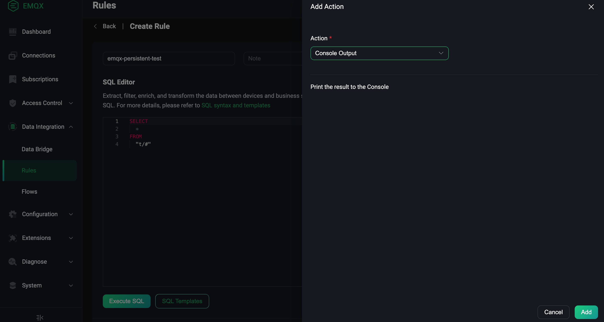
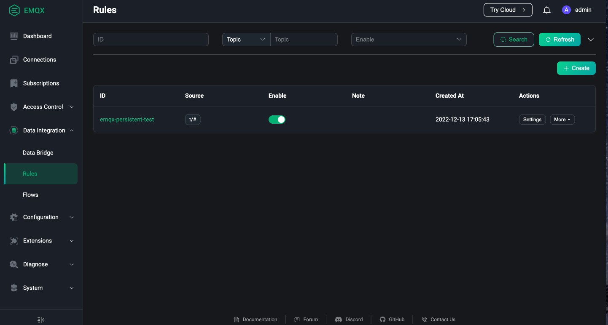
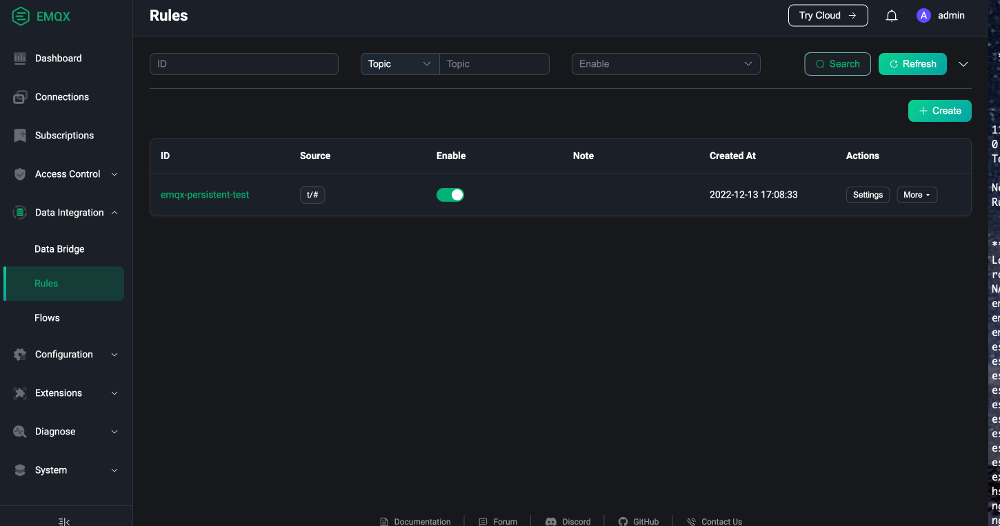

# Enable Persistence in EMQX Cluster

## Objective

Configure persistence for the set of Core nodes of an EMQX cluster through the `volumeClaimTemplates` field.

## Configure EMQX Cluster Persistence

EMQX CRD `apps.emqx.io/v2` supports configuring persistence of each core node data through `.spec.coreTemplate.spec.volumeClaimTemplates`. The definition and semantics of the `.spec.coreTemplate.spec.volumeClaimTemplates` field are consistent with [`PersistentVolumeClaimSpec`](https://kubernetes.io/docs/reference/generated/kubernetes-api/v1.32/#persistentvolumeclaimspec-v1-core) defined in the Kubernetes API.

When you specify the `.spec.coreTemplate.spec.volumeClaimTemplates` field, EMQX Operator configures the `/opt/emqx/data` volume of the EMQX container to be backed by a Persistent Volume Claim (PVC), which provisions a Persistent Volume (PV) using a specified [StorageClass](https://kubernetes.io/docs/concepts/storage/storage-classes/). As a result, when an EMQX Pod is deleted, the associated PV and PVC are retained, preserving EMQX runtime data.

For more details about PVs and PVCs, refer to the [Persistent Volumes](https://kubernetes.io/docs/concepts/storage/persistent-volumes/) documentation.

+ Save the following content as a YAML file and deploy it using `kubectl apply`.

  ```yaml
  apiVersion: apps.emqx.io/v2
  kind: EMQX
  metadata:
    name: emqx
  spec:
    image: emqx/emqx:6.0
    config:
      data: |
        license {
          key = "..."
        }
    coreTemplate:
      spec:
        volumeClaimTemplates:
          storageClassName: standard
          resources:
            requests:
              storage: 20Mi
          accessModes:
            - ReadWriteOnce
        replicas: 3
    listenersServiceTemplate:
      spec:
        type: LoadBalancer
    dashboardServiceTemplate:
      spec:
        type: LoadBalancer
  ```

  > The `storageClassName` field specifies the name of the StorageClass. You can use the command `kubectl get storageclass` to list the StorageClasses that already exist in the Kubernetes cluster, or you can create a StorageClass according to your needs.

+ Wait for the EMQX cluster to become ready.

  Check the status of the EMQX cluster with `kubectl get` and ensure that `STATUS` is `Ready`. This may take some time.

  ```bash
  $ kubectl get emqx emqx
  NAME   STATUS   AGE
  emqx   Ready    10m
  ```

## Verify Persistence

+ Create a test rule in the EMQX Dashboard.

  ```bash
  external_ip=$(kubectl get svc emqx-dashboard -o json | jq -r '.status.loadBalancer.ingress[0].ip')
  ```

  1. Log in to the EMQX Dashboard at `http://${external_ip}:18083`.
  2. Navigate to _Data Integration_ → _Rules_ to create a new rule.
  3. Attach a simple action to this rule.
  4. Click _Create_ to generate a rule, as shown in the following figure:

  

  Once the rule is created successfully, a corresponding record with `emqx-persistent-test` ID will appear on the page, as shown in the figure below:

  

+ Delete the old EMQX cluster.

  Run the following command to delete the EMQX cluster, where `emqx.yaml` is the file you used to deploy the cluster earlier:

  ```bash
  $ kubectl delete -f emqx.yaml
  emqx.apps.emqx.io "emqx" deleted
  ```

+ Re-deploy the EMQX cluster.

  Run the following command to re-deploy the EMQX cluster:

  ```bash
  $ kubectl apply -f emqx.yaml
  emqx.apps.emqx.io/emqx created
  ```

  Wait for the EMQX cluster to be ready. Access the EMQX Dashboard through your browser to verify that the previously created rule still exists, as shown in the following figure:

  

  The `emqx-persistent-test` rule created in the old cluster still exists in the new cluster, which confirms that the persistence configuration is working correctly.
