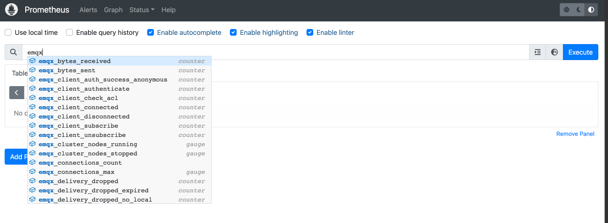
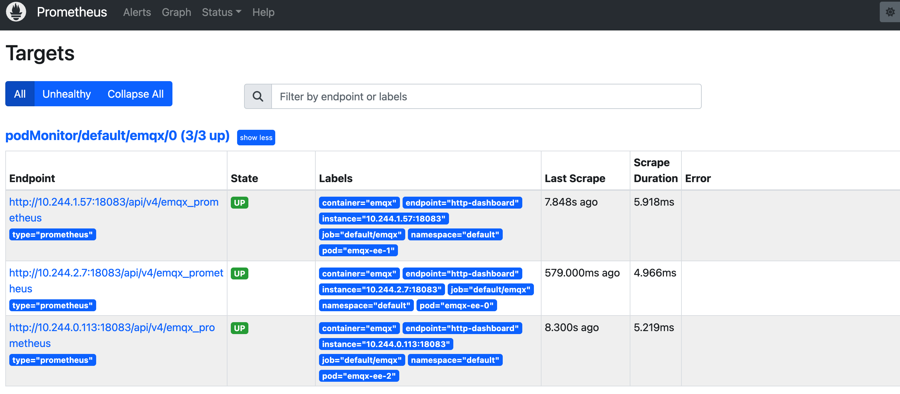
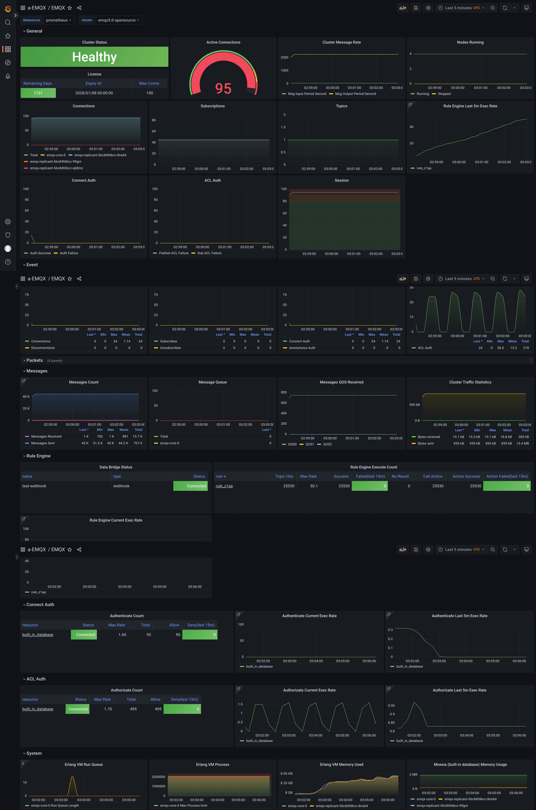

# Monitor EMQX cluster by Prometheus and Grafana

## Task Target
Deploy [EMQX Exporter](https://github.com/emqx/emqx-exporter) and monitor EMQX cluster by Prometheus and Grafana.

## Deploy Prometheus and Grafana

Prometheus' deployment documentation can refer to [Prometheus](https://github.com/prometheus-operator/prometheus-operator)
Grafana' deployment documentation can refer to [Grafana](https://grafana.com/docs/grafana/latest/setup-grafana/installation/kubernetes/)

## Deploy EMQX Cluster

Here are the relevant configurations for EMQX Custom Resource. You can choose the corresponding APIVersion based on the version of EMQX you wish to deploy. For specific compatibility relationships, please refer to [EMQX Operator Compatibility](../index.md):

:::: tabs type:card
::: tab v2alpha1

EMQX supports exposing indicators through the http interface. For all statistical indicators under the cluster, please refer to the document: [HTTP API](https://www.emqx.io/docs/en/v5.0/observability/prometheus.html)

```yaml
apiVersion: apps.emqx.io/v2alpha1
kind: EMQX
metadata:
  name: emqx
spec:
  image: emqx:5.0
  coreTemplate:
    spec:
      ports:
        # prometheus monitor requires the pod must name the target port
        - name: dashboard
          containerPort: 18083
  replicantTemplate:
    spec:
      ports:
        - name: dashboard
          containerPort: 18083
```

Save the above content as `emqx.yaml` and execute the following command to deploy the EMQX cluster:

```bash
$ kubectl apply -f emqx.yaml

emqx.apps.emqx.io/emqx created
```

Check the status of the EMQX cluster and make sure that `STATUS` is `Running`, which may take some time to wait for the EMQX cluster to be ready.

```bash
$ kubectl get emqx emqx

NAME   IMAGE      STATUS    AGE
emqx   emqx:5.0   Running   10m
```

:::
::: tab v1beta4

EMQX supports exposing indicators through the http interface. For all statistical indicators under the cluster, you can refer to the document: [HTTP API](https://www.emqx.io/docs/en/v4.4/advanced/http-api.html#%E7%BB%9F%E8%AE%A1%E6%8C%87%E6%A0%87)

```yaml
apiVersion: apps.emqx.io/v1beta4
kind: EmqxEnterprise
metadata:
  name: emqx-ee
spec:
  template:
    spec:
      emqxContainer:
        image:
          repository: emqx/emqx-ee
          version: 4.4.16
        ports:
          # prometheus monitor requires the pod must name the target port
          - name: dashboard
            containerPort: 18083
```

Save the above content as `emqx.yaml` and execute the following command to deploy the EMQX cluster:

```bash
$ kubectl apply -f emqx.yaml

emqxenterprise.apps.emqx.io/emqx-ee created
```

Check the status of the EMQX cluster and make sure that `STATUS` is `Running`, which may take some time to wait for the EMQX cluster to be ready.

```bash
$ kubectl get emqxenterprises

NAME      STATUS   AGE
emqx-ee   Running  8m33s
```

If you are deploying EMQX 4.4 open-source, you need to enable plugin `emqx_prometheus` by `EmqxPlugin` CRD:

```shell
cat << "EOF" | kubectl apply -f -
apiVersion: apps.emqx.io/v1beta4
kind: EmqxPlugin
metadata:
  name: emqx-prometheus
spec:
  selector:
    # EMQX pod labels
    ${replace_with_your_emqx_pod_label} : label_value
  pluginName: emqx_prometheus
```

:::
::::

## Create API secret
emqx-exporter and Prometheus will pull metrics from EMQX dashboard API, so you need to sign in to dashboard to create an API secret.

Note that it is different to create a secret between EMQX 5 and EMQX 4.4 on the dashboard.
* **EMQX 5** create a new [API KEY](https://www.emqx.io/docs/en/v5.0/dashboard/system.html#api-keys).
* **EMQX 4.4** create a new `User` instead of `Application`

## Deploy [EMQX Exporter](https://github.com/emqx/emqx-exporter)

The `emqx-exporter` is designed to expose partial metrics that are not included in the EMQX Prometheus API. It is compatible with EMQX 4.4 and EMQX 5, both open-source and enterprise.

```yaml
apiVersion: v1
kind: Service
metadata:
  labels:
    app: emqx-exporter
  name: emqx-exporter-service
spec:
  ports:
    - name: metrics
      port: 8085
      targetPort: metrics
  selector:
    app: emqx-exporter
---
apiVersion: apps/v1
kind: Deployment
metadata:
  name: emqx-exporter
  labels:
    app: emqx-exporter
spec:
  selector:
    matchLabels:
      app: emqx-exporter
  replicas: 1
  template:
    metadata:
      labels:
        app: emqx-exporter
    spec:
      securityContext:
        runAsUser: 1000
      containers:
        - name: exporter
          image: emqx-exporter:latest
          imagePullPolicy: IfNotPresent
          args:
            # "emqx-dashboard-service-name" is the service name that creating by operator for exposing 18083 port
            - --emqx.nodes=${emqx-dashboard-service-name}:18083
            - --emqx.auth-username=${paste_your_new_api_key_here}
            - --emqx.auth-password=${paste_your_new_secret_here}
          securityContext:
            allowPrivilegeEscalation: false
            runAsNonRoot: true
          ports:
            - containerPort: 8085
              name: metrics
              protocol: TCP
          resources:
            limits:
              cpu: 100m
              memory: 100Mi
            requests:
              cpu: 100m
              memory: 20Mi
```

> Set the arg "--emqx.nodes" to the service name that creating by operator for exposing 18083 port. Check out the service name by call `kubectl get svc`.

Save the above content as `emqx-exporter.yaml`, replace `--emqx.auth-username` and `--emqx.auth-password` with your new creating API secret, then execute the following command to deploy the emqx-exporter:

```bash
kubectl apply -f emqx-exporter.yaml
```

Check the status of emqx-exporter pod。
```bash
$ kubectl get po -l="app=emqx-exporter"

NAME      STATUS   AGE
emqx-exporter-856564c95-j4q5v   Running  8m33s
```

## Configure Prometheus Monitor
Prometheus-operator uses [PodMonitor](https://github.com/prometheus-operator/prometheus-operator/blob/main/Documentation/design.md#podmonitor) and [ServiceMonitor](https://github.com/prometheus-operator/prometheus-operator/blob/main/Documentation/design.md#servicemonitor) CRD to define how to monitor a set of pods or services dynamically.

:::: tabs type:card
::: tab v2alpha1

```yaml
apiVersion: monitoring.coreos.com/v1
kind: PodMonitor
metadata:
  name: emqx
  labels:
    app.kubernetes.io/name: emqx
spec:
  podMetricsEndpoints:
    - interval: 5s
      path: /api/v5/prometheus/stats
      # the name of emqx dashboard containerPort
      port: dashboard
      relabelings:
        - action: replace
          # user-defined cluster name, requires unique
          replacement: emqx5
          targetLabel: cluster
        - action: replace
          # fix value, don't modify
          replacement: emqx
          targetLabel: from
        - action: replace
          # fix value, don't modify
          sourceLabels: ['pod']
          targetLabel: "instance"
  selector:
    matchLabels:
      # the label is the same as the label of emqx pod
      apps.emqx.io/instance: emqx
      apps.emqx.io/managed-by: emqx-operator
  namespaceSelector:
    matchNames:
      # modify the namespace if your EMQX cluster deployed in other namespace
      #- default
---
apiVersion: monitoring.coreos.com/v1
kind: ServiceMonitor
metadata:
  name: emqx-exporter
  labels:
    app: emqx-exporter
spec:
  selector:
    matchLabels:
      # the label is the same as the label of emqx exporter svc
      app: emqx-exporter
  endpoints:
    - port: metrics
      interval: 5s
      path: /metrics
      relabelings:
        - action: replace
          # user-defined cluster name, requires unique
          replacement: emqx5
          targetLabel: cluster
        - action: replace
          # fix value, don't modify
          replacement: exporter
          targetLabel: from
        - action: replace
          # fix value, don't modify
          sourceLabels: ['pod']
          regex: '(.*)-.*-.*'
          replacement: $1
          targetLabel: "instance"
        - action: labeldrop
          # fix value, don't modify
          regex: 'pod'
  namespaceSelector:
    matchNames:
      # modify the namespace if your exporter deployed in other namespace
      #- default
```

<p> `path` indicates the path of the indicator collection interface. In EMQX 5, the path is: `/api/v5/prometheus/stats`. `selector.matchLabels` indicates the label of the matching Pod: `apps.emqx.io/instance: emqx`.</p>
<p> The value of targetLabel `cluster` represents the name of current cluster, make sure its uniqueness. </p>

:::
::: tab v1beta4

```yaml
apiVersion: monitoring.coreos.com/v1
kind: PodMonitor
metadata:
  name: emqx
  labels:
    app.kubernetes.io/name: emqx
spec:
  podMetricsEndpoints:
  - interval: 5s
    params:
      type:
        - prometheus
    path: /api/v4/emqx_prometheus
    # the name of emqx dashboard containerPort
    port: dashboard
    relabelings:
      - action: replace
        # user-defined cluster name, requires unique
        replacement: emqx4
        targetLabel: cluster
      - action: replace
        # fix value, don't modify
        replacement: emqx
        targetLabel: from
      - action: replace
        # fix value, don't modify
        sourceLabels: ['pod']
        targetLabel: "instance"
  selector:
    matchLabels:
      # the label is the same as the label of emqx pod
      apps.emqx.io/instance: emqx
      apps.emqx.io/managed-by: emqx-operator
  namespaceSelector:
    matchNames:
      # modify the namespace if your EMQX cluster deployed in other namespace
      #- default
---
apiVersion: monitoring.coreos.com/v1
kind: ServiceMonitor
metadata:
  name: emqx-exporter
  labels:
    app: emqx-exporter
spec:
  selector:
    matchLabels:
      # the label in emqx exporter svc
      app: emqx-exporter
  endpoints:
    - port: metrics
      interval: 5s
      path: /metrics
      relabelings:
        - action: replace
          # user-defined cluster name, requires unique
          replacement: emqx4
          targetLabel: cluster
        - action: replace
          # fix value, don't modify
          replacement: exporter
          targetLabel: from
        - action: replace
          # fix value, don't modify
          sourceLabels: ['pod']
          regex: '(.*)-.*-.*'
          replacement: $1
          targetLabel: "instance"
        - action: labeldrop
          # fix value, don't modify
          regex: 'pod'
  namespaceSelector:
    matchNames:
      # modify the namespace if your exporter deployed in other namespace
      #- default
```

> `path` indicates the path of the indicator collection interface. In EMQX 4, the path is: `/api/v4/emqx_prometheus`. `selector.matchLabels` indicates the label of the matching Pod: `apps.emqx.io/instance: emqx-ee`.
> The value of targetLabel `cluster` represents the name of current cluster, make sure its uniqueness.

:::
::::

Save the above content as `monitor.yaml` and execute the following command:

```bash
$ kubectl apply -f monitor.yaml
```

## View EMQX Indicators on Prometheus

Open the Prometheus interface, switch to the Graph page, and enter `emqx` to display as shown in the following figure:



Switch to the **Status** -> **Targets** page, the following figure is displayed, and you can see all monitored EMQX Pod information in the cluster:



## Import Grafana Templates
Import all dashboard [templates](https://github.com/emqx/emqx-exporter/tree/main/config/grafana-template). Open the main dashboard **EMQX** and enjoy yourself!


