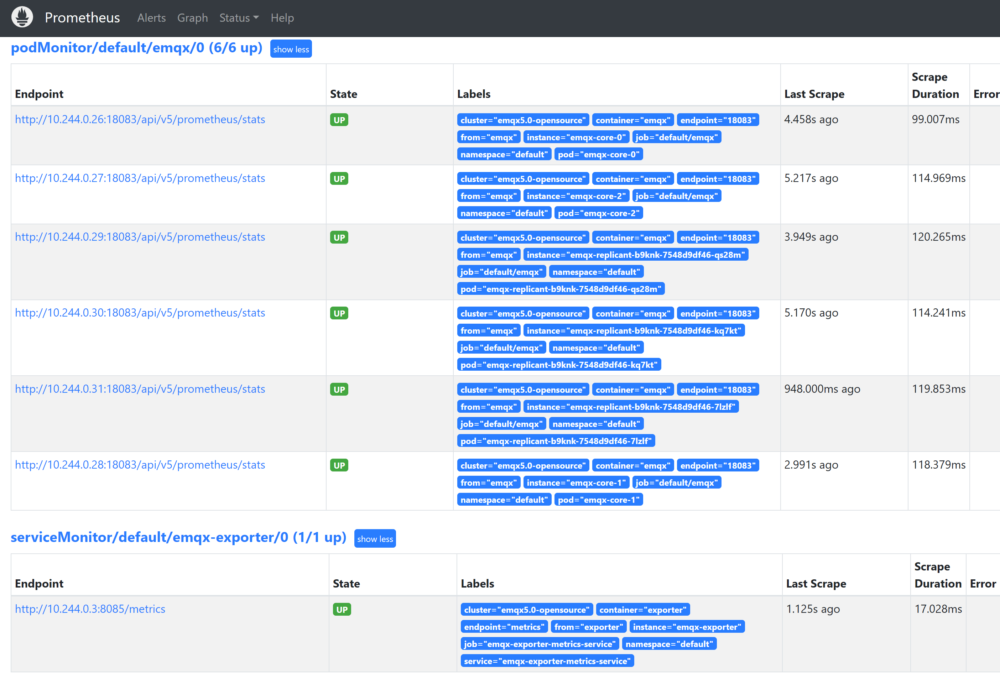

# Monitor EMQX cluster by Prometheus

## Task Target

How to monitor EMQX cluster through Prometheus.

## Deploy Prometheus

Prometheus deployment documentation can refer to: [Prometheus](https://github.com/prometheus-operator/prometheus-operator)

## Deploy EMQX Cluster

Here are the relevant configurations for EMQX Custom Resource. You can choose the corresponding APIVersion based on the version of EMQX you wish to deploy. For specific compatibility relationships, please refer to [EMQX Operator Compatibility](../README.md):

:::: tabs type:card
::: tab v2alpha1

EMQX supports exposing indicators through the http interface. For all statistical indicators under the cluster, please refer to the document: [HTTP API](https://www.emqx.io/docs/en/v5.0/observability/prometheus.html)

```yaml
apiVersion: apps.emqx.io/v2alpha1
kind: EMQX
metadata:
  name: emqx
spec:
  image: emqx:5.0
  imagePullPolicy: IfNotPresent    
  coreTemplate:
    spec:
      ports:
        - name: http-dashboard
          containerPort: 18083
  replicantTemplate:
    spec:
      ports:
        - name: http-dashboard
          containerPort: 18083
```

Save the above content as `emqx.yaml` and execute the following command to deploy the EMQX cluster:

```bash
$ kubectl apply -f emqx.yaml

emqx.apps.emqx.io/emqx created
```

Check the status of the EMQX cluster and make sure that `STATUS` is `Running`, which may take some time to wait for the EMQX cluster to be ready.

```bash
$ kubectl get emqx emqx

NAME   IMAGE      STATUS    AGE
emqx   emqx:5.0   Running   10m
```


:::
::: tab v1beta4

EMQX supports exposing indicators through the http interface. For all statistical indicators under the cluster, you can refer to the document: [HTTP API](https://www.emqx.io/docs/en/v4.4/advanced/http-api.html#%E7%BB%9F%E8%AE%A1%E6%8C%87%E6%A0%87)

```yaml
apiVersion: apps.emqx.io/v1beta4
kind: EmqxEnterprise
metadata:
  name: emqx-ee
spec:
  template:
    spec:
      emqxContainer:
        image: 
          repository: emqx/emqx-ee
          version: 4.4.14
        ports:
          - name: http-management
            containerPort: 8081
```

Save the above content as `emqx.yaml` and execute the following command to deploy the EMQX cluster:

```bash
$ kubectl apply -f emqx.yaml

emqxenterprise.apps.emqx.io/emqx-ee created
```

Check the status of the EMQX cluster and make sure that `STATUS` is `Running`, which may take some time to wait for the EMQX cluster to be ready.

```bash
$ kubectl get emqxenterprises

NAME      STATUS   AGE
emqx-ee   Running  8m33s
```


:::
::::

## Configure Prometheus Monitor

A PodMonitor Custom Resource Definition (CRD) allows to declaratively define how a dynamic set of services should be monitored. Use label selection to define which services are selected to monitor with the desired configuration, and its documentation can be referred to: [PodMonitor](https://github.com/prometheus-operator/prometheus-operator/blob/main/Documentation/design.md#podmonitor)

:::: tabs type:card
::: tab v2alpha1

```yaml
apiVersion: monitoring.coreos.com/v1
kind: PodMonitor
metadata:
   name: emqx
   namespace: default
   labels:
     app.kubernetes.io/name: emqx
spec:
   jobLabel: emqx-scraping
   namespaceSelector:
     matchNames:
     - default
   podMetricsEndpoints:
   - basicAuth:
       password:
         key: password
         name: emqx-basic-auth
       username:
         key: username
         name: emqx-basic-auth
     interval: 10s
     params:
       type:
       -prometheus
     path: /api/v5/prometheus/stats
     port: http-dashboard
     scheme: http
   selector:
     matchLabels:
       apps.emqx.io/instance: emqx
```

> `path` indicates the path of the indicator collection interface. In EMQX 5, the path is: `/api/v5/prometheus/stats`. `selector.matchLabels` indicates the label of the matching Pod: `apps.emqx.io/instance: emqx`.

:::
::: tab v1beta4

```yaml
apiVersion: monitoring.coreos.com/v1
kind: PodMonitor
metadata:
   name: emqx
   namespace: default
   labels:
     app.kubernetes.io/name: emqx
spec:
   jobLabel: emqx-scraping
   namespaceSelector:
     matchNames:
     - default
   podMetricsEndpoints:
   - basicAuth:
       password:
         key: password
         name: emqx-basic-auth
       username:
         key: username
         name: emqx-basic-auth
     interval: 10s
     params:
       type:
       -prometheus
     path: /api/v4/emqx_prometheus
     port: http-management
     scheme: http
   selector:
     matchLabels:
       apps.emqx.io/instance: emqx-ee
```

> `path` indicates the path of the indicator collection interface. In EMQX 4, the path is: `/api/v4/emqx_prometheus`. `selector.matchLabels` indicates the label of the matching Pod: `apps.emqx.io/instance: emqx-ee`.

:::
::::

Save the above content as `monitor.yaml` and execute the following command:

```bash
$ kubectl apply -f monitor.yaml
```

Use basicAuth to provide Monitor with password and account information for accessing EMQX interface

```yaml
apiVersion: v1
kind: Secret
metadata:
   name: emqx-basic-auth
   namespace: default
type: kubernetes.io/basic-auth
stringData:
   username: admin
   password: public
```

Save the above content as `secret.yaml` and create a Secret

```bash
$ kubectl apply -f secret.yaml
```

## View EMQX Indicators on Prometheus

Open the Prometheus interface, switch to the Graph page, and enter `emqx` to display as shown in the following figure:


Switch to the **Status** -> **Targets** page, the following figure is displayed, and you can see all monitored EMQX Pod information in the cluster:


