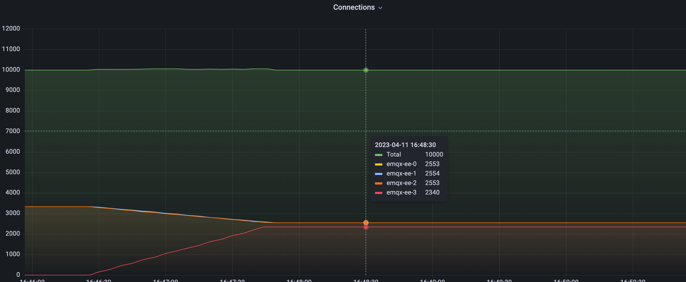

# Rebalancing MQTT connections (EMQX Enterprise)

## Task target

How to rebalance MQTT connections.

## Why Need Rebalancing

Cluster load rebalancing is the act of forcibly migrating client connections and sessions from one set of nodes to another. It will automatically calculate the number of connections that need to be migrated to achieve node balance, and then migrate the corresponding number of connections and sessions from high-load nodes to low-load nodes, thereby achieving load balancing between nodes. This operation is usually required to achieve balance after a new join or restart of a node.

The value of rebalancing mainly has the following two points:

- Improve system scalability: Since the MQTT connection is a long connection based on the TCP/IP protocol, when the cluster expands, the connection on the old node will not be automatically migrated to the new node. If you want the new node to carry part of the load on the old node, you can smoothly migrate the load on the old node to the new node through rebalancing, so that the load of the entire cluster is more balanced, and the throughput, response speed and resources of the system are improved. Utilization, making the system scale better.

- Reduce operation and maintenance costs: If the load of some nodes in the system is too high or too low, these nodes need to be adjusted manually, and through rebalancing, the load of nodes can be automatically adjusted to reduce operation and maintenance costs.

For EMQX cluster load rebalancing, please refer to the document: [Rebalancing](https://docs.emqx.com/en/enterprise/v4.4/advanced/rebalancing.html#rebalancing).

:::tip

The cluster load rebalancing function is only available in EMQX Enterprise  4.4.12.

:::

- How to use rebalancing

The corresponding CRD of the cluster rebalancing in EMQX Operator is `Rebalance`, and its example is as follows:

```yaml
apiVersion: apps.emqx.io/v1beta4
kind: Rebalance
metadata:
   name: rebalance-sample
spec:
   instanceName: emqx-ee
   rebalanceStrategy:
     connEvictRate: 10
     sessEvictRate: 10
     waitTakeover: 10
     waitHealthCheck: 10
     absConnThreshold: 100
     absSessThreshold: 100
     relConnThreshold: "1.1"
     relSessThreshold: "1.1"
```

> For Rebalance configuration, please refer to the document: [Rebalance reference](../reference/v1beta4-reference.md#rebalancestrategy).

## Test rebalancing of EMQX Enterprise

- Before Rebalancing, the cluster load

Before Rebalancing, we built a cluster with unbalanced load. And use Grafana + Prometheus to monitor the load of EMQX cluster:


It can be seen from the figure that there are four EMQX nodes in the current cluster, three of which carry 10,000 connections, and the remaining one has 0 connections. Next, we will demonstrate how to perform a rebalancing operation so that the load of the four nodes reaches a balanced state. Next, we will demonstrate how to perform a rebalancing operation so that the load of the four nodes reaches a balanced state.

- Submit the Rebalance task

```yaml
apiVersion: apps.emqx.io/v1beta4
kind: Rebalance
metadata:
   name: rebalance-sample
spec:
   instanceName: emqx-ee
   rebalanceStrategy:
     connEvictRate: 10
     sessEvictRate: 10
     waitTakeover: 10
     waitHealthCheck: 10
     absConnThreshold: 100
     absSessThreshold: 100
     relConnThreshold: "1.1"
     relSessThreshold: "1.1"
```

Save the above content as: rebalance.yaml, and execute the following command to submit the Rebalance task:

```bash
$ kubectl apply -f rebalance.yaml
rebalance.apps.emqx.io/rebalance-sample created
```

Execute the following command to view the rebalancing status of the EMQX cluster:

```bash
$ kubectl get rebalances rebalance-sample -o json | jq '.status.rebalanceStates'
{
     "state": "wait_health_check",
     "session_eviction_rate": 10,
     "recipients":[
         "emqx-ee@emqx-ee-3.emqx-ee-headless.default.svc.cluster.local",
     ],
     "node": "emqx-ee@emqx-ee-0.emqx-ee-headless.default.svc.cluster.local",
     "donors":[
         "emqx-ee@emqx-ee-0.emqx-ee-headless.default.svc.cluster.local",
         "emqx-ee@emqx-ee-1.emqx-ee-headless.default.svc.cluster.local",
         "emqx-ee@emqx-ee-2.emqx-ee-headless.default.svc.cluster.local"
     ],
     "coordinator_node": "emqx-ee@emqx-ee-0.emqx-ee-headless.default.svc.cluster.local",
     "connection_eviction_rate": 10
}
```
> For a detailed description of the rebalanceStates field, please refer to the document: [rebalanceStates reference](../reference/v1beta4-reference.md#rebalancestate).

Wait for the Rebalance task to complete:

```bash
$ kubectl get rebalances rebalance-sample
NAME               STATUS      AGE
rebalance-sample   Completed   62s
```

> There are three states of Rebalance: Processing, Completed and Failed. Processing indicates that the rebalancing task is in progress, Completed indicates that the rebalancing task has been completed, and Failed indicates that the rebalancing task failed.

- Cluster load after Rebalance is completed



The figure above shows the cluster load after Rebalance is completed. It can be seen from the graph that the entire Rebalance process is very smooth. It can be seen from the data that the total number of connections in the cluster is still 10,000, which is consistent with that before Rebalance. The connections of four nodes has changed, and some connections of three nodes have been migrated to newly expanded nodes. After rebalancing, the loads of the four nodes remain stable, and the connections is close to 2,500 and will not change.

According to the conditions for the cluster to reach balance:

```
avg(source node connection number) < avg(target node connection number) + abs_conn_threshold
or
avg(source node connection number) < avg(target node connection number) * rel_conn_threshold
```

Substituting the configured Rebalance parameters and the number of connections can calculate `avg(2553 + 2553+ 2554) < 2340 * 1.1`, so the current cluster has reached a balanced state, and the Rebalance task has successfully rebalanced the cluster load.
