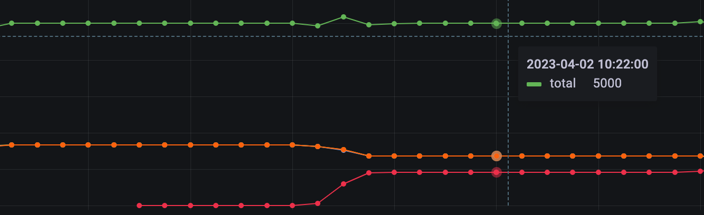

# Configure rebalancing (EMQX Enterprise)

## Task target

How to balance the load of EMQX cluster nodes through rebalancing.

## Why Need Rebalancing

Cluster load rebalancing is a process used in distributed systems to balance the load among nodes in a cluster. It involves redistributing connections and sessions across the cluster to ensure that all nodes are operating within their capacity limits and that the load is evenly distributed.

During cluster load rebalancing, connections and sessions are migrated from high-load nodes to low-load nodes to ensure that all nodes are being utilized effectively. The process is automated and calculates the number of connections that need to be migrated to achieve node balance. The corresponding number of connections and sessions are then migrated from high-load nodes to low-load nodes to achieve load balancing between nodes.

Cluster load rebalancing is typically required after a new node joins the cluster or after a node restarts. This is because when a new node is added, the workload is not evenly distributed among all nodes. Similarly, when a node restarts, the workload is shifted to the remaining nodes until the restarted node is back online. By performing load rebalancing, the cluster can operate efficiently and effectively, providing high availability and scalability to the application or service running on it. 

For EMQX cluster load rebalancing, please refer to the document: [Rebalancing](https://docs.emqx.com/en/enterprise/v4.4/advanced/rebalancing.html#rebalancing).

:::tip

The cluster load rebalancing is only available in EMQX Enterprise 4.4.12.

:::

- How to use rebalancing

The CRD corresponding to the cluster rebalancing in EMQX Operator is Rebalance, and its example is as follows:

```yaml
apiVersion: apps.emqx.io/v1beta4
kind: Rebalance
metadata:
   name: rebalance-sample
spec:
   instanceName: emqx-ee
   rebalanceStrategy:
     connEvictRate: 5
     sessEvictRate: 5
     waitTakeover: 5
     waitHealthCheck: 10
     absConnThreshold: 10
     absSessThreshold: 10
     relConnThreshold: "1.2"
     relSessThreshold: "1.2"
```

> `instanceName` indicates the name of the EMQX cluster instance that will perform the Rebalance task, `waitTakeover` indicates the waiting time before migrating the session (unit is second), `connEvictRate` indicates the rate of migrating connections (unit: count/second), `sessEvictRate` indicates the rate of migrating sessions (unit: is: count/second), `waitHealthCheck` indicates the time (in seconds) to wait for LoadBalancer to remove the source node from the list of active backend nodes. After the specified waiting time is exceeded, the rebalancing task will start. `absConnThreshold` indicates the absolute threshold for checking connection balance, `relConnThreshold` indicates the relative threshold for checking connection balance, `absSessThreshold` indicates the absolute threshold for checking session connection balance, and `relSessThreshold` indicates the relative threshold for checking session connection balance.

## Test the cluster rebalancing of EMQX Enterprise

- Deploy EMQX cluster

```yaml
apiVersion: apps.emqx.io/v1beta4
kind: EmqxEnterprise
metadata:
   name: emqx-ee
spec:
   replicas: 3
   template:
     spec:
       emqxContainer:
         image:
           repository: emqx/emqx-ee
           version: 4.4.14
         ports:
           - name: "http-management"
             containerPort: 1883
   serviceTemplate:
     spec:
       type: LoadBalancer
       ports:
         - name: "mqtt-tcp-1883"
           protocol: "TCP"
           port: 1883
           targetPort: 1883
```

> It is recommended to use the load balancing algorithm with the minimum number of connections. Under this load balancing strategy, the Rebalance task only needs to be executed once, and the cluster load can be rebalanced after the client disconnects at most once.

Save the above content as: emqx.yaml, execute the following command to deploy the EMQX cluster:

```bash
$ kubectl apply -f emqx.yaml
emqxenterprise.apps.emqx.io/emqx-ee created
```

Check the EMQX cluster status, please make sure `STATUS` is `Running`, it may take some time to wait for the EMQX cluster to be ready.

```bash
$ kubectl get emqxenterprises
NAME      STATUS   AGE
emqx-ee   Running  8m33s
```

- Use MQTT X CLI to connect to EMQX cluster

MQTT X CLI is an open source MQTT 5.0 CLI Client that supports automatic reconnection, and it is also a pure command-line mode MQTT X. Designed to help develop and debug MQTT services and applications faster without using a graphical interface. For documentation about MQTT X CLI, please refer to: MQTTX CLI.

Execute the following command to connect to the EMQX cluster:

```bash
$ mqttx bench conn -h $host -p $port -c 5000
[10:05:21 AM] › ℹ Start the connect benchmarking, connections: 5000, req interval: 10ms
✔ success [5000/5000] - Connected
[10:06:13 AM] › ℹ Done, total time: 31.113s
```

> -h indicates EMQX LoadBalancer IP, -p indicates EMQX MQTT service port (1883 by default), -c indicates the number of connections created.

Execute the following command to expand EMQX. After the expansion, the connection load of the new node is 0, and then we will submit the Rebalance task to rebalance the node load.

```bash
$ kubectl scale emqxenterprise emqx-ee --replicas=4
emqxenterprise.apps.emqx.io/emqx-ee scaled
```

**NOTE:** After expansion, you need to wait for the cluster to be ready before submitting the Rebalance job.

- Submit the Rebalance job

```yaml
apiVersion: apps.emqx.io/v1beta4
kind: Rebalance
metadata:
   name: rebalance-sample
spec:
   instanceName: emqx-ee
   rebalanceStrategy:
     connEvictRate: 5
     sessEvictRate: 5
     waitTakeover: 5
     waitHealthCheck: 10
     absConnThreshold: 10
     absSessThreshold: 10
     relConnThreshold: "1.2"
     relSessThreshold: "1.2"
```

Save the above content as: rebalance.yaml, and submit the Rebalance task as follows:

```bash
$ kubectl apply -f rebalance.yaml
rebalance.apps.emqx.io/rebalance-sample created
```

Execute the following command to view the rebalancing status of the EMQX cluster:

```bash
$ kubectl get rebalances rebalance-sample -o json | jq '.status.rebalances'
{
     "state": "wait_health_check",
     "session_eviction_rate": 5,
     "recipients":[
         "emqx-ee@emqx-ee-3.emqx-ee-headless.default.svc.cluster.local",
         "emqx-ee@emqx-ee-4.emqx-ee-headless.default.svc.cluster.local"
     ],
     "node": "emqx-ee@emqx-ee-0.emqx-ee-headless.default.svc.cluster.local",
     "donors":[
         "emqx-ee@emqx-ee-0.emqx-ee-headless.default.svc.cluster.local",
         "emqx-ee@emqx-ee-1.emqx-ee-headless.default.svc.cluster.local",
         "emqx-ee@emqx-ee-2.emqx-ee-headless.default.svc.cluster.local"
     ],
     "coordinator_node": "emqx-ee@emqx-ee-0.emqx-ee-headless.default.svc.cluster.local",
     "connection_eviction_rate": 5
}
```

Execute the following command to view the status of the Rebalance job:

```bash
$ kubectl get rebalances rebalance-sample
NAME               STATUS      AGE
rebalance-sample   Completed   42s
```

> There are three states of Rebalance: Processing, Completed and Failed. Processing indicates that the rebalancing task is in progress, Completed indicates that the rebalancing task has been completed, and Failed indicates that the rebalancing task failed.

## Use Grafana + Prometheus to monitor cluster node connections during rebalancing



It can be seen from the figure that after the Rebalance job is submitted, the connections of the three old nodes of EMQX are disconnected at the configured rate and migrated to the new node with a load of 0. When the cluster load reaches a balanced state, the rebalance task ends, and each node’s The load will also remain steady state.