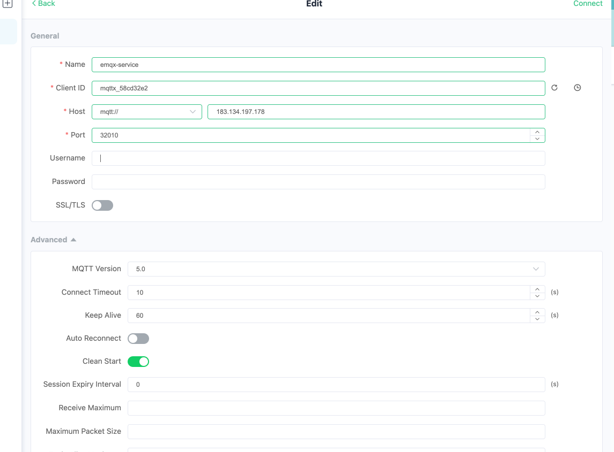
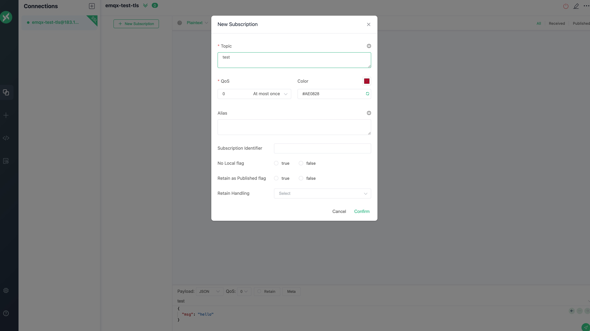
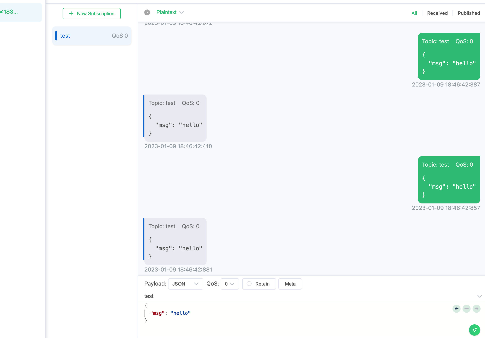

# Configure EMQX Service

## Task target

- How to configure EMQX Cluster Service.

## Configure EMQX cluster

:::: tabs type:card
::: tab v2alpha1

EMQX CRD supports using `.spec.dashboardServiceTemplate` to configure EMQX cluster Dashboard Service, using `.spec.listenersServiceTemplate` to configure EMQX cluster listener Service, its documentation can refer to: [Service](https://github.com/emqx/emqx-operator/blob/main-2.1/docs/en_US/reference/v2alpha1-reference.md).

```yaml
apiVersion: apps.emqx.io/v2alpha1
kind: EMQX
metadata:
   name: emqx
spec:
   image: emqx/emqx:5.0.14
   imagePullPolicy: IfNotPresent
   bootstrapConfig: |
     listeners.quic.default {
       enabled = true
       bind = "0.0.0.0:14567"
       keyfile = "/opt/emqx/etc/certs/key.pem"
       certfile = "/opt/emqx/etc/certs/cert.pem"
     }
   coreTemplate:
     spec:
       replicas: 3
   replicantTemplate:
     spec:
       replicas: 0
   dashboardServiceTemplate:
     spec:
       type: NodePort
       ports:
         - name: "dashboard-listeners-http-bind"
           protocol: TCP
           port: 18083
           targetPort: 18083
           nodePort: 32009
   listenersServiceTemplate:
     spec:
       type: NodePort
       ports:
         - name: "tcp-default"
           protocol: TCP
           port: 1883
           targetPort: 1883
           nodePort: 32010
         - name: quic-default
           protocol: UDP
           port: 14567
           targetPort: 14567
           nodePort: 32011
```

> By default, EMQX will open an MQTT TCP listener `tcp-default` corresponding to port 1883 and Dashboard listener `dashboard-listeners-http-bind` corresponding to port 18083. Users can add new listeners through `.spec.bootstrapConfig` field or EMQX Dashboard. EMQX Operator will automatically inject the default listener information into the Service when creating the Service, but when there is a conflict between the Service configured by the user and the listener configured by EMQX (name or port fields are repeated), EMQX Operator will use the user's configuration prevail.

:::
::: tab v1beta4

The corresponding CRD of EMQX Enterprise Edition in EMQX Operator is EmqxEnterprise, and EmqxEnterprise supports configuring EMQX cluster Service through `.spec.serviceTemplate` field. For the specific description of the serviceTemplate field, please refer to: [serviceTemplate](https://github.com/emqx/emqx-operator/blob/main-2.1/docs/en_US/reference/v1beta4-reference.md#servicetemplate).

```yaml
apiVersion: apps.emqx.io/v1beta4
kind: EmqxEnterprise
metadata:
   name: emqx-ee
spec:
   template:
     spec:
       emqxContainer:
         image:
           repository: emqx/emqx-ee
           version: 4.4.14
   serviceTemplate:
     spec:
       type: NodePort
       ports:
         - name: "http-management-8081"
           port: 8081
           protocol: "TCP"
           targetPort: 8081
         - name: "http-dashboard-18083"
           port: 18083
           protocol: "TCP"
           targetPort: 18083
         - name: "mqtt-tcp-1883"
           protocol: "TCP"
           port: 1883
           targetPort: 1883
```

> EMQX will open 6 listeners by default, namely: `mqtt-ssl-8883` corresponds to port 8883, `mqtt-tcp-1883` corresponds to port 1883, `http-dashboard-18083` corresponds to port 18083, `http-management-8081` corresponds to port 8081,`mqtt-ws-8083` corresponds to port 8083 and `mqtt-wss-8084` corresponds to port 8084. EMQX Operator will automatically inject the default listener information into the Service when creating the Service, but when there is a conflict between the Service configured by the user and the listener configured by EMQX (the name or port field is repeated), EMQX Operator will use the user's configuration prevail.

:::
::: tab v1beta3

The corresponding CRD of EMQX Enterprise Edition in EMQX Operator is EmqxEnterprise, and EmqxEnterprise supports configuration of cluster Service through `.spec.emqxTemplate.serviceTemplate` field. The description of the serviceTemplate field can refer to the document: [serviceTemplate](https://github.com/emqx/emqx-operator/blob/main-2.1/docs/en_US/reference/v1beta3-reference.md#servicetemplate)

```yaml
apiVersion: apps.emqx.io/v1beta3
kind: EmqxEnterprise
metadata:
   name: emqx-ee
spec:
   emqxTemplate:
     image: emqx/emqx-ee:4.4.14
     serviceTemplate:
       spec:
         type: NodePort
         ports:
           - name: "http-management-8081"
             port: 8081
             protocol: "TCP"
             targetPort: 8081
           - name: "http-dashboard-18083"
             port: 18083
             protocol: "TCP"
             targetPort: 18083
           - name: "mqtt-tcp-1883"
             protocol: "TCP"
             port: 1883
             targetPort: 1883
```

> EMQX will open 6 listeners by default, namely: `mqtt-ssl-8883` corresponds to port 8883, `mqtt-tcp-1883` corresponds to port 1883, `http-dashboard-18083` corresponds to port 18083, `http-management-8081` corresponds to port 8081, `mqtt-ws-8083` corresponds to port 8083 and `mqtt-wss-8084` corresponds to port 8084. EMQX Operator will automatically inject the default listener information into the Service when creating the Service, but when there is a conflict between the Service configured by the user and the listener configured by EMQX (the name or port field is repeated), EMQX Operator will use the user's configuration prevail.

:::
::::

Save the above content as: emqx-service.yaml, and execute the following command to deploy the EMQX cluster:

```bash
kubectl apply -f emqx-service.yaml
```

The output is similar to:

```
emqx.apps.emqx.io/emqx created
```

- Check whether the EMQX cluster is ready

:::: tabs type:card
::: tab v2alpha1

```bash
kubectl get emqx emqx -o json | jq '.status.conditions[] | select( .type == "Running" and .status == "True")'
```

The output is similar to:

```bash
{
   "lastTransitionTime": "2023-02-10T02:46:36Z",
   "lastUpdateTime": "2023-02-07T06:46:36Z",
   "message": "Cluster is running",
   "reason": "ClusterRunning",
   "status": "True",
   "type": "Running"
}
```

:::
::: tab v1beta4

```bash
kubectl get emqxEnterprise emqx-ee -o json | jq '.status.conditions[] | select( .type == "Running" and .status == "True")'
```
The output is similar to:

```bash
{
  "lastTransitionTime": "2023-03-01T02:49:22Z",
  "lastUpdateTime": "2023-03-01T02:49:23Z",
  "message": "All resources are ready",
  "reason": "ClusterReady",
  "status": "True",
  "type": "Running"
}
```

:::
::: tab v1beta3

```bash
kubectl get emqxEnterprise emqx-ee -o json | jq '.status.conditions[] | select( .type == "Running" and .status == "True")'
```

The output is similar to:

```bash
{
  "lastTransitionTime": "2023-03-01T02:49:22Z",
  "lastUpdateTime": "2023-03-01T02:49:23Z",
  "message": "All resources are ready",
  "reason": "ClusterReady",
  "status": "True",
  "type": "Running"
}
```

:::
::::

## Check whether EMQX Service is ready

- Use the command line to view the EMQX cluster Service

```bash
kubectl get svc -l apps.emqx.io/instance=emqx
```

The output is similar to:

```bash
NAME             TYPE       CLUSTER-IP       EXTERNAL-IP   PORT(S)                          AGE
emqx-dashboard   NodePort   10.101.225.238   <none>        18083:32012/TCP                  32s
emqx-listeners   NodePort   10.97.59.150     <none>        1883:32010/TCP,14567:32011/UDP   10s
```

- Use MQTT X to connect to the EMQX cluster to send messages

Click the button to create a new connection on the MQTT X page, and configure the EMQX cluster node information as shown in the figure. After configuring the connection information, click the connect button to connect to the EMQX cluster:



Then click the Subscribe button to create a new subscription, as shown in the figure, MQTT X has successfully connected to the EMQX cluster and successfully created the subscription:



After successfully connecting to the EMQX cluster and creating a subscription, we can send messages to the EMQX cluster, as shown in the following figure:



- Add new listeners through EMQX Dashboard

Open the browser, enter the host `IP` and port `32012` where the EMQX Pod is located, log in to the EMQX cluster Dashboard (Dashboard default user name: admin, default password: public), enter the Dashboard and click Configuration → Listeners to enter the listener page, We first click the Add Listener button to add a listener named test and port 1884, as shown in the figure below:


Then click the Add button to create the listener, as shown in the following figure:


As can be seen from the figure, the test listener we created has taken effect.

- Check whether the newly added listener is injected into the Service

```bash
kubectl get svc -l apps.emqx.io/instance=emqx
```

The output is similar to:

```bash
NAME             TYPE       CLUSTER-IP       EXTERNAL-IP   PORT(S)                                         AGE
emqx-dashboard   NodePort   10.105.110.235   <none>        18083:32012/TCP                                 13m
emqx-listeners   NodePort   10.106.1.58      <none>        1883:32010/TCP,14567:32011/UDP,1884:30763/TCP   12m
```

From the output results, we can see that the newly added listener 1884 has been injected into the `emqx-listeners` Service.
