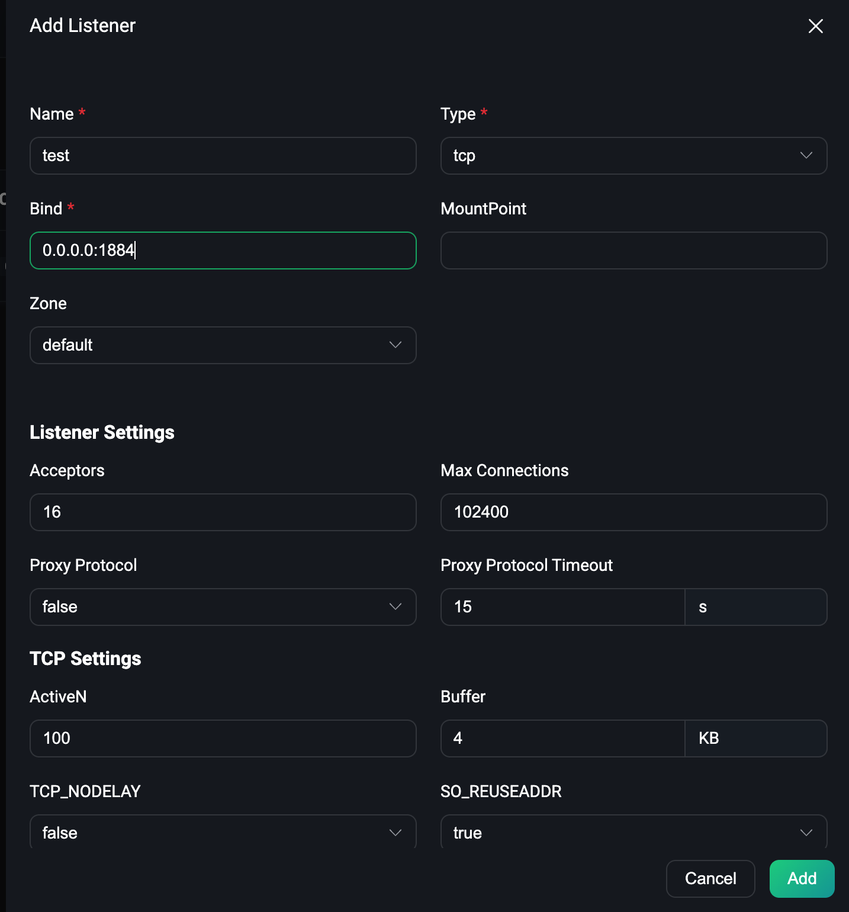
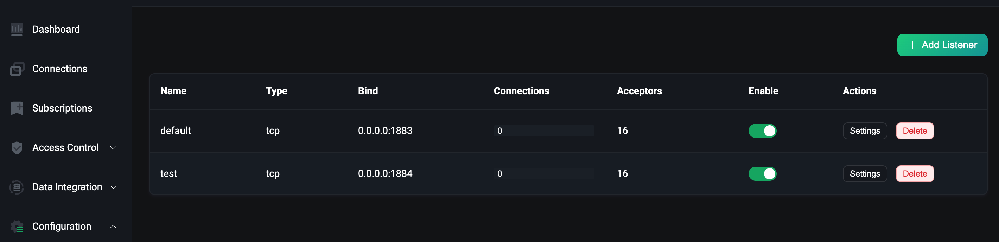

# Access EMQX Cluster Through LoadBalancer

## Task Target

Access the EMQX cluster through the Service of LoadBalancer type.

## Configure EMQX Cluster

The following is the relevant configuration of EMQX Custom Resource. You can choose the corresponding APIVersion according to the version of EMQX you want to deploy. For the specific compatibility relationship, please refer to [EMQX Operator Compatibility](../index.md):

:::: tabs type:card
::: tab apps.emqx.io/v2beta1

`apps.emqx.io/v2beta1 EMQX` supports configuring EMQX cluster Dashboard Service through `.spec.dashboardServiceTemplate`, and configuring EMQX cluster listener Service through `.spec.listenersServiceTemplate`, its documentation can refer to [Service](../reference/v2beta1-reference.md#emqxspec).

+ Save the following content as a YAML file and deploy it via the `kubectl apply` command

  ```yaml
  apiVersion: apps.emqx.io/v2beta1
  kind: EMQX
  metadata:
    name: emqx
  spec:
    image: emqx:5
    listenersServiceTemplate:
      spec:
        type: LoadBalancer
    dashboardServiceTemplate:
      spec:
        type: LoadBalancer
  ```

  > By default, EMQX will open an MQTT TCP listener `tcp-default` corresponding to port 1883 and Dashboard listener `dashboard-listeners-http-bind` corresponding to port 18083.

  > Users can add new listeners through `.spec.config.data` field or EMQX Dashboard. EMQX Operator will automatically inject the default listener information into the Service when creating the Service, but when there is a conflict between the Service configured by the user and the listener configured by EMQX (name or port fields are repeated), EMQX Operator will use the user's configuration prevail.

+ Wait for the EMQX cluster to be ready, you can check the status of the EMQX cluster through `kubectl get` command, please make sure `STATUS` is `Running`, this may take some time

  ```bash
  $ kubectl get emqx emqx
  NAME   IMAGE      STATUS    AGE
  emqx   emqx:5.1   Running   10m
  ```
+ Obtain the Dashboard External IP of the EMQX cluster and access the EMQX console

  EMQX Operator will create two EMQX Service resources, one is emqx-dashboard and the other is emqx-listeners, corresponding to EMQX console and EMQX listening port respectively.

  ```bash
  $ kubectl get svc emqx-dashboard -o json | jq '.status.loadBalancer.ingress[0].ip'

  192.168.1.200
  ```

  Access `http://192.168.1.200:18083` through a browser, and use the default username and password `admin/public` to log in to the EMQX console.

:::
::: tab apps.emqx.io/v1beta4

`apps.emqx.io/v1beta4 EmqxEnterprise` supports configuring EMQX cluster Service through `.spec.serviceTemplate` field. For the specific description of the serviceTemplate field, please refer to [serviceTemplate](../reference/v1beta4-reference.md#servicetemplate).

+ Save the following content as a YAML file and deploy it via the `kubectl apply` command

  ```yaml
  apiVersion: apps.emqx.io/v1beta4
  kind: EmqxEnterprise
  metadata:
    name: emqx-ee
  spec:
    template:
      spec:
        emqxContainer:
          image:
            repository: emqx/emqx-ee
            version: 4.4.14
    serviceTemplate:
      spec:
        type: LoadBalancer
  ```

  > EMQX Operator will automatically inject the default listener information into the Service when creating the Service, but when there is a conflict between the Service configured by the user and the listener configured by EMQX (the name or port field is repeated), EMQX Operator will use the user's The configuration prevails.

+ Wait for the EMQX cluster to be ready, you can check the status of the EMQX cluster through `kubectl get` command, please make sure `STATUS` is `Running`, this may take some time

  ```bash
  $ kubectl get emqxenterprises
  NAME      STATUS   AGE
  emqx-ee   Running  8m33s
  ```

+ Obtain the External IP of the EMQX cluster and access the EMQX console

  ```bash
  $ kubectl get svc emqx-ee -o json | jq '.status.loadBalancer.ingress[0].ip'

  192.168.1.200
  ```
  Access `http://192.168.1.200:18083` through a browser, and use the default username and password `admin/public` to log in to the EMQX console.

:::
::::

## Connect To EMQX Cluster By MQTT X CLI

+ Obtain the External IP of the EMQX cluster

  :::: tabs type:card
  ::: tab apps.emqx.io/v2beta1

  ```bash
  external_ip=$(kubectl get svc emqx-listeners -o json | jq '.status.loadBalancer.ingress[0].ip')
  ```
  :::
  ::: tab apps.emqx.io/v1beta4
  ```bash
  external_ip=$(kubectl get svc emqx-ee -o json | jq '.status.loadBalancer.ingress[0].ip')
  ```
  :::
  ::::

+ Use MQTT X CLI to connect to the EMQX cluster

  ```bash
  $ mqttx conn -h ${external_ip} -p 1883

  [4/17/2023] [5:17:31 PM] › … Connecting...
  [4/17/2023] [5:17:31 PM] › ✔ Connected
  ```

## Add New Listener Through EMQX Dashboard

:::tip
The screenshots of the Dashboard below are from EMQX 5, [EMQX 4 Dashboard](https://docs.emqx.com/en/enterprise/v4.4/getting-started/dashboard-ee.html#dashboard) also supports the corresponding function, please operate by yourself.
:::

+ Add new Listener

  Open the browser to login the EMQX Dashboard and click Configuration → Listeners to enter the listener page, we first click the Add Listener button to add a name called test, port 1884 The listener, as shown in the following figure:

  <div style="text-align:center">
  
  </div>
  Then click the Add button to create the listener, as shown in the following figure:

  

  As can be seen from the figure, the test listener we created has taken effect.

+ Check whether the newly added listener is injected into the Service

  ```bash
  kubectl get svc

  NAME             TYPE       CLUSTER-IP       EXTERNAL-IP   PORT(S)                                         AGE
  emqx-dashboard   NodePort   10.105.110.235   <none>        18083:32012/TCP                                 13m
  emqx-listeners   NodePort   10.106.1.58      <none>        1883:32010/TCP,1884:30763/TCP                   12m
  ```

  From the output results, we can see that the newly added listener 1884 has been injected into the `emqx-listeners` Service.
