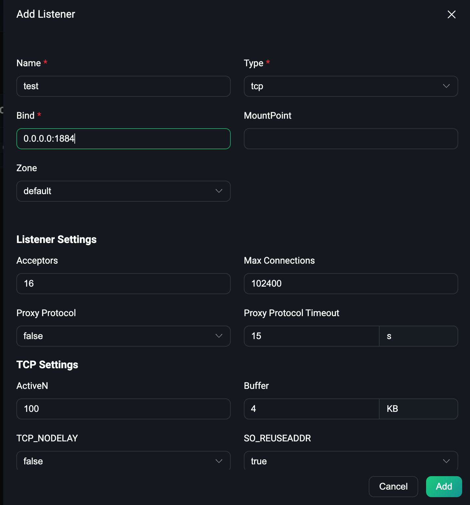
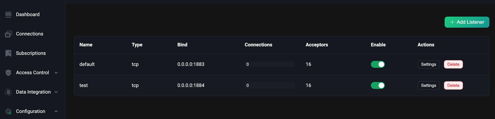

# Access EMQX Cluster through LoadBalancer

## Objective

Access the EMQX cluster through a Service of type LoadBalancer.

## Configure EMQX Cluster

EMQX CRD `apps.emqx.io/v2` supports:
* Configuring the EMQX Dashboard Service through `.spec.dashboardServiceTemplate`.
* Configuring the EMQX cluster listener Service through `.spec.listenersServiceTemplate`.

Refer to the [respective documentation](../reference/v2-reference.md#emqxspec) for more details.

+ Save the following as a YAML file and deploy it using `kubectl apply`.

  ```yaml
  apiVersion: apps.emqx.io/v2
  kind: EMQX
  metadata:
    name: emqx
  spec:
    image: emqx/emqx:6.0
    config:
      data: |
        license {
          key = "..."
        }
    listenersServiceTemplate:
      spec:
        type: LoadBalancer
    dashboardServiceTemplate:
      spec:
        type: LoadBalancer
  ```

  ::: tip
  By default, EMQX starts an MQTT TCP listener `tcp-default` on port 1883 and a Dashboard HTTP listener on port 18083.

  Users can configure new or existing listeners through `.spec.config.data`, or manage them through the EMQX Dashboard.
  
  EMQX Operator automatically reflects the default listener information in the Service resources. When there is a conflict between the Service configured by the user and the listener configured by EMQX (name or port fields are repeated), EMQX Operator prioritizes the user configuration.
  :::

+ Wait for the EMQX cluster to become ready.

  Check the status of the EMQX cluster with `kubectl get` and make sure that `STATUS` is `Ready`. This may take some time.

  ```bash
  $ kubectl get emqx emqx
  NAME   STATUS   AGE
  emqx   Ready    10m
  ```

## Add New Listener through EMQX Dashboard

+ Add a new listener.

  Open the EMQX Dashboard and navigate to _Configuration_ → _Listeners_.
  
  Click the _Add Listener_ button to add a listener with name `test` and port `1884`, as shown in the following figure:

  <div style="text-align:center">
  
  </div>

  Then click the _Add_ button to create the listener, as shown in the following figure:

  

  As seen in the figure, the new listener has been created.

+ Check if the new listener is reflected in the Service.

  ```bash
  kubectl get svc

  NAME             TYPE       CLUSTER-IP       EXTERNAL-IP   PORT(S)                                         AGE
  emqx-dashboard   NodePort   10.105.110.235   <none>        18083:32012/TCP                                 13m
  emqx-listeners   NodePort   10.106.1.58      <none>        1883:32010/TCP,1884:30763/TCP                   12m
  ```

  From this output, we can see that the newly added listener on port 1884 has been reflected in the `emqx-listeners` Service resource.

## Connect to the new listener using MQTTX

+ Obtain the external IP of the EMQX listeners service.

  ```bash
  external_ip=$(kubectl get svc emqx-listeners -o json | jq -r '.status.loadBalancer.ingress[0].ip')
  ```

+ Connect to the new listener using MQTTX CLI.

  ```bash
  $ mqttx conn -h ${external_ip} -p 1884

  [4/17/2023] [5:17:31 PM] › … Connecting...
  [4/17/2023] [5:17:31 PM] › ✔ Connected
  ```
