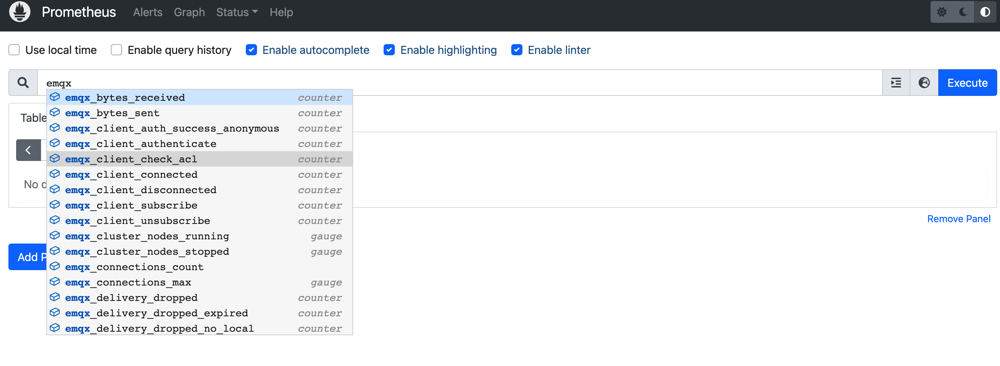
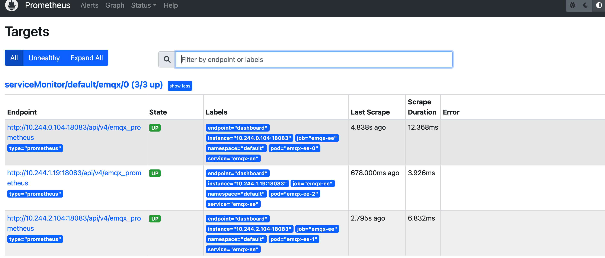

# Use Prometheus to monitor EMQX cluster


## Task target
- Learn how to monitor EMQX cluster through Prometheus

## Deploy Prometheus
Prometheus deployment documentation can refer to: [Prometheus document](https://github.com/prometheus-operator/prometheus-operator)

## Deploy EMQX cluster
EMQX supports exposing indicators through the http interface, and all statistical indicators under the cluster can refer to the document: [HTTP API](https://www.emqx.io/docs/en/v4.4/advanced/http-api.html#%E7%BB%9F%E8%AE%A1%E6%8C%87%E6%A0%87) 

```yaml
apiVersion: apps.emqx.io/v1beta3
kind: EmqxEnterprise
metadata:
  name: emqx-ee
spec:
  emqxTemplate:
    image: emqx/emqx-ee:4.4.8
    serviceTemplate:
      metadata:
        name: emqx-ee
        namespace: default
        labels:
          "apps.emqx.io/instance": "emqx-ee"
      spec:
        type: NodePort
        selector:
          "apps.emqx.io/instance": "emqx-ee"
        ports:
          - name: "http-management-8081"
            port: 8081
            protocol: "TCP"
            targetPort: 8081
          - name: "dashboard"
            port: 18083
            protocol: "TCP"
            targetPort: 18083
            nodePort: 32053
          - name: "mqtt-tcp-1883"
            protocol: "TCP"
            port: 1883
            targetPort: 1883
            nodePort: 30654
          - name: "mqtt-tcp-11883"
            protocol: "TCP"
            port: 11883
            targetPort: 11883
            nodePort: 30655
          - name: "mqtt-ws-8083"
            protocol: "TCP"
            port: 8083
            targetPort: 8083
```
Save the above content as: emqx.yaml and deploy the EMQX cluster

```
kubectl apply -f emqx.yaml
```

## Configure ServiceMonitor
A ServiceMonitor Custom Resource Definition (CRD) allows to declaratively define how a dynamic set of services should be monitored. Use label selection to define which services are selected for monitoring with the desired configuration, the documentation for which can be referred to: [ServiceMonitor document](https://github.com/prometheus-operator/prometheus-operator/blob/main/Documentation/design.md#servicemonitor)

```yaml
apiVersion: monitoring.coreos.com/v1
kind: ServiceMonitor
metadata:
  name: emqx
  namespace: default
  labels:
    app.kubernetes.io/name: emqx-ee
spec:
  endpoints:
  - interval: 10s
    port: 18083
    scheme: http
    path: /api/v4/emqx_prometheus
    params:
      type:
        - prometheus
    basicAuth:
      password:
        name: emqx-basic-auth
        key: password
      username:
        name: emqx-basic-auth
        key: username
  jobLabel: emqx-scraping
  namespaceSelector:
    matchNames:
      -  default
  selector:
    matchLabels:
      apps.emqx.io/instance: emqx-ee
```
Save the above content as: serviceMonitor.yaml and create ServiceMonitor

```
kubectl apply -f serviceMonitor.yaml
```

## Authenticate for ServiceMonitors using basicAuth

```yaml
apiVersion: v1
kind: Secret
metadata:
  name: emqx-basic-auth
  namespace: default
type: kubernetes.io/basic-auth
stringData:
  username: admin
  password: public
```
Save the above content as: secret.yaml and create Secret

```
kubectl apply -f secret.yaml
```

## Visit Promethus to see if there are indicators of EMQX cluster collected
Open the Prometheus interface, switch to the Graph page, and enter emqx to display the following figure



Switch to the Status → Targets page, as shown in the figure below, you can see all monitored EMQX Pod information in the cluster


 

