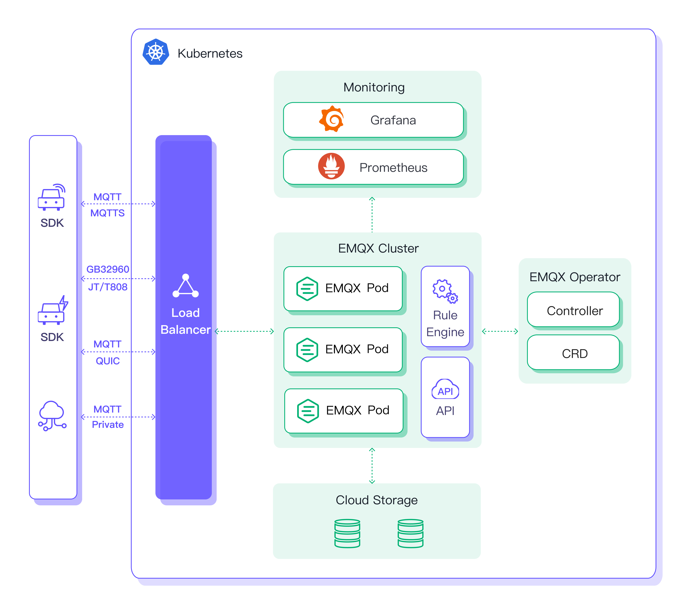

## EMQX Operator简介

EMQX Broker/Enterprise 是一个云原生的 MQTT 消息中间件。 我们提供了 EMQX Kubernetes Operator 来帮助您在 Kubernetes 的环境上快速创建和管理 EMQX Broker/Enterprise 集群。 它可以大大简化部署和管理 EMQX 集群的流程，对于管理和配置的知识要求也更低。它把部署和管理的工作变成一种低成本的、标准化的、可重复性的能力。

EMQX Operator 包括但不限于以下功能：

**Kubernetes自定义资源**：使用预定义的自定义资源部署和管理EMQX集群。

**简化部署配置**：以Kubernetes原生方式配置EMQX集群的基本原理，包括持久性、配置、许可证等。

EMQX Operator 与 EMQX 版本的对应关系如下：

|      EMQX Version      |     EMQX Operator Version                            |     APIVersion    |
|:----------------------:|:----------------------------------------------------:|:-----------------:|
| 4.3.x <= EMQX < 4.4    | 1.2.1，1.2.2，1.2.3                                   |  v1beta3          |
| 4.4.6 <= EMQX < 4.4.8  | 1.2.5                                                 | v1beta3          |
| 4.4.8 <= EMQX < 4.4.14 | 1.2.6，1.2.7，1.2.8，2.0.0，2.0.1，2.0.2, 2.0.3        |  v1beta3          |
| 4.4.14 <= EMQX         | 2.1.0                                                 |  v1beta4          |
| 5.0.6 <= EMQX < 5.0.8  | 2.0.0，2.0.1, 2.0.3 .                                 |  v2alpha1         |
| 5.0.8 <= EMQX < 5.0.14 | 2.0.2                                                 |  v2alpha1         |
| 5.0.14 <= EMQX         | 2.1.0                                                 |  v2alpha1         |
