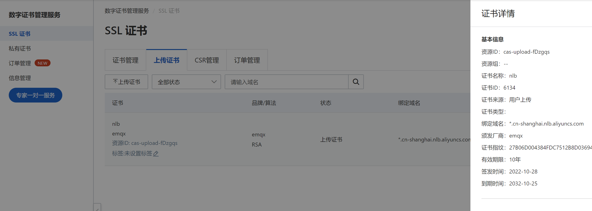
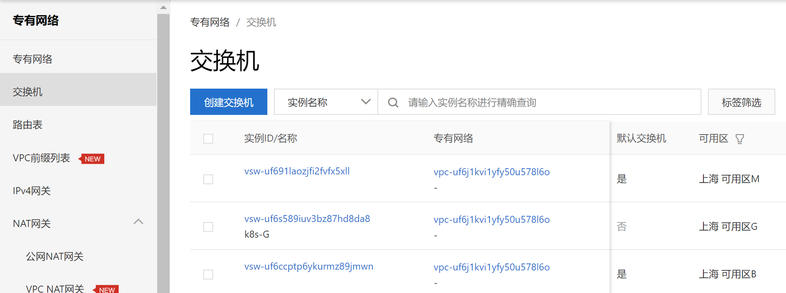

# 使用 EMQX Operator 在阿里云 ACK 上部署 EMQX 集群

## 名词解释

EMQX：The most scalable open-source MQTT broker for IoT，[EMQX 文档](https://github.com/emqx/emqx)

EMQX Operator：A Kubernetes Operator for EMQX，[EMQX Operator 文档](https://github.com/emqx/emqx-operator)

ACK：Alibaba Cloud Container Service for Kubernetes，简称容器服务 ACK， [ACK 文档](https://www.alibabacloud.com/help/zh/container-service-for-kubernetes/latest/ack-cluster-overview)

CLB：传统型负载均衡 CLB（Classic Load Balancer）是将访问流量根据转发策略分发到后端多台云服务器的流量分发控制服务，[CLB 文档](https://help.aliyun.com/document_detail/27539.html)

## 创建 ACK 集群

登录阿里云，选择云产品  -> 容器服务 Kubernets 版，点击创建， 选择标准集群，具体创建步骤参考：[云厂商文档](https://www.alibabacloud.com/help/zh/container-service-for-kubernetes/latest/create-an-ack-managed-cluster)

## LoadBalancer 配置

支持在 Terway 网络模式下，通过 annotation 将 Pod 直接挂载到 CLB 后端，提升网络转发性能。：[通过Annotation配置负载均衡](https://www.alibabacloud.com/help/zh/container-service-for-kubernetes/latest/use-annotations-to-configure-load-balancing-1)

```bash
service.beta.kubernetes.io/backend-type："eni"
```

## StorageClass 配置

使用如下命令查看当前集群可用的 storageClass:

```bash 
kubectl get sc 
```
可以看到集群默认创建了多个可用的 storageClass，本文档部署 EMQX 时选取的第一个 storageClass: `alibabacloud-cnfs-nas`, 其他 StorageClass 可参考文档[存储-CSI](https://help.aliyun.com/document_detail/127551.html)

## 使用 EMQX Operator 部署 EQMX 集群

EMQX Operator 安装参考：[EMQX Operator 安装](https://github.com/emqx/emqx-operator/blob/main/docs/en_US/getting-started/getting-started.md)

EMQX Operator 安装完成后，使用以下命令在 ACK 上进行部署 EMQX 集群：

:::: tabs type:card 
::: tab v2alpha1

```yaml
apiVersion: apps.emqx.io/v2alpha1
kind: EMQX
metadata:
  name: emqx
  annotations:
   service.beta.kubernetes.io/backend-type: "eni"
spec:
  image: emqx/emqx:5.0.14
  imagePullPolicy: IfNotPresent
  coreTemplate:
    spec:
      volumeClaimTemplates:
        storageClassName: alibabacloud-cnfs-nas
        resources:
          requests:
            storage: 20Mi
        accessModes:
        - ReadWriteOnce
      replicas: 3
  replicantTemplate:
    spec:
      replicas: 0
  dashboardServiceTemplate:
    spec:
      type: NodePort
      ports:
        - name: "dashboard-listeners-http-bind"
          protocol: TCP
          port: 18083
          targetPort: 18083
          nodePort: 32016
```
:::
::: tab v1beta4

```yaml
apiVersion: apps.emqx.io/v1beta4
kind: EmqxEnterprise
metadata:
  name: emqx-ee
  annotations:
    service.beta.kubernetes.io/backend-type: "eni"
spec:
  persistent:
    metadata:
      name: emqx-ee
    spec:
      storageClassName: alibabacloud-cnfs-nas
      resources:
        requests:
          storage: 20Mi
      accessModes:
        - ReadWriteOnce
  template:
    spec:
      emqxContainer:
        image: 
          repository: emqx/emqx-ee
          version: 4.4.14
  serviceTemplate:
    spec:
      type: NodePort
      ports:
        - name: "http-dashboard-18083"
          protocol: "TCP"
          port: 18083
          targetPort: 18083
```
:::
::: tab v1beta3

```yaml
apiVersion: apps.emqx.io/v1beta3
kind: EmqxEnterprise
metadata:
  name: emqx-ee
  annotations:
    service.beta.kubernetes.io/backend-type: "eni"
spec:
  persistent:
    storageClassName: alibabacloud-cnfs-nas
    resources:
      requests:
        storage: 20Mi
    accessModes:
    - ReadWriteOnce
  emqxTemplate:
    image: emqx/emqx-ee:4.4.14
    serviceTemplate:
      spec:
        type: NodePort
        ports:
          - name: "http-dashboard-18083"
            protocol: "TCP"
            port: 18083
            targetPort: 18083
```
::: 
::::

## 使用 LB 终结 TCP TLS 方案

我们推荐通过 [Aliyun NLB](https://help.aliyun.com/document_detail/439119.html) 进行 TLS 终结,如需在 NLB 上实现 TLS 终结，你可以通过以下几个步骤实现

**备注**： 此文档详细解释了使用 EMQX Operator 在阿里云 ACK 上部署 EMQX 集群的步骤，另外还支持配置 LB 直连 Pod, 进一步提升转发性能。

> 使用 NLB 要求 k8s 版本不低于v1.24且 CCM 版本不低于v2.5.0。有关 CCM 的版本升级说明请查看[官方文档](https://help.aliyun.com/document_detail/198792.html)

### 证书导入

在 Aliyun [数字证书管理服务](https://us-east-2.console.aws.amazon.com/acm/home)控制台，导入自签名或者购买证书, 证书导入后点击证书详情，获取证书ID（纯数字）。如下图:


由于每次重新创建 NLB 时，其关联的 DNS 域名会发生变化，如果采用自签名证书，为方便测试，这里建议将证书绑定的域名设置为`*.cn-shanghai.nlb.aliyuncs.com`

### 修改部署 yaml

:::: tabs type:card 
::: tab v2alpha1

```yaml
apiVersion: apps.emqx.io/v2alpha1
kind: EMQX
metadata:
  name: emqx
  annotations:
    service.beta.kubernetes.io/alibaba-cloud-loadbalancer-name: "nlb"
    service.beta.kubernetes.io/alibaba-cloud-loadbalancer-force-override-listeners: "true"
    service.beta.kubernetes.io/alibaba-cloud-loadbalancer-protocol-port: "tcpssl:8883"
    # 如集群为中国内地 Region 时，组合后的证书ID为${your-cert-id}-cn-hangzhou。
    # 如集群为除中国内地以外的其他Region时，组合后的证书ID为${your-cert-id}-ap-southeast-1，例如：6134-ap-southeast-1。
    service.beta.kubernetes.io/alibaba-cloud-loadbalancer-cert-id: "${组合后的证书ID}"
    # NLB 支持的地域及可用区可以登录 NLB 控制台查看，至少需要两个可用区。
    service.beta.kubernetes.io/alibaba-cloud-loadbalancer-zone-maps: cn-hangzhou-k:vsw-i123456,cn-hangzhou-j:vsw-j654321
spec:
    image: emqx/emqx:5.0.14
    imagePullPolicy: IfNotPresent
    coreTemplate:
      spec:
        volumeClaimTemplates:
          storageClassName: alibabacloud-cnfs-nas
          resources:
            requests:
              storage: 20Mi
          accessModes:
          - ReadWriteOnce
        replicas: 3
    replicantTemplate:
      spec:
        replicas: 0
    listenersServiceTemplate:
     spec:
        type: LoadBalancer
        loadBalancerClass: "alibabacloud.com/nlb"
        externalTrafficPolicy: Local
        ports:
        - name: tcpssl
          port: 8883
          protocol: TCP
          targetPort: 1883
        selector:
          "apps.emqx.io/instance": "emqx-ee"   
```
::: 
::: tab v1beta4

```yaml
apiVersion: apps.emqx.io/v1beta4
kind: EmqxEnterprise
metadata:
  name: emqx-ee
  annotations:
    service.beta.kubernetes.io/alibaba-cloud-loadbalancer-name: "nlb"
    service.beta.kubernetes.io/alibaba-cloud-loadbalancer-force-override-listeners: "true"
    service.beta.kubernetes.io/alibaba-cloud-loadbalancer-protocol-port: "tcpssl:8883"
    # 如集群为中国内地 Region 时，组合后的证书ID为${your-cert-id}-cn-hangzhou。
    # 如集群为除中国内地以外的其他Region时，组合后的证书ID为${your-cert-id}-ap-southeast-1，例如：6134-ap-southeast-1。
    service.beta.kubernetes.io/alibaba-cloud-loadbalancer-cert-id: "${组合后的证书ID}"
    # NLB 支持的地域及可用区可以登录 NLB 控制台查看，至少需要两个可用区。
    service.beta.kubernetes.io/alibaba-cloud-loadbalancer-zone-maps: cn-hangzhou-k:vsw-i123456,cn-hangzhou-j:vsw-j654321
spec:
  persistent:
    metadata:
      name: emqx-ee
    spec:
      storageClassName: alibabacloud-cnfs-nas
      resources:
        requests:
          storage: 20Mi
      accessModes:
        - ReadWriteOnce
  template:
    spec:
      emqxContainer:
        image: 
          repository: emqx/emqx-ee
          version: 4.4.14
  serviceTemplate:
    spec:
      type: LoadBalancer
      loadBalancerClass: "alibabacloud.com/nlb"
      externalTrafficPolicy: Local
      ports:
      - name: tcpssl
        port: 8883
        protocol: TCP
        targetPort: 1883
      selector:
        "apps.emqx.io/instance": "emqx-ee"
```
::: 
::: tab v1beta3

```yaml
apiVersion: apps.emqx.io/v1beta3
kind: EmqxEnterprise
metadata:
  name: emqx-ee
  annotations:
    service.beta.kubernetes.io/alibaba-cloud-loadbalancer-name: "nlb"
    service.beta.kubernetes.io/alibaba-cloud-loadbalancer-force-override-listeners: "true"
    service.beta.kubernetes.io/alibaba-cloud-loadbalancer-protocol-port: "tcpssl:8883"
    # 如集群为中国内地 Region 时，组合后的证书ID为${your-cert-id}-cn-hangzhou。
    # 如集群为除中国内地以外的其他Region时，组合后的证书ID为${your-cert-id}-ap-southeast-1，例如：6134-ap-southeast-1。
    service.beta.kubernetes.io/alibaba-cloud-loadbalancer-cert-id: "${组合后的证书ID}"
    # NLB 支持的地域及可用区可以登录 NLB 控制台查看，至少需要两个可用区。
    service.beta.kubernetes.io/alibaba-cloud-loadbalancer-zone-maps: cn-hangzhou-k:vsw-i123456,cn-hangzhou-j:vsw-j654321
spec:
  persistent:
    storageClassName: alibabacloud-cnfs-nas
    resources:
      requests:
        storage: 20Mi
    accessModes:
    - ReadWriteOnce
  emqxTemplate:
    image: emqx/emqx-ee:4.4.14
    serviceTemplate:
      spec:
        type: LoadBalancer
        loadBalancerClass: "alibabacloud.com/nlb"
        externalTrafficPolicy: Local
        ports:
        - name: tcpssl
          port: 8883
          protocol: TCP
          targetPort: 1883
        selector:
          "apps.emqx.io/instance": "emqx-ee"
```
::: 
::::

可用区域的组成规则为服务器所在区域+专有网络中[交换机](https://vpc.console.aliyun.com/vpc/cn-shanghai/switches)的实例ID


> 查看[官方文档](https://help.aliyun.com/document_detail/456461.html)以了解更多的参数说明

部署成功后，可在[网络型负载均衡 NLB](https://slb.console.aliyun.com/nlb)中查看自动创建的 NLB 实例
