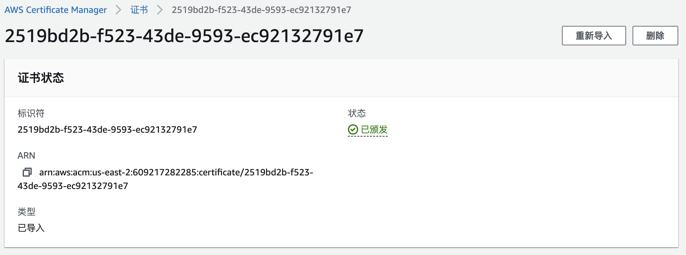

# 本文主要介绍在AWS EKS上通过EMQX Operator 部署 EMQX集群，主要内容包括:


## 名词解释

EMQX: The most scalable open-source MQTT broker for IoT, [详见](https://github.com/emqx/emqx) 

EMQX Operator: A Kubernetes Operator for EMQX, [详见](https://github.com/emqx/emqx-operator) 

EKS:  Amazon Elastic Kubernetes Service , [详见](https://docs.aws.amazon.com/eks/latest/userguide/what-is-eks.html) 

NLB：AWS 提供的LoadBalancer

## 创建EKS集群

登录 AWS EKS 控制台，进入创建eks 集群页面，EMQX Operator 要求Kubernetes 版本>=1.20.0 ，因此我们在此选择 Kubernetes 选择 1.22 ,网络与其他资源信息根据自身需求来制定。[细节请参考](https://docs.aws.amazon.com/eks/latest/userguide/create-cluster.html) 

## 访问EKS集群

参考: [AWS 手册](https://docs.aws.amazon.com/eks/latest/userguide/create-kubeconfig.html)  

## LoadBalancer 配置 

Load Balancer 介绍: [AWS 手册](https://docs.aws.amazon.com/eks/latest/userguide/network-load-balancing.html) 

Load Balancer Controller安装 : [AWS 手册](https://docs.aws.amazon.com/eks/latest/userguide/aws-load-balancer-controller.html) 

Annotations: [AWS 手册](https://kubernetes-sigs.github.io/aws-load-balancer-controller/v2.4/guide/service/annotations/) 

## StorageClass 配置

[点击查看权限设置](https://docs.aws.amazon.com/eks/latest/userguide/csi-iam-role.html) 
storageclass  yaml 示例，此处使用ebs 
[查看ebs插件安装](https://docs.aws.amazon.com/eks/latest/userguide/managing-ebs-csi.html) 

```yaml
apiVersion: storage.k8s.io/v1
kind: StorageClass
metadata:
  name: ebs-sc
provisioner: ebs.csi.aws.com
volumeBindingMode: Immediate
parameters:
  csi.storage.k8s.io/fstype: xfs
  type: io1
  iopsPerGB: "500"
  encrypted: "true"
allowedTopologies:
- matchLabelExpressions:
  - key: topology.ebs.csi.aws.com/zone
    values:
    - us-east-2c
```

执行以下命令
```shell
kubectl apply -f storageclass.yaml
```

## 使用EMQX Operator 进行集群创建 

[查看Operator安装](https://github.com/emqx/emqx-operator/blob/main/docs/en_US/getting-started/getting-started.md) 
Operator 安装完成后，使用以下yaml 在 AWS EKS 上进行部署EMQX 集群

```shell
cat << "EOF" | kubectl apply -f -
apiVersion: apps.emqx.io/v1beta3
kind: EmqxEnterprise
metadata:
  name: emqx-ee
  labels:
    "foo": "bar"
  annotations:
    service.beta.kubernetes.io/aws-load-balancer-type: "external"
    service.beta.kubernetes.io/aws-load-balancer-nlb-target-type: "ip"
    service.beta.kubernetes.io/aws-load-balancer-scheme: internet-facing
    service.beta.kubernetes.io/aws-load-balancer-attributes: load_balancing.cross_zone.enabled=true
    service.beta.kubernetes.io/aws-load-balancer-target-group-attributes: preserve_client_ip.enabled=true
    service.beta.kubernetes.io/aws-load-balancer-attributes: deletion_protection.enabled=true
spec:
  replicas: 3
  persistent:
     storageClassName: ebs-sc
     resources:
       requests:
         storage: 4Gi
     accessModes:
     - ReadWriteOnce
  emqxTemplate:
    image: emqx/emqx-ee:4.4.6
    serviceTemplate:
      spec:
        type: LoadBalancer
EOF
```

## 使用NLB 进行TLS 终结

我们推荐在NLB上做TLS终结,如需在NLB上实现TLS 终于，你可以通过以下几个步骤实现

### 证书导入

在AWS [控制台](https://us-east-2.console.aws.amazon.com/acm/home)，导入相关证书, 证书导入后点击证书ID，进入详情页面，复制ARN信息，如下图:


### 修改部署yaml

```shell
cat << "EOF" | kubectl apply -f -
apiVersion: apps.emqx.io/v1beta3
kind: EmqxEnterprise
metadata:
  name: emqx-ee
  labels:
    "foo": "bar"
  annotations:
    service.beta.kubernetes.io/aws-load-balancer-type: "external"
    service.beta.kubernetes.io/aws-load-balancer-nlb-target-type: "ip"
    service.beta.kubernetes.io/aws-load-balancer-scheme: internet-facing
    service.beta.kubernetes.io/aws-load-balancer-attributes: load_balancing.cross_zone.enabled=true
    service.beta.kubernetes.io/aws-load-balancer-ssl-cert: arn:aws:acm:us-west-2:arn:arn:aws:acm:us-east-1:609217282285:certificate/326649a0-f3b3-4bdb-a478-5691b4ba0ef3
    service.beta.kubernetes.io/aws-load-balancer-backend-protocol: tcp
    service.beta.kubernetes.io/aws-load-balancer-ssl-ports: 1883,mqtt-tls
    service.beta.kubernetes.io/aws-load-balancer-target-group-attributes: preserve_client_ip.enabled=true
    service.beta.kubernetes.io/aws-load-balancer-attributes: deletion_protection.enabled=true
spec:
  replicas: 3
  persistent:
     storageClassName: ebs-sc
     resources:
       requests:
         storage: 4Gi
     accessModes:
     - ReadWriteOnce
  emqxTemplate:
    image: emqx/emqx-ee:4.4.6
    serviceTemplate:
      spec:
        type: LoadBalancer
EOF
```

相比不使用TLS证书，我们在annotations里增加了下面三项内容，其中service.beta.kubernetes.io/aws-load-balancer-ssl-cert 的值为我们第一步中复制的ARN信息。

```yaml
service.beta.kubernetes.io/aws-load-balancer-ssl-cert: arn:aws:acm:us-west-2:arn:arn:aws:acm:us-east-1:609217282285:certificate/326649a0-f3b3-4bdb-a478-5691b4ba0ef3
service.beta.kubernetes.io/aws-load-balancer-backend-protocol: tcp
service.beta.kubernetes.io/aws-load-balancer-ssl-ports: 1883,mqtt-tls
```