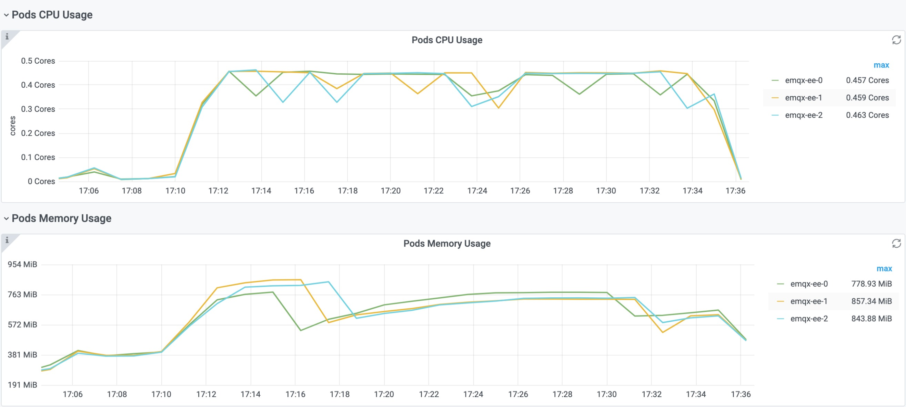

## 部署背景

本次测试使用阿里云 ACK 专有服务，网络插件为 `Flannel`，使用 3 台规格为 `ecs.c7.2xlarge`，操作系统为 `centos7.9` 的实例作为 master 节点，3 台规格为 `ecs.c7.16xlarge`，操作系统为 `centos7.9` 的实例作为 worker 节点，测试工具使用 xmeter，压力机与 ACK 的负载均衡在同一个 VPC 网络中，通过 emqx-operator 1.1.5 部署 EMQX Enterprise，配置如下：
```
apiVersion: apps.emqx.io/v1beta2
kind: EmqxEnterprise
metadata:
  name: emqx-ee
  labels:
    cluster: emqx
spec:
  image: emqx/emqx-ee:4.4.1
  env:
    - name: "EMQX_NODE__DIST_BUFFER_SIZE"
      value: "16MB"
    - name: "EMQX_NODE__PROCESS_LIMIT"
      value: "2097152"
    - name: "EMQX_NODE__MAX_PORTS"
      value: "1048576"
    - name: "EMQX_LISTENER__TCP__EXTERNAL__ACCEPTORS"
      value: "64"
    - name: "EMQX_LISTENER__TCP__EXTERNAL__BACKLOG"
      value: "1024000"
    - name: "EMQX_LISTENER__TCP__EXTERNAL__MAX_CONNECTIONS"
      value: "1024000"
    - name: "EMQX_LISTENER__TCP__EXTERNAL__MAX_CONN_RATE"
      value: "100000"
  emqxTemplate:
    license: "your license string"
    listener:
      type: LoadBalancer
      annotations:
        service.beta.kubernetes.io/alibaba-cloud-loadbalancer-address-type: "intranet"
        service.beta.kubernetes.io/alibaba-cloud-loadbalancer-spec: "slb.s3.large"
```

## 系统调优

在测试之前，使用以下脚本优化 worker 节点的 sysctl
```
echo "DefaultLimitNOFILE=100000000" >> /etc/systemd/system.conf
echo "session required pam_limits.so" >> /etc/pam.d/common-session
echo "*      soft    nofile      10000000"  >> /etc/security/limits.conf
echo "*      hard    nofile      100000000"  >> /etc/security/limits.conf


# lsmod |grep -q conntrack || modprobe ip_conntrack

cat >> /etc/sysctl.d/99-sysctl.conf <<EOF
net.ipv4.tcp_tw_reuse=1
fs.nr_open=1000000000
fs.file-max=1000000000
net.ipv4.ip_local_port_range=1025 65534
net.ipv4.udp_mem=74583000 499445000 749166000

net.core.somaxconn=32768
net.ipv4.tcp_max_sync_backlog=163840
net.core.netdev_max_backlog=163840

net.core.optmem_max=16777216
net.ipv4.tcp_rmem=1024 4096 16777216
net.ipv4.tcp_wmem=1024 4096 16777216
net.ipv4.tcp_max_tw_buckets=1048576
net.ipv4.tcp_fin_timeout=15
net.core.rmem_default=262144000
net.core.wmem_default=262144000
net.core.rmem_max=262144000
net.core.wmem_max=262144000
net.ipv4.tcp_mem=378150000  504200000  756300000

# net.netfilter.nf_conntrack_max=1000000
# net.netfilter.nf_conntrack_tcp_timeout_time_wait=30
EOF

sysctl -p
```

## 测试场景

N 个客户端使用 MQTT 5.0 协议连接 EMQX Broker，其中 50% 的客户端在连接后立即订阅主题，另外 50% 的客户端在全部客户端连接完成开始发布消息，订阅与发布的主题是一对一的关系。

本次测试中所有的消息 QoS = 1， payload size = 1k，消息发布频率为每个客户端每秒发布一条消息。

## 测试结果概述

#### 场景一: 20k MQTT 客户端

场景模拟 20k MQTT 连接，publish 客户端和 subscribe 客户端各 10k，每个 publish 客户端每秒发布一条 Qos 1、payload size 1k 的消息，相应的每个 subscribe 客户端每秒消费一条消息。

测试持续 30 分钟，其中收发消息持续 25 分钟。

EMQX Enterprise 由 3 个 Pod 组成集群，每个 Pod 的资源限额如下。
```
$ kubectl get emqx-ee emqx-ee -o json | jq ".spec.resources"
{
  "limits": {
    "cpu": "1",
    "memory": "1Gi"
  }
}
```

如下图 EMQ X Enterprise Dashboard 监控显示，本次测试被测集群共 3 个节点，集群接入量实际达到 20k 连接和 10k 订阅，消息流入(发布)消息流出(消费)都达到了每秒 1 万。


消息吞吐期间 EMQX Pods 的资源消耗如下。



测试详情如下。


#### 场景二: 50k MQTT 客户端

场景模拟 50k MQTT 连接，publish 客户端和 subscribe 客户端各 25k，每个 publish 客户端每秒发布一条 Qos 1、payload size 1k 的消息，相应的每个 subscribe 客户端每秒消费一条消息。

测试持续 30 分钟，其中收发消息持续 25 分钟。

EMQX Enterprise 由 3 个 Pod 组成集群，每个 Pod 的资源限额如下。
```
$ kubectl get emqx-ee emqx-ee -o json | jq ".spec.resources"
{
  "limits": {
    "cpu": "2",
    "memory": "2Gi"
  }
}
```

如下图 EMQ X Enterprise Dashboard 监控显示，本次测试被测集群共 3 个节点，集群接入量实际达到 50k 连接和 25k 订阅，消息流入(发布)消息流出(消费)都达到了每秒 2.5 万。


消息吞吐期间 EMQX Pods 的资源消耗如下。


测试详情如下。


#### 场景三: 100k MQTT 客户端

场景模拟 100k MQTT 连接，publish 客户端和 subscribe 客户端各 50k，每个 publish 客户端每秒发布一条 Qos 1、payload size 1k 的消息，相应的每个 subscribe 客户端每秒消费一条消息。

测试持续 30 分钟，其中收发消息持续 25 分钟。

EMQX Enterprise 由 3 个 Pod 组成集群，每个 Pod 的资源限额如下。
```
$ kubectl get emqx-ee emqx-ee -o json | jq ".spec.resources"
{
  "limits": {
    "cpu": "4",
    "memory": "4Gi"
  }
}
```

如下图 EMQ X Enterprise Dashboard 监控显示，本次测试被测集群共 3 个节点，集群接入量实际达到 100k 连接和 50k 订阅，消息流入(发布)消息流出(消费)都达到了每秒 5 万。


消息吞吐期间 EMQX Pods 的资源消耗如下。


测试详情如下。


#### 场景四: 200k MQTT 客户端

场景模拟 200k MQTT 连接，publish 客户端和 subscribe 客户端各 100k，每个 publish 客户端每秒发布一条 Qos 1、payload size 1k 的消息，相应的每个 subscribe 客户端每秒消费一条消息。

测试持续 30 分钟，其中收发消息持续 25 分钟。

EMQX Enterprise 由 3 个 Pod 组成集群，每个 Pod 的资源限额如下。
```
$ kubectl get emqx-ee emqx-ee -o json | jq ".spec.resources"
{
  "limits": {
    "cpu": "6",
    "memory": "6Gi"
  },
  "requests": {
    "cpu": "4",
    "memory": "4Gi"
  }
}
```

如下图 EMQ X Enterprise Dashboard 监控显示，本次测试被测集群共 3 个节点，集群接入量实际达到 200k 连接和 100k 订阅，消息流入(发布)消息流出(消费)都达到了每秒 10 万。


消息吞吐期间 EMQX Pods 的资源消耗如下。


测试详情如下。


#### 场景五: 500k MQTT 客户端

场景模拟 500k MQTT 连接，publish 客户端和 subscribe 客户端各 250k，每个 publish 客户端每秒发布一条 Qos 1、payload size 1k 的消息，相应的每个 subscribe 客户端每秒消费一条消息。

测试持续 30 分钟，其中收发消息持续 25 分钟。

EMQX Enterprise 由 3 个 Pod 组成集群，每个 Pod 的资源限额如下。
```
$ kubectl get emqx-ee emqx-ee -o json | jq ".spec.resources"
{
  "limits": {
    "cpu": "14",
    "memory": "14Gi"
  },
  "requests": {
    "cpu": "4",
    "memory": "4Gi"
  }
}
```

如下图 EMQ X Enterprise Dashboard 监控显示，本次测试被测集群共 3 个节点，集群接入量实际达到 500k 连接和 250k 订阅，消息流入(发布)消息流出(消费)都达到了每秒 25 万。


消息吞吐期间 EMQX Pods 的资源消耗如下。


测试详情如下。

