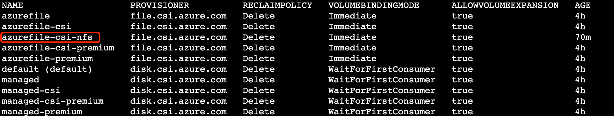

# 使用 EMQX Operator 在 Azure AKS 上部署 EMQX 集群

## 名词解释

EMQX: The most scalable open-source MQTT broker for IoT. 详见：[EMQX文档](https://github.com/emqx/emqx)

EMQX Operator: A Kubernetes Operator for EMQX. 详见：[EMQX Operator文档](https://github.com/emqx/emqx-operator)

AKS: Azure Kubernetes 服务 (AKS) 通过将操作开销卸载到 Azure，简化了在 Azure 中部署托管 Kubernetes 群集的过程。作为一个托管的 Kubernetes 服务，Azure 可以自动处理运行状况监视和维护等关键任务。由于 Kubernetes 主节点由 Azure 管理，因此你只需要管理和维护代理节点。详见：[Azure 文档](https://docs.microsoft.com/en-us/azure/aks/learn/quick-kubernetes-deploy-portal?tabs=azure-cli)

## 创建AKS集群

登录 Azure AKS 控制台，进入 Kubernetes 服务，创建 Kubernetes 集群。EMQX Operator 要求Kubernetes 版本>=1.20.0 ，因此我们在此选择 Kubernetes 选择 1.22.11，网络与其他资源信息根据自身需求来制定。[细节请参考](https://docs.microsoft.com/en-us/azure/aks/learn/quick-kubernetes-deploy-portal?tabs=azure-cli)


## 访问 Kubernetes 集群

建议通过 Azure 提供的 Cloud Shell 连接。[细节请参考](https://docs.microsoft.com/en-us/azure/cloud-shell/overview)

## StorageClass 配置

这里采用 NSF 文件存储。其他 StorageClass [可参考](https://docs.microsoft.com/en-us/azure/aks/azure-files-csi)

创建 StroageClass
```yaml
cat << "EOF" | kubectl apply -f -
apiVersion: storage.k8s.io/v1
kind: StorageClass
metadata:
  name: azurefile-csi-nfs
provisioner: file.csi.azure.com
allowVolumeExpansion: true
parameters:
  protocol: nfs
mountOptions:
  - nconnect=8
EOF
```

查看该 StroageClass 是否创建成功
```shell
kubectl get sc
```



## 使用EMQX Operator 部署EMQX集群

Operator 安装[参考](https://github.com/emqx/emqx-operator/blob/main/docs/en_US/getting-started/getting-started.md)

Operator 安装完成后，使用以下yaml 在 azure 上进行部署 EMQX 集群

```yaml
cat << "EOF" | kubectl apply -f -
apiVersion: apps.emqx.io/v1beta3
kind: EmqxEnterprise
metadata:
  name: emqx-ee
  labels:
    "foo": "bar"
spec:
  replicas: 3
  persistent:
     storageClassName: azurefile-csi-nfs
     resources:
       requests:
         storage: 4Gi
     accessModes:
     - ReadWriteOnce
  emqxTemplate:
    image: emqx/emqx-ee:4.4.6
    serviceTemplate:
      spec:
        type: LoadBalancer
EOF
```

这里 service type采用LoadBalancer

## 关于 LoadBalancer 终结 TLS

由于 Azure LoadBalancer 不支持 TCP 证书，所以请参考这篇[文档](https://github.com/emqx/emqx-operator/discussions/312)解决 TCP 证书终结问题