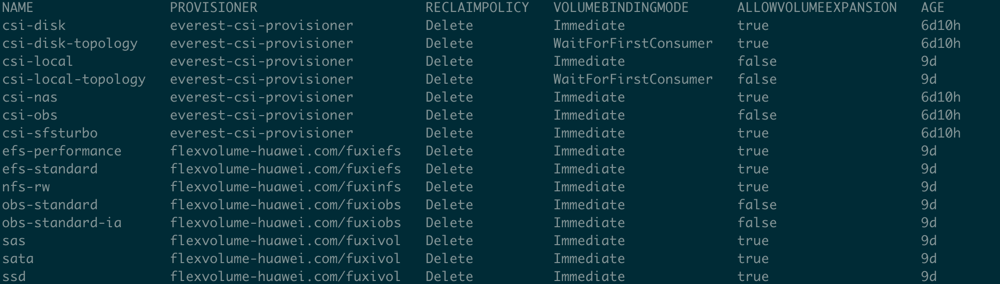

# 使用 EMQX Operator 在华为 CCE 上部署 EMQX 集群

## 名词解释

EMQX: The most scalable open-source MQTT broker for IoT. 详见：[EMQX文档](https://github.com/emqx/emqx)

EMQX Operator: A Kubernetes Operator for EMQX. 详见：[EMQX Operator文档](https://github.com/emqx/emqx-operator)

CCE: 云容器引擎（Cloud Container Engine，简称CCE）提供高度可扩展的、高性能的企业级 Kubernetes 集群，支持运行 Docker 容器。借助云容器引擎，您可以在华为云上轻松部署、管理和扩展容器化应用程序。详见：[CCE文档](https://support.huaweicloud.com/cce/index.html)


## 创建CCE集群

登录华为 CCE控制台，购买“Turbo集群”或者“CCE集群”，EMQX Operator 要求Kubernetes 版本>=1.20.0 ，因此我们在此选择 Kubernetes 选择 1.21，网络与其他资源信息根据自身需求来制定。另外需要添加节点。[细节请参考](https://support.huaweicloud.com/qs-cce/cce_qs_0008.html?utm_source=cce_Growth_map&utm_medium=display&utm_campaign=help_center&utm_content=Growth_map)

注意：
这里添加的节点必须可以访问外网（可以通过加NAT网关解决）
节点安装的操作系统建议是Ubuntu，否则有可能会缺少必要的库（socat）

## 访问 Kubernetes 集群
[详情参考](https://support.huaweicloud.com/usermanual-cce/cce_01_0107.html)

## StorageClass 配置

查看当前的StroageClass
```shell
kubectl get sc
```


这里我们用 csi-disk，其他 StorageClass [参考](https://support.huaweicloud.com/usermanual-cce/cce_10_0380.html)


## 使用EMQX Operator 部署EMQX集群

Operator 安装[参考](https://github.com/emqx/emqx-operator/blob/main/docs/en_US/getting-started/getting-started.md)

Operator 安装完成后，使用以下yaml 在 CCE 上进行部署 EMQX 集群
```yaml
cat << "EOF" | kubectl apply -f -
apiVersion: apps.emqx.io/v1beta3
kind: EmqxEnterprise
metadata:
  name: emqx-ee
  labels:
    "foo": "bar"
spec:
  persistent:
    storageClassName: csi-disk
    resources:
      requests:
        storage: 1Gi
    accessModes:
    - ReadWriteOnce
  emqxTemplate:
    image: emqx/emqx-ee:4.4.6
    serviceTemplate:
      metadata:
        annotations:
          kubernetes.io/elb.pass-through: "true"
          kubernetes.io/elb.class: union
          kubernetes.io/elb.autocreate:
              '{
                "type": "public",
                "name": "emqx",
                "bandwidth_name": "cce-emqx",
                "bandwidth_chargemode": "bandwidth",
                "bandwidth_size": 200,
                "bandwidth_sharetype": "PER",
                "eip_type": "5_bgp"
              }'
      spec:
        type: LoadBalancer
EOF
```

这里 service type采用LoadBalancer

annotations的说明[参考](https://support.huaweicloud.com/usermanual-cce/cce_10_0252.html)

## 关于LoadBalancer终结TLS

由于华为ELB不支持TCP证书，所以请参考这篇[文档](https://github.com/emqx/emqx-operator/discussions/312)解决TCP证书终结问题