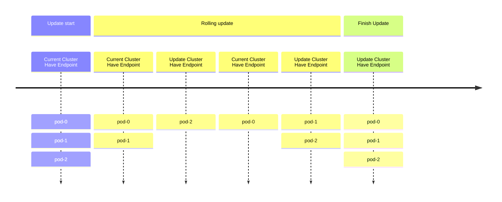
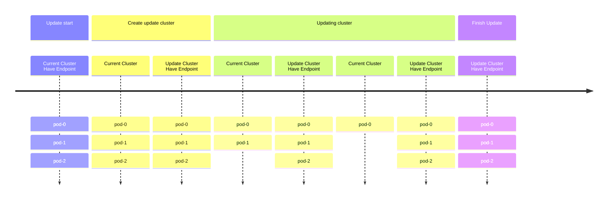
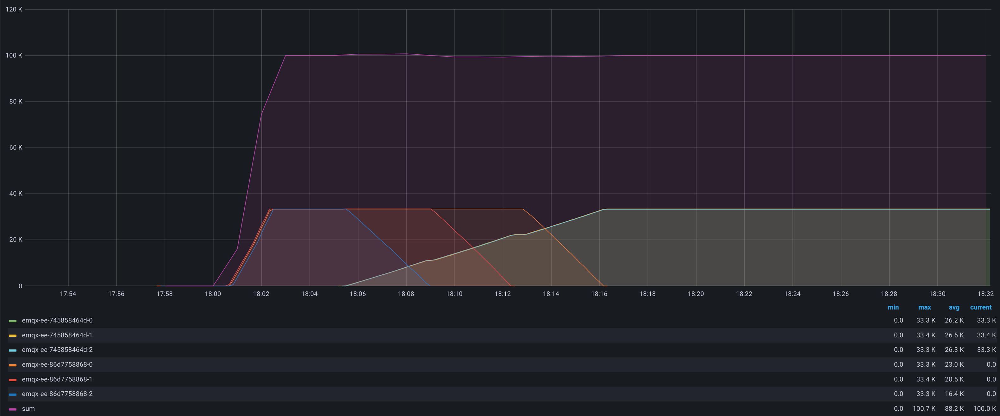

# 通过蓝绿发布优雅的升级 EMQX 集群

## 任务目标

如何通过蓝绿发布优雅的升级 EMQX 集群

:::tip

该功能仅支持 `apps.emqx.io/v1beta4 EmqxEnterprise` 及 `apps.emqx.io/v2beta1 EMQX`

:::

## 背景

在传统的 EMQX 集群部署中，通常使用 StatefulSet 默认的滚动升级策略来更新 EMQX Pod。然而，这种方式存在以下两个问题：

1. 在进行滚动更新时，对应的 Service 会同时选中新的和旧的 Pod。这可能导致 MQTT 客户端连接到错误的 Pod 上，从而频繁断开连接并进行重连操作。
2. 在滚动更新过程中，只有 N - 1 个 Pod 能够提供服务，因为新的 Pod 需要一定时间来启动和准备就绪。这可能导致服务的可用性下降。



## 解决方案

针对上文提到的滚动更新的问题，EMQX Operator 提供了蓝绿发布的升级方案，通过 EMQX 自定义资源升级 EMQX 集群时，EMQX Operator 会创建新的 EMQX 集群，并在集群就绪后将 Kubernetes Service 指向新的 EMQX 集群，并逐步删除旧的 EMQX 集群的 Pod，从而达到更新 EMQX 集群的目的。

在删除旧的 EMQX 集群的 Pod 时，EMQX Operator 还可以利用 EMQX 节点疏散的特性，以用户所希望的速率将 MQTT 连接转移到新的集群中，避免了段时间内大量连接的问题。

整个升级流程大致可分为以下几步：

1. 创建一个相同规格的集群。
2. 新集群就绪后，将 service 指向新集群，并将旧集群从 service 中摘除，此时新集群开始接受流量，旧集群现有的连接不受影响。
3. （仅支持 EMQX 企业版）通过 EMQX 节点疏散功能，逐个对节点上的连接进行疏散。
4. 将旧的集群逐步缩容到 0 个节点。
5. 完成升级。



## 如何通过蓝绿发布更新 EMQX 集群

### 配置更新策略

:::: tabs type:card
::: tab apps.emqx.io/v2beta1

创建 `apps.emqx.io/v2beta1 EMQX`，并配置更新策略

```yaml
apiVersion: apps.emqx.io/v2beta1
kind: EMQX
metadata:
  name: emqx
spec:
  image: emqx:5
  updateStrategy:
    evacuationStrategy:
      connEvictRate: 1000
      sessEvictRate: 1000
      waitTakeover: 10
    initialDelaySeconds: 10
    type: Recreate
```

`initialDelaySeconds`: 所有的节点就绪后，开始更新前的等待时间（单位: second）。

`waitTakeover`: 删除 Pod 时的间隔时间（单位: second）。

`connEvictRate`: MQTT  客户端疏散速率，仅支持 EMQX 企业版（单位: count/second）。

`sessEvictRate`: MQTT Session 疏散速率，仅支持 EMQX 企业版（单位：count/second）。

将上述内容保存为：emqx-update.yaml，执行如下命令部署 EMQX：

```bash
$ kubectl apply -f emqx-update.yaml

emqx.apps.emqx.io/emqx-ee created
```

检查 EMQX 集群状态，请确保 `STATUS` 为 `Running`，这可能需要一些时间等待 EMQX 集群准备就绪。

```bash
$ kubectl get emqx

NAME      STATUS   AGE
emqx-ee   Running  8m33s
```

:::
::: tab apps.emqx.io/v1beta4

创建 `apps.emqx.io/v1beta4 EmqxEnterprise` 并配置更新策略。

```yaml
apiVersion: apps.emqx.io/v1beta4
kind: EmqxEnterprise
metadata:
  name: emqx-ee
spec:
  blueGreenUpdate:
    initialDelaySeconds: 60
    evacuationStrategy:
      waitTakeover: 5
      connEvictRate: 200
      sessEvictRate: 200
  template:
    spec:
      emqxContainer:
        image:
          repository: emqx/emqx-ee
          version: 4.4.14
```

`initialDelaySeconds`: 所有的节点就绪后，开始节点疏散前的等待时间（单位: second）。

`waitTakeover`: 所有连接断开后，等待客户端重连以接管会话的时间（单位: second）。

`connEvictRate`: MQTT 客户端疏散速率（单位: count/second）。

`sessEvictRate`: MQTT Session 疏散速度（单位：count/second）。

将上述内容保存为：emqx-update.yaml，执行如下命令部署 EMQX 企业版集群：

```bash
$ kubectl apply -f emqx-update.yaml

emqxenterprise.apps.emqx.io/emqx-ee created
```

检查 EMQX 集群状态，请确保 `STATUS` 为 `Running`，这可能需要一些时间等待 EMQX 集群准备就绪。

```bash
$ kubectl get emqxenterprises

NAME      STATUS   AGE
emqx-ee   Running  8m33s
```

:::
::::

### 使用 MQTT X CLI 连接 EMQX 集群

MQTT X CLI 是一个开源的，支持自动重连的 MQTT 5.0 CLI Client，也是一个纯命令行模式的 MQTT X。旨在帮助更快地开发和调试 MQTT 服务和应用程序，而无需使用图形界面。关于 MQTT X CLI 的文档可以参考：[MQTTX CLI](https://mqttx.app/docs/cli)。

执行如下命令连接 EMQX 集群：

```bash
mqttx bench conn -h ${IP} -p ${PORT} -c 3000
```

输出类似于：

```bash
[10:05:21 AM] › ℹ  Start the connect benchmarking, connections: 3000, req interval: 10ms
✔  success   [3000/3000] - Connected
[10:06:13 AM] › ℹ  Done, total time: 31.113s
```

### 升级 EMQX 集群

- 任何作用到 Pod Template 的修改都会触发 EMQX Operator 的升级策略

  > 在本文中通过我们修改 EMQX Container Image 来触发升级，用户可根据实际需求自行修改。

  ```bash
  $ kubectl patch emqx emqx-ee --type=merge -p '{"spec": {"imagePullPolicy": "Never"}}'

  emqx.apps.emqx.io/emqx-ee patched
  ```

- 检查蓝绿升级的状态

  ```bash
  $ kubectl get emqx emqx-ee -o json | jq ".status.nodEvacuationsStatus"

  [
    {
      "connection_eviction_rate": 200,
      "node": "emqx-ee@emqx-ee-54fc496fb4-2.emqx-ee-headless.default.svc.cluster.local",
      "session_eviction_rate": 200,
      "session_goal": 0,
      "connection_goal": 22,
      "session_recipients": [
        "emqx-ee@emqx-ee-5d87d4c6bd-2.emqx-ee-headless.default.svc.cluster.local",
        "emqx-ee@emqx-ee-5d87d4c6bd-1.emqx-ee-headless.default.svc.cluster.local",
        "emqx-ee@emqx-ee-5d87d4c6bd-0.emqx-ee-headless.default.svc.cluster.local"
      ],
      "state": "waiting_takeover",
      "stats": {
        "current_connected": 0,
        "current_sessions": 0,
        "initial_connected": 33,
        "initial_sessions": 0
      }
    }
  ]
  ```

  `connection_eviction_rate`: 节点疏散速率（单位：count/second）。

  `node`: 当前正在进行疏散的节点。

  `session_eviction_rate`: 节点 session 疏散速率(单位：count/second)。

  `session_recipients`: session 疏散的接受者列表。

  `state`: 节点疏散阶段。

  `stats`: 疏散节点的统计指标，包括当前连接数（current_connected），当前 session 数（current_sessions），初始连接数（initial_connected），初始 session 数（initial_sessions）。

- 等待完成升级

  ```bash
  $ kubectl get emqx

  NAME      STATUS   AGE
  emqx-ee   Ready    8m33s
  ```

  请确保 `STATUS` 为 `Ready`， 这需要一些时间等待 EMQX 集群完成升级。

  升级完成后， 通过 `$ kubectl get pods` 命令可以观察到旧的 EMQX 节点已经被删除。

## Grafana 监控

升级过程中连接数监控图如下（1万连接为例）



Total：总的连接数，图中最上面的一条线

emqx-ee-86f864f975：前缀表示的是升级前的 3 个 EMQX 节点

emqx-ee-648c45c747：前缀表示升级后的 3 个 EMQX 节点

如上图，我们通过 EMQX Kubernetes Operator 的蓝绿发布在 Kubernetes 中实现了优雅升级，通过该方案升级，总连接数未出现较大抖动（取决于迁移速率、服务端能够接收的速率、客户端重连策略等），能够极大程度保障升级过程的平滑，有效防止服务端过载，减少业务感知，从而提升服务的稳定性。
