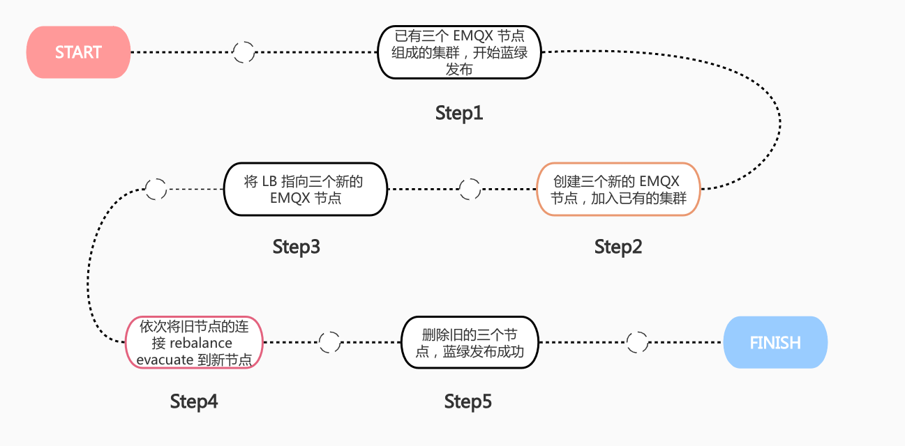
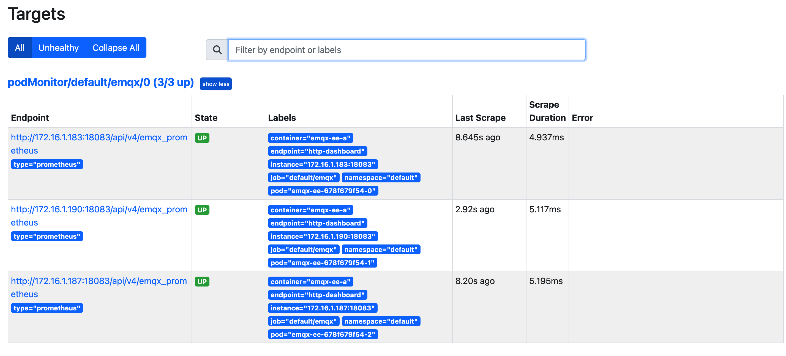
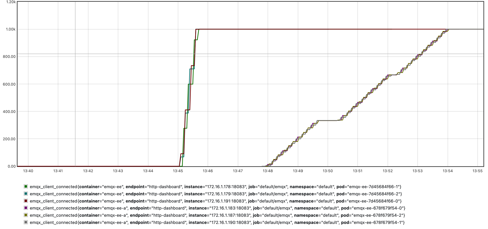

# 配置 EMQX 企业版蓝绿升级

## 任务目标

- 如何使用 blueGreenUpdate 字段配置 EMQX 企业版蓝绿升级。

## 使用 blueGreenUpdate 字段配置蓝绿升级

EMQX 提供的是长连接服务，在 Kubernets 中，现有升级策略除了热升级外，都需要重启 EMQX 服务，这种升级策略会导致设备出现断连，如果设备有重连机制，就会出现大量设备同时请求连接的情况，从而引发雪崩，最终导致大量客户端暂时得不到服务。因此 EMQX Operator 基于 EMQX 企业版的节点疏散（Node Evacuation）功能实现了蓝绿升级来解决上述问题。EMQX Operator 进行蓝绿升级的流程如下图所示：



EMQX 节点疏散功能用于疏散节点中的所有连接，手动/自动的将客户端连接和会话移动到集群中的其他节点或者其他集群。关于 EMQX 节点疏散的详细介绍可以参考文档：[Node Evacuation](https://docs.emqx.com/zh/enterprise/v4.4/advanced/rebalancing.html#%E8%8A%82%E7%82%B9%E7%96%8F%E6%95%A3) 。**注意：** 节点疏散功能仅在 EMQX 企业版 4.4.12 版本才开放。

- 配置 EMQX 集群

EMQX 企业版在 EMQX Operator 里面对应的 CRD 为 EmqxEnterprise，EmqxEnterprise 支持通过 `.spec.blueGreenUpdate` 字段来配置 EMQX 企业版蓝绿升级，blueGreenUpdate 字段的具体描述可以参考：[blueGreenUpdate](https://github.com/emqx/emqx-operator/blob/main-2.1/docs/en_US/reference/v1beta4-reference.md#evacuationstrategy)。

```yaml
apiVersion: apps.emqx.io/v1beta4
kind: EmqxEnterprise
metadata:
  name: emqx-ee
spec:
  replicas: 3
  license:
    stringData: |
      -----BEGIN CERTIFICATE-----
      ...
      -----END CERTIFICATE-----
  blueGreenUpdate:
    initialDelaySeconds: 5
    evacuationStrategy:
      waitTakeover: 5
      connEvictRate: 10
      sessEvictRate: 10
  template:
    spec:
      emqxContainer:
        image: 
          repository: emqx/emqx-ee
          version: 4.4.14
        ports:
          - name: "http-dashboard"
            containerPort: 18083
  serviceTemplate:
    spec:
      type: NodePort
      ports:
        - name: "mqtt-tcp-1883"
          protocol: "TCP"
          port: 1883
          targetPort: 1883
          nodePort: 32010
```

**说明：**`waitTakeover` 表示当前节点开始 session 疏散之前等待的时间（单位为 second）。`connEvictRate` 表示当前节点客户端断开速率（单位为：count/second）。`sessEvictRate` 表示当前节点客户端 session 疏散速率（单位为：count/second）。`.spec.license.stringData` 字段填充的是 License 证书内容，在本文该字段的内容被省略，请用自己证书的内容进行填充。

将上述内容保存为：emqx-update.yaml，执行如下命令部署 EMQX 企业版集群：

```
kubectl apply -f emqx-update.yaml
```

输出类似于：

```
emqxenterprise.apps.emqx.io/emqx-ee created
```

- 检查 EMQX 企业版集群是否就绪

```
kubectl get emqxenterprise emqx-ee -o json | jq ".status.emqxNodes"
```

输出类似于：

```
[
  {
    "node": "emqx-ee@emqx-ee-54fc496fb4-1.emqx-ee-headless.default.svc.cluster.local",
    "node_status": "Running",
    "otp_release": "24.3.4.2/12.3.2.2",
    "version": "4.4.12"
  },
  {
    "node": "emqx-ee@emqx-ee-54fc496fb4-0.emqx-ee-headless.default.svc.cluster.local",
    "node_status": "Running",
    "otp_release": "24.3.4.2/12.3.2.2",
    "version": "4.4.12"
  },
  {
    "node": "emqx-ee@emqx-ee-54fc496fb4-2.emqx-ee-headless.default.svc.cluster.local",
    "node_status": "Running",
    "otp_release": "24.3.4.2/12.3.2.2",
    "version": "4.4.12"
  }
]
```

**说明：**`node` 表示 EMQX 节点在集群的唯一标识。`node_status` 表示 EMQX 节点的状态。`otp_release` 表示 EMQX 使用的 Erlang 的版本。`version` 表示 EMQX 版本。EMQX Operator 默认会拉起三个节点的 EMQX 集群，所以当集群运行正常时，可以看到三个运行的节点信息。如果你配置了 `.spec.replicas` 字段，当集群运行正常时，输出结果中显示的运行节点数量应和 replicas 的值相等。

## 部署 Prometheus 采集 EMQX 统计指标

为了更好的展示蓝绿升级过程中 EMQX 客户端连接情况，本文采用 Prometheus 来采集 EMQX 的统计指标。以下是部署 Prometheus 的流程：

- 部署 Prometheus

Prometheus 部署文档可以参考：[Prometheus](https://github.com/prometheus-operator/prometheus-operator/blob/main/Documentation/user-guides/getting-started.md)

- 配置 PodMonitor

PodMonitor 自定义资源定义 (CRD) 允许以声明方式定义一组动态的 pod 应该如何被监控。使用标签选择来定义选择哪些 pod 以使用所需配置进行监视，其文档可以参考：[PodMonitor](https://github.com/prometheus-operator/prometheus-operator/blob/main/Documentation/design.md#podmonitor)

```yaml
apiVersion: monitoring.coreos.com/v1
kind: PodMonitor
metadata:
  name: emqx
  namespace: default
  labels:
    app.kubernetes.io/name: emqx-ee
spec:
  podMetricsEndpoints:
  - interval: 10s
    port: http-dashboard
    scheme: http
    path: /api/v4/emqx_prometheus
    params:
      type:
        - prometheus
    basicAuth:
      password:
        name: emqx-basic-auth
        key: password
      username:
        name: emqx-basic-auth
        key: username
  jobLabel: emqx-scraping
  namespaceSelector:
    matchNames:
      -  default
  selector:
    matchLabels:
      apps.emqx.io/instance: emqx-ee
```

将上述内容保存为：podMonitor.yaml 并创建 PodMonitor。

```bash
kubectl apply -f podMonitor.yaml
```

创建 basicAuth 为 PodMonitor 提供访问 EMQX 接口需要的账号密码信息。

```yaml
apiVersion: v1
kind: Secret
metadata:
  name: emqx-basic-auth
  namespace: default
type: kubernetes.io/basic-auth
stringData:
  username: admin
  password: public
```

将上述内容保存为：secret.yaml 并创建 Secret。

```
kubectl apply -f secret.yaml
```

- 检查 Prometheus 是否正常获取 EMQX 集群指标

使用浏览器访问 Prometheus Web 服务，切换到 Status -> Targets，显示如下图所示：



从图中可以看出可以正常获取到 EMQX 集群所有 Pod 的指标数据。

## 测试 EMQX 企业版蓝绿升级

- 使用 MQTT X CLI 连接 EMQX 集群

MQTT X CLI 是开源一个的，支持自动重连的 MQTT 5.0 CLI Client，也是一个纯命令行模式的 MQTT X。旨在帮助更快地开发和调试 MQTT 服务和应用程序，而无需使用图形界面。关于 MQTT X CLI 的文档可以参考：[MQTTX CLI](https://mqttx.app/docs/cli)。

执行如下命令连接 EMQX 集群：

```bash
mqttx bench  conn -h 47.103.65.17  -p 32010   -c 3000
```

**说明：**`-h` 表示 EMQX Pod 所在宿主机 IP。`-p` 表示 nodePort 端口。`-c` 表示创建的连接数。本文在部署 EMQX 集群的时候采用的是 NodePort 模式暴露服务。如果采用 LoadBalancer 的方式暴露服务则 `-h` 应为 LoadBalancer 的 IP，`-p` 应为 EMQX MQTT 服务端口。

输出类似于：

```
[10:05:21 AM] › ℹ  Start the connect benchmarking, connections: 3000, req interval: 10ms
✔  success   [3000/3000] - Connected
[10:06:13 AM] › ℹ  Done, total time: 31.113s
```

- 修改 EmqxEnterprise 对象触发 EMQX Operator 进行蓝绿升级

修改 EmqxEnterprise 对象 `.spec.template` 字段的任意内容都会触发 EMQX Operator 进行蓝绿升级。在本文中通过我们修改 EMQX Container Name 来触发升级，用户可根据实际需求自行修改。

```
kubectl patch EmqxEnterprise emqx-ee --type='merge' -p '{"spec": {"template": {"spec": {"emqxContainer": {"emqxConfig": {"name": "emqx-ee-a"}}}}}}'
```

输出类似于：

```
emqxenterprise.apps.emqx.io/emqx-ee patched
```

- 检查蓝绿升级的状态

```bash
kubectl get emqxenterprise emqx-ee -o json | jq ".status.blueGreenUpdateStatus.evacuationsStatus"
```

输出类似于：

```
[
  {
    "connection_eviction_rate": 10,
    "node": "emqx-ee@emqx-ee-54fc496fb4-2.emqx-ee-headless.default.svc.cluster.local",
    "session_eviction_rate": 10,
    "session_goal": 0,
    "connection_goal": 22,
    "session_recipients": [
      "emqx-ee@emqx-ee-5d87d4c6bd-2.emqx-ee-headless.default.svc.cluster.local",
      "emqx-ee@emqx-ee-5d87d4c6bd-1.emqx-ee-headless.default.svc.cluster.local",
      "emqx-ee@emqx-ee-5d87d4c6bd-0.emqx-ee-headless.default.svc.cluster.local"
    ],
    "state": "waiting_takeover",
    "stats": {
      "current_connected": 0,
      "current_sessions": 0,
      "initial_connected": 33,
      "initial_sessions": 0
    }
  }
]
```

**说明：**`connection_eviction_rate` 表示节点疏散速率（单位：count/second）。`node` 表示当前正在进行疏散的节点。`session_eviction_rate` 表示节点 session 疏散速率(单位：count/second)。`session_recipients` 表示 session 疏散的接受者列表。`state` 表示节点疏散阶段。`stats` 表示疏散节点的统计指标，包括当前连接数（current_connected），当前 session 数（current_sessions），初始连接数（initial_connected），初始 session 数（initial_sessions）。

- 使用 Prometheus 查看蓝绿升级过程中客户端连接情况

使用浏览器访问 Prometheus Web 服务，点击 Graph，在收索框输入 `emqx_connections_count`，并点击 Execute，显示如下图所示：



从图中可以看出存在新旧两个 EMQX 集群，每个集群都有三个 EMQX 节点。在开始进行蓝绿升级后，旧集群每个节点的连接按照配置的速率断开并迁移到新集群的节点上，最终旧集群中的所有连接完全迁移到新集群中，则代表蓝绿升级完成。


