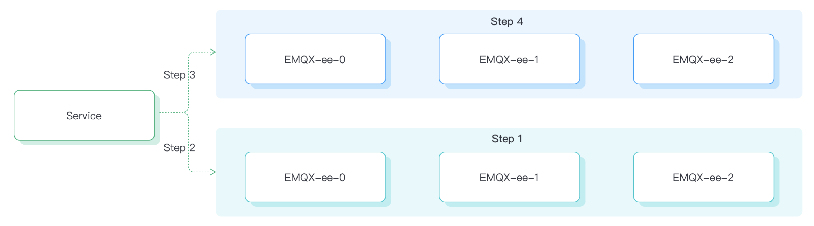

# 配置蓝绿发布（EMQX 4 企业版）

## 任务目标

如何通过蓝绿发布优雅的升级 EMQX 集群

## 为什么需要蓝绿发布

传统的滚动升级在生产环境中可能会面临以下问题：

1. 升级过程中会逐个销毁旧的节点再创建新的节点，因此可能导致客户端多次断连（最坏的情况下断连次数与节点数量一致）

2. 当集群处于较高连接的情况下，一个节点被销毁，那么该节点上面的连接会在瞬间断开，由客户端重试逻辑来进行重连。当单节点连接数较大时，如果大量客户端进行重连，则可能会给服务端造成压力导致过载

3. 升级完成后，各节点间的负载不均衡

4. 由于 StatefulSets 进行部署，在升级过程中提供服务的节点会比实际节点要少一个


因此 EMQX Operator 基于 EMQX 企业版的节点疏散（Node Evacuation）功能实现了蓝绿发布来解决上述问题。


EMQX 节点疏散功能用于疏散节点中的所有连接，手动/自动的将客户端连接和会话移动到集群中的其他节点或者其他集群。关于 EMQX 节点疏散的详细介绍可以参考文档：[Node Evacuation](https://docs.emqx.com/zh/enterprise/v4.4/advanced/rebalancing.html#%E8%8A%82%E7%82%B9%E7%96%8F%E6%95%A3) 。

:::tip

节点疏散功能仅在 EMQX 企业版 4.4.12 版本后才开放。

:::

## 蓝绿发布流程



整个升级流程大致可分为以下几步：
1. 升级时我们会先创建一个同规格的节点加入到现有集群中。

2. 当新节点全部就绪后，我们将 service 全部指向新创建的节点，此时新节点开始接受新的连接请求。

3. 将旧节点从 service 中摘出，此时旧节点不再接收新的连接请求。

4. 通过 EMQX 节点疏散功能，逐个对节点上的连接进行可控迁移，直至连接全部完成迁移，再对节点进行销毁。


## 如何使用蓝绿发布

### 配置蓝绿发布参数

EMQX 企业版在 EMQX Operator 里面对应的 CRD 为 EmqxEnterprise，EmqxEnterprise 支持通过 `.spec.blueGreenUpdate` 字段来配置 EMQX 企业版蓝绿升级，blueGreenUpdate 字段的具体描述可以参考：[blueGreenUpdate](https://github.com/emqx/emqx-operator/blob/main-2.1/docs/en_US/reference/v1beta4-reference.md#evacuationstrategy)。

```yaml
apiVersion: apps.emqx.io/v1beta4
kind: EmqxEnterprise
metadata:
  name: emqx-ee
spec:
  blueGreenUpdate:
    initialDelaySeconds: 60
    evacuationStrategy:
      waitTakeover: 5
      connEvictRate: 200
      sessEvictRate: 200
  template:
    spec:
      emqxContainer:
        image:
          repository: emqx/emqx-ee
          version: 4.4.14
```

`initialDelaySeconds`: 所有的节点就绪后，开始节点疏散前的等待时间（单位: second）。

`waitTakeover`: 所有连接断开后，等待客户端重连以接管会话的时间（单位: second）。

`connEvictRate`: 客户端断开速率（单位: count/second）。

`sessEvictRate`: `waitTakeover` 之后会话疏散速度（单位：count/second）。

将上述内容保存为：emqx-update.yaml，执行如下命令部署 EMQX 企业版集群：

```bash
$ kubectl apply -f emqx-update.yaml

emqxenterprise.apps.emqx.io/emqx-ee created
```

检查 EMQX 集群状态，请确保 `STATUS` 为 `Running`，这可能需要一些时间等待 EMQX 集群准备就绪。

   ```bash
$ kubectl get emqxenterprises

NAME      STATUS   AGE
emqx-ee   Running  8m33s
   ```

### 使用 MQTT X CLI 连接 EMQX 集群

MQTT X CLI 是开源一个的，支持自动重连的 MQTT 5.0 CLI Client，也是一个纯命令行模式的 MQTT X。旨在帮助更快地开发和调试 MQTT 服务和应用程序，而无需使用图形界面。关于 MQTT X CLI 的文档可以参考：[MQTTX CLI](https://mqttx.app/docs/cli)。

执行如下命令连接 EMQX 集群：

```bash
mqttx bench conn -h ${IP} -p ${PORT}  -c 3000
```

本文在部署 EMQX 集群的时候采用的是 NodePort 模式暴露服务。

`-h`: EMQX Pod 所在宿主机 IP。

`-p`: NodePort 端口。

`-c`: 创建的连接数。

输出类似于：

```bash
[10:05:21 AM] › ℹ  Start the connect benchmarking, connections: 3000, req interval: 10ms
✔  success   [3000/3000] - Connected
[10:06:13 AM] › ℹ  Done, total time: 31.113s
```

### 触发 EMQX Operator 进行蓝绿升级

修改 EmqxEnterprise 对象 `.spec.template` 字段的任意内容都会触发 EMQX Operator 进行蓝绿升级。在本文中通过我们修改 EMQX Container Name 来触发升级，用户可根据实际需求自行修改。

```bash
$ kubectl patch EmqxEnterprise emqx-ee --type='merge' -p '{"spec": {"template": {"spec": {"emqxContainer": {"emqxConfig": {"image": {"version": "4.4.15"}}}}}}}'

emqxenterprise.apps.emqx.io/emqx-ee patched
```

- 检查蓝绿升级的状态

  ```bash
  $ kubectl get emqxEnterprise emqx-ee -o json | jq ".status.blueGreenUpdateStatus.evacuationsStatus"

  [
    {
      "connection_eviction_rate": 200,
      "node": "emqx-ee@emqx-ee-54fc496fb4-2.emqx-ee-headless.default.svc.cluster.local",
      "session_eviction_rate": 200,
      "session_goal": 0,
      "connection_goal": 22,
      "session_recipients": [
        "emqx-ee@emqx-ee-5d87d4c6bd-2.emqx-ee-headless.default.svc.cluster.local",
        "emqx-ee@emqx-ee-5d87d4c6bd-1.emqx-ee-headless.default.svc.cluster.local",
        "emqx-ee@emqx-ee-5d87d4c6bd-0.emqx-ee-headless.default.svc.cluster.local"
      ],
      "state": "waiting_takeover",
      "stats": {
        "current_connected": 0,
        "current_sessions": 0,
        "initial_connected": 33,
        "initial_sessions": 0
      }
    }
  ]
  ```

  `connection_eviction_rate`: 节点疏散速率（单位：count/second）。

  `node`: 当前正在进行疏散的节点。

  `session_eviction_rate`: 节点 session 疏散速率(单位：count/second)。

  `session_recipients`: session 疏散的接受者列表。

  `state`: 节点疏散阶段。

  `stats`: 疏散节点的统计指标，包括当前连接数（current_connected），当前 session 数（current_sessions），初始连接数（initial_connected），初始 session 数（initial_sessions）。

- 等待完成升级

  ```bash
  $ kubectl get emqxenterprises

  NAME      STATUS   AGE
  emqx-ee   Running  8m33s
  ```

  请确保 `STATUS` 为 `Running`，这需要一些时间等待 EMQX 集群完成升级。
  
  升级完成后，通过 `$ kubectl get pods` 命令可以观察到旧的 EMQX 节点已经被删除。

## Grafana 监控

升级过程中连接数监控图如下（10万连接为例）


sum：总的连接数，图中最上面的一条线

emqx-ee-86d7758868：升级前的 3 个 EMQX 节点

emqx-ee-745858464d：升级后的 3 个 EMQX 节点

如上图，我们通过 EMQX Kubernetes Operator 的蓝绿发布在 Kubernetes 中实现了优雅升级，通过该方案升级，总连接数未出现较大抖动（取决于迁移速率、服务端能够接收的速率、客户端重连策略等），能够极大程度保障升级过程的平滑，有效防止服务端过载，减少业务感知，从而提升服务的稳定性。

