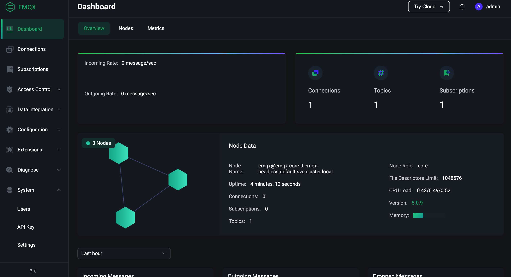
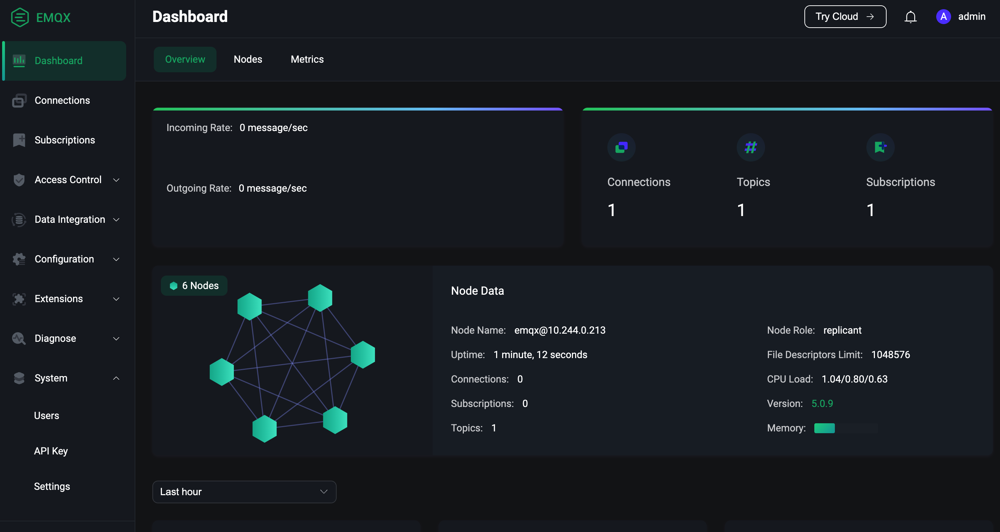

# 配置 EMQX Core 和 Replicant 节点

## 任务目标

- 如何通过 coreTemplate 字段配置 EMQX 集群 Core 节点。
- 如何通过 replicantTemplate 字段配置 EMQX 集群 Replicant 节点。

## 配置 EMQX 集群 Core 节点

在 EMQX 5.0 中，为了实现集群横向扩展能力，可以将集群中的 EMQX 节点分成两个角色：核心（Core）节点和 复制（Replicant）节点。其拓扑结构如下图所示：


Core 节点的行为与 EMQX 4.x 中节点一致：Core 节点使用全连接的方式组成集群，每个节点都可以发起事务、持有锁等。因此，EMQX 5.0 仍然要求 Core 节点在部署上要尽量的可靠。**请注意：EMQX 集群中至少要有一个 Core 节点**。

Replicant 节点不再直接参与事务的处理。但它们会连接到 Core 节点，并被动地复制来自 Core 节点的数据更新。Replicant 节点不允许执行任何的写操作。而是将其转交给 Core 节点代为执行。另外，由于 Replicant 会复制来自 Core 节点的数据，所以它们有一份完整的本地数据副本，以达到最高的读操作的效率，这样有助于降低 EMQX 路由的时延。另外，Replicant 节点被设计成是无状态的，添加或删除它们不会导致集群数据的丢失、也不会影响其他节点的服务状态，所以 Replicant 节点可以被放在一个自动扩展组中。

- 部署 EMQX 集群

EMQX CRD 支持使用 `.spec.coreTemplate` 字段来配置 EMQX 集群 Core 节点，coreTemplate 字段的具体描述可以参考：[coreTemplate](https://github.com/emqx/emqx-operator/blob/2.0.2/docs/en_US/reference/v2alpha1-reference.md#emqxcoretemplate)。使用 `.spec.replicantTemplate` 字段来配置 EMQX 集群 Replicant 节点，replicantTemplate 字段的具体描述可以参考：[emqxreplicanttemplate](https://github.com/emqx/emqx-operator/blob/2.0.2/docs/en_US/reference/v2alpha1-reference.md#emqxreplicanttemplate)。

```yaml
apiVersion: apps.emqx.io/v2alpha1
kind: EMQX
metadata:
  name: emqx
spec:
  image: emqx/emqx:5.0.14
  coreTemplate:
    spec:
      replicas: 3
  replicantTemplate:
    spec:
      replicas: 0
  dashboardServiceTemplate:
    spec:
      type: NodePort
      ports:
        - name: "dashboard-listeners-http-bind"
          protocol: TCP
          port: 18083
          targetPort: 18083
          nodePort: 32015
  listenersServiceTemplate:
    spec:
      type: NodePort
      ports:
        - name: "tcp-default"
          protocol: TCP
          port: 1883
          targetPort: 1883 
          nodePort: 32016
```

> 如果 EMQX 集群配置了 Replicant 节点，MQTT 客户端的请求会连接 Rplicant 节点，否则会连接到 Core 节点。访问 EMQX Dashboard 的请求只会连接到 Core 节点。在 `.spec.dashboardServiceTemplate` 里面我们配置了 EMQX 集群对外暴露 Dashboard 服务的方式为 NodePort，并指定了 EMQX Dashboard 服务 18083 端口对应的 nodePort 为 32015（nodePort 取值范围为：30000-32767）。在 `.spec.listenersServiceTemplate` 里面我们配置了 EMQX 集群监听器对外暴露服务的方式为 NodePort，并指定了 EMQX 监听器 1883 端口对应的 nodePort 为 32016。**请注意：EMQX 集群中至少要配置一个 Core 节点**。

将上述内容保存为：emqx-core.yaml，并执行如下命令部署 EMQX 集群：

```bash
kubectl apply -f emqx-core.yaml
```

输出类似于：

```
emqx.apps.emqx.io/emqx created
```

- 检查 EMQX 集群是否就绪

```bash
 kubectl get emqx emqx -o json | jq '.status.conditions[] | select( .type == "Running" and .status == "True")'
```

输出类似于：

```bash
{
  "lastTransitionTime": "2023-03-01T02:17:03Z",
  "lastUpdateTime": "2023-03-01T02:17:03Z",
  "message": "Cluster is running",
  "reason": "ClusterRunning",
  "status": "True",
  "type": "Running"
}
```

- 使用 MQTT X 连接 EMQX 集群发送消息

MQTT X 是一款完全开源的 MQTT 5.0 跨平台桌面客户端。支持快速创建多个同时在线的 MQTT 客户端连接，方便测试 MQTT/TCP、MQTT/TLS、MQTT/WebSocket 的连接、发布、订阅功能及其他 MQTT 协议特性。更多 MQTT X 的使用文档可以参考：[MQTT X](https://mqttx.app/zh/docs)。

在 MQTT X 页面点击创建新连接的按钮，按照如图所示配置 EMQX 集群节点信息，在配置好连接信息之后，点击 connect 按钮连接 EMQX 集群：


然后点击订阅按钮新建订阅，如图所示 MQTT X 已成功连接 EMQX 集群并且已经成功创建订阅：


在成功连接 EMQX 集群并创建订阅之后，我们就可以向 EMQX 集群发送消息，如下图所示：


- 通过 Dashboard 访问 EMQX 集群 

打开浏览器，输入 EMQX Pod 所在宿主机 `IP` 和 端口 `32015` 登录 EMQX 集群 Dashboard（Dashboard 默认用户名为：admin ，默认密码为：public），进入 Dashboard 点击仪表盘可以看到集群中所有节点信息，如下图所示：



从图中可以看到当前 EMQX 集群中有3个 Core 节点，连接数和订阅数均为1。

## 配置EMQX 集群 Replicant 节点

- 部署 EMQX 集群 

```yaml
apiVersion: apps.emqx.io/v2alpha1
kind: EMQX
metadata:
  name: emqx
spec:
  image: emqx/emqx:5.0.14
  coreTemplate:
    spec:
      replicas: 3
  replicantTemplate:
    spec:
      replicas: 3
  dashboardServiceTemplate:
    spec:
      type: NodePort
      ports:
        - name: "dashboard-listeners-http-bind"
          protocol: TCP
          port: 18083
          targetPort: 18083
          nodePort: 32015
  listenersServiceTemplate:
    spec:
      type: NodePort
      ports:
        - name: "tcp-default"
          protocol: TCP
          port: 1883
          targetPort: 1883 
          nodePort: 32016
```

将上述内容保存为：emqx-replicant.yaml，并执行如下命令部署 EMQX 集群：

```bash
kubectl apply -f emqx-replicant.yaml 
```

输出类似于：

```
emqx.apps.emqx.io/emqx created
```

- 检查 EMQX 集群是否就绪

```bash
kubectl get emqx emqx -o json | jq '.status.conditions[] | select( .type == "Running" and .status == "True")'
```

输出类似于：

```bash
{
  "lastTransitionTime": "2023-03-01T02:17:03Z",
  "lastUpdateTime": "2023-03-01T02:17:03Z",
  "message": "Cluster is running",
  "reason": "ClusterRunning",
  "status": "True",
  "type": "Running"
}
```

- 使用 MQTT X 连接 EMQX 集群发送消息

在 MQTT X 页面点击创建新连接的按钮，按照如图所示配置 EMQX 集群节点信息，在配置好连接信息之后，点击 connect 按钮连接 EMQX 集群：


然后点击订阅按钮新建订阅，如图所示 MQTT X 已成功连接 EMQX 集群并且已经成功创建订阅：


在成功连接 EMQX 集群并创建订阅之后，我们就可以向 EMQX 集群发送消息，如下图所示：


- 通过 Dashboard 访问 EMQX 集群 

最后打开浏览器，输入 EMQX Pod 所在宿主机 `IP` 和 端口 `32015` 登录 EMQX 集群 Dashboard，点击仪表盘查看 EMQX 集群节点信息：



从图中可以看出，当前集群中有3个 Core 节点和3个 Replicant 节点，连接数和订阅数均为1。