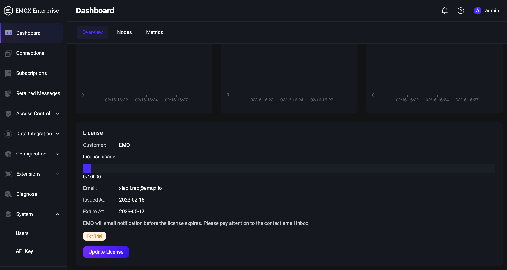
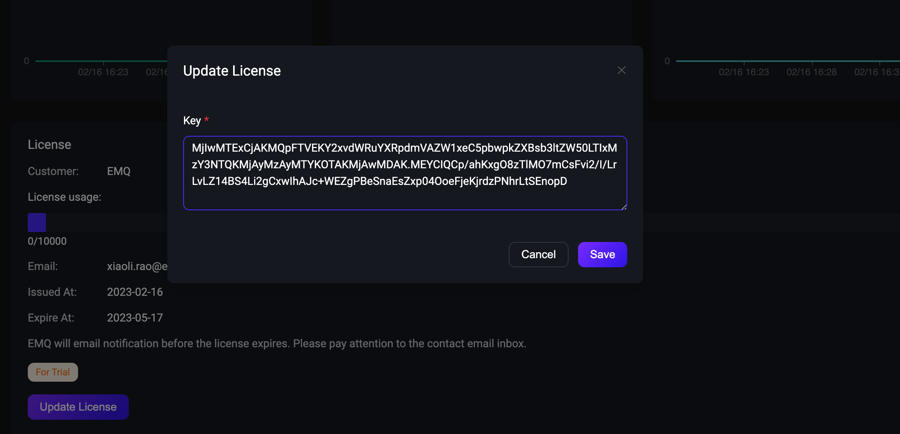
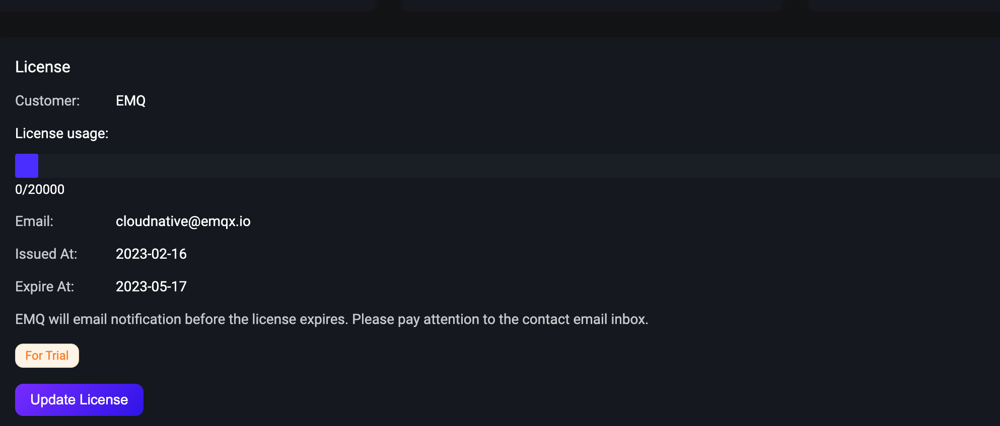

# License 配置 (EMQX 企业版)

## 任务目标

- 如何配置 EMQX 企业版 License。
- 如何更新 EMQX 企业版 License。

## 配置 License

EMQX 企业版 License 可以在 EMQ 官网免费申请：[申请 EMQX 企业版 License](https://www.emqx.com/zh/apply-licenses/emqx)。

下面是 EMQX Custom Resource 的相关配置，你可以根据希望部署的 EMQX 的版本来选择对应的 APIVersion，具体的兼容性关系，请参考[EMQX Operator 兼容性](../README.md):

:::: tabs type:card
::: tab v2alpha1

配置 EMQX 集群

EMQX 企业版在 EMQX Operator 里面对应的 CRD 为 EMQX ，EMQX CRD 支持使用 `.spec.bootstrapConfig` 配置 EMQX 集群 License ，bootstrapConfig 的配置可以参考文档：[bootstrapConfig](https://www.emqx.io/docs/zh/v5.0/admin/cfg.html)。这个字段只允许在创建 EMQX 集群的时候配置，不支持更新。**注意：** 在创建 EMQX 集群之后，如果需要更新 License，请通过 EMQX Dashboard 进行更新。

```yaml
apiVersion: apps.emqx.io/v2alpha1
kind: EMQX
metadata:
  name: emqx-ee
spec:
  bootstrapConfig: |
    license {
      key = "..."
    }
  image: emqx/emqx-enterprise:5.0.0
```

> `bootstrapConfig` 字段里面的 `license.key` 表示 Licesne 内容，此例中 License 内容被省略，请用户自行填充。

将上述内容保存为：`emqx.yaml`，并执行如下命令部署 EMQX 集群：

```bash
$ kubectl apply -f emqx.yaml

emqx.apps.emqx.io/emqx created
```

检查 EMQX 集群状态，请确保 `STATUS` 为 `Running`，这可能需要一些时间等待 EMQX 集群准备就绪。

```bash
$ kubectl get emqx emqx

NAME   IMAGE      STATUS    AGE
emqx   emqx:5.0   Running   10m
```

:::
::: tab v1beta4

创建基于 License 文件的 Secret

Secret 是一种包含少量敏感信息例如密码、令牌或密钥的对象。关于 Secret 更加详尽的文档可以参考：[Secret](https://kubernetes.io/zh-cn/docs/concepts/configuration/secret/)。EMQX Operator 支持使用 Secret 挂载 License 信息，因此在创建 EMQX 集群之前我们需要基于 License 创建好 Secret。

```
kubectl create secret generic test --from-file=emqx.lic=/path/to/license/file
```

> `/path/to/license/file` 表示 EMQX 企业版 License 文件路径，可以是绝对路径，也可以是相对路径。更多使用 kubectl 创建 Secret 的细节可以参考文档：[使用 kubectl 创建 secret](https://kubernetes.io/zh-cn/docs/tasks/configmap-secret/managing-secret-using-kubectl/)。

输出类似于：

```
secret/test created
```

配置 EMQX 集群

EMQX 企业版在 EMQX Operator 里面对应的 CRD 为 EmqxEnterprise，EmqxEnterprise 支持通过 `.spec.license.secretName` 字段来配置 EMQX 企业版 License，secretName 字段的具体描述可以参考：[secretName](https://github.com/emqx/emqx-operator/blob/main-2.1/docs/en_US/reference/v1beta4-reference.md#emqxlicense)。

```yaml
apiVersion: apps.emqx.io/v1beta4
kind: EmqxEnterprise
metadata:
  name: emqx-ee
spec:
  license:
    secretName: test
  template:
    spec:
      emqxContainer:
        image:
          repository: emqx/emqx-ee
          version: 4.4.14
```

> `secretName` 表示上一步中创建的 Secret 名称。

将上述内容保存为：emqx.yaml，执行如下命令部署 EMQX 集群：

```bash
$ kubectl apply -f emqx.yaml

emqxenterprise.apps.emqx.io/emqx-ee created
```

检查 EMQX 集群状态，请确保 `STATUS` 为 `Running`，这可能需要一些时间等待 EMQX 集群准备就绪。

   ```bash
$ kubectl get emqxenterprises

NAME      STATUS   AGE
emqx-ee   Running  8m33s
   ```

:::
::::

## 检查 License 信息

```bash
kubectl exec -it emqx-ee-core-0 -c emqx -- emqx_ctl license info
```

输出类似于：

```bash
customer        : EMQ
email           : cloudnative@emqx.io
deployment      : deployment-6159820
max_connections : 10000
start_at        : 2023-02-16
expiry_at       : 2023-05-17
type            : trial
customer_type   : 0
expiry          : false
```

> 从输出结果可以看到我们申请的 License 的基本信息，包括申请人的信息和 License 支持最大连接数以及 License 过期时间等。


:::: tabs type:card
::: tab v2alpha1

- 通过 EMQX Dashboard 更新 License

打开浏览器，输入 EMQX Pod 所在宿主机 `IP` 和 端口 `32012` 登录 EMQX 集群 Dashboard（Dashboard 默认用户名为：admin ，默认密码为：public），进入 Dashboard 点击 Overview 将页面下拉到底部可以看到集群当前的 License 信息，如下图所示：



然后点击 **Update License** 按钮上传最新的 License Key 内容，如下图所示：



最后点击 **Save** 按钮保存更新，下图是更新后的 License 信息：



从上面的图中可以看出，License 的内容已经更新，则说明 License 更新成功。

:::
::: tab v1beta4

- 更新 EMQX 企业版 License Secret

```bash
kubectl create secret generic test --from-file=emqx.lic=/path/to/license/file --dry-run -o yaml | kubectl apply -f -
```

输出类似于：

```
secret/test configured
```

- 查看 EMQX 集群 License 是否被更新

```bash
kubectl exec -it emqx-ee-0 -c emqx -- emqx_ctl license info
```

输出类似于：

```bash
customer                 : cloudnative
email                    : cloudnative@emqx.io
max_connections          : 100000
original_max_connections : 100000
issued_at                : 2022-11-21 02:49:35
expiry_at                : 2022-12-01 02:49:35
vendor                   : EMQ Technologies Co., Ltd.
version                  : 4.4.14
type                     : official
customer_type            : 2
expiry                   : false
```

> 若证书信息没有更新，可以等待一会，License 的更新会有些时延。从上面输出的结果可以看出，License 的内容已经更新，则说明 EMQX 企业版 License 更新成功。

:::
::::
