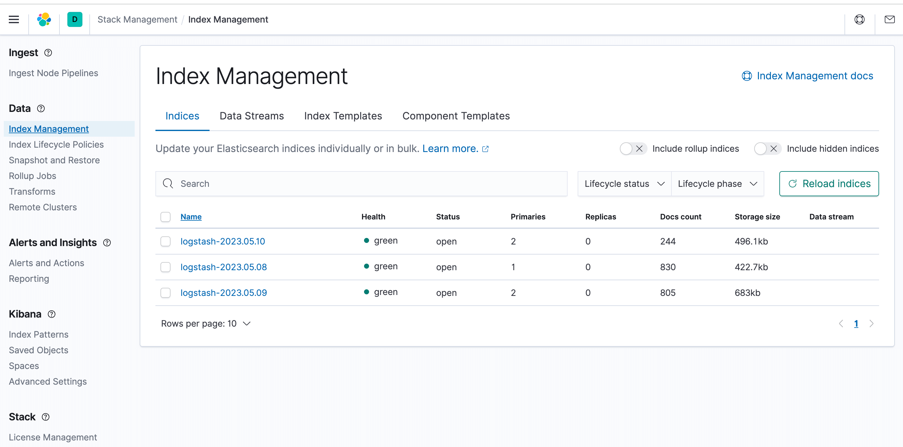
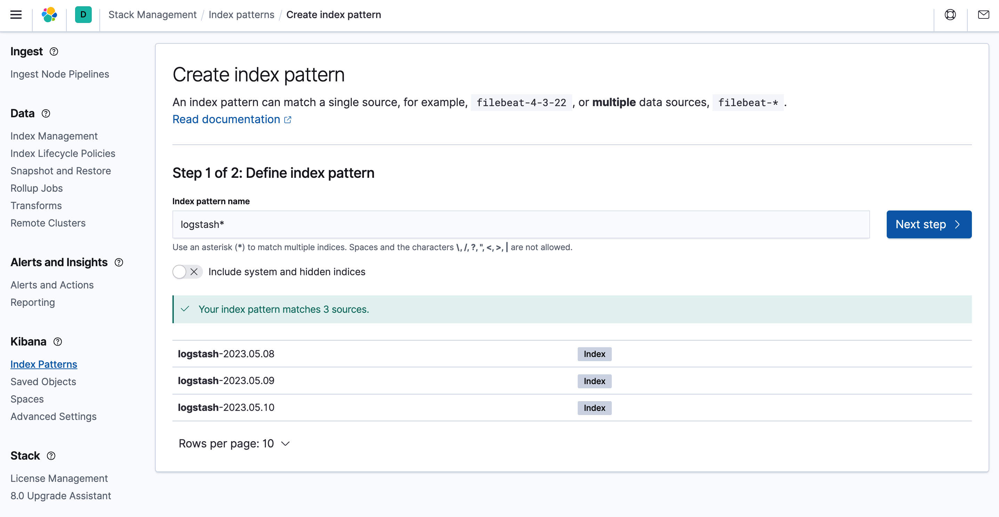
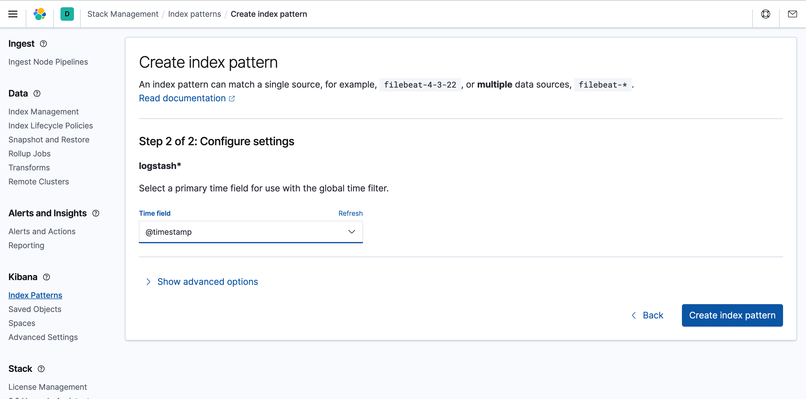
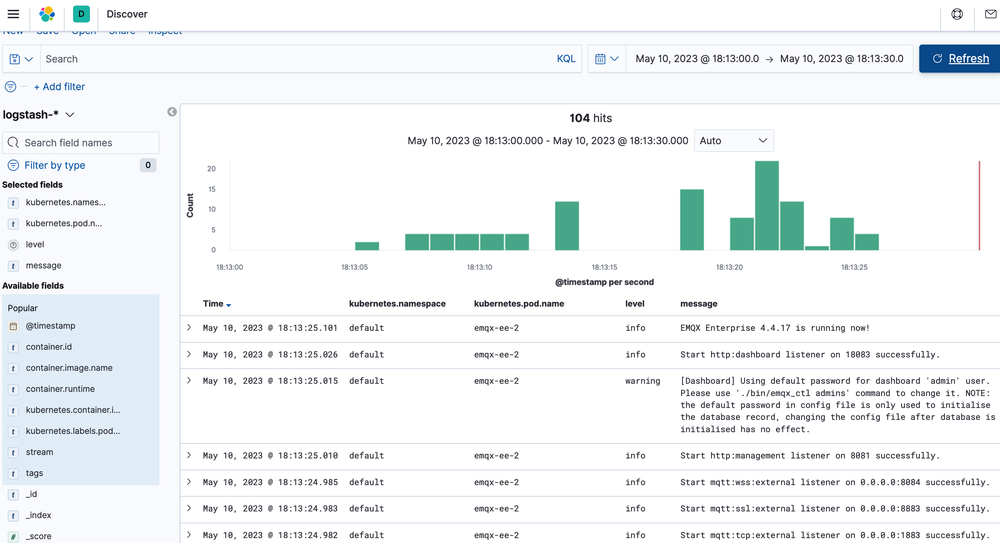

# 采集 EMQX 的日志

## 任务目标

使用 ELK 收集 EMQX 集群日志。

## 部署 ELK

ELK 是 Elasticsearch、Logstash、Kibana 三大开源框架首字母大写简称，也被称为 Elastic Stack。[Elasticsearch](https://www.elastic.co/cn/elasticsearch/) 是一个基于 Lucene、分布式、通过 Restful 方式进行交互的近实时搜索平台框架，也被简称为：es。[Logstash](https://www.elastic.co/cn/logstash/) 是 ELK 的中央数据流引擎，用于从不同目标（文件/数据存储/MQ）收集的不同格式数据，经过过滤后支持输出到不同目的地（文件 /MQ/redis/elasticsearch/kafka 等）。[Kibana](https://www.elastic.co/cn/kibana/) 可以将 es 的数据通过页面展示出来，提供实时分析的功能。

### 部署单节点 Elasticsearch

部署单节点 Elasticsearch 的方法较简单，可以参考下面的 YAML 编排文件，快速部署一个 Elasticsearch 集群。

- 将下面的内容保存成 YAML 文件，并通过 `kubectl apply` 命令部署它

  ```yaml
  ---
  apiVersion: v1
  kind: Service
  metadata:
    name: elasticsearch-logging
    namespace: kube-logging
    labels:
      k8s-app: elasticsearch
      kubernetes.io/cluster-service: "true"
      addonmanager.kubernetes.io/mode: Reconcile
  spec:
    ports:
    - port: 9200
      protocol: TCP
      targetPort: db
    selector:
      k8s-app: elasticsearch
  ---
  apiVersion: v1
  kind: ServiceAccount
  metadata:
    name: elasticsearch-logging
    namespace: kube-logging
    labels:
      k8s-app: elasticsearch
      kubernetes.io/cluster-service: "true"
      addonmanager.kubernetes.io/mode: Reconcile
  ---
  kind: ClusterRole
  apiVersion: rbac.authorization.k8s.io/v1
  metadata:
    name: elasticsearch-logging
    labels:
      k8s-app: elasticsearch
      kubernetes.io/cluster-service: "true"
      addonmanager.kubernetes.io/mode: Reconcile
  rules:
  - apiGroups:
    - ""
    resources:
    - "services"
    - "namespaces"
    - "endpoints"
    verbs:
    - "get"
  ---
  kind: ClusterRoleBinding
  apiVersion: rbac.authorization.k8s.io/v1
  metadata:
    namespace: kube-logging
    name: elasticsearch-logging
    labels:
      k8s-app: elasticsearch
      kubernetes.io/cluster-service: "true"
      addonmanager.kubernetes.io/mode: Reconcile
  subjects:
  - kind: ServiceAccount
    name: elasticsearch-logging
    namespace: kube-logging
    apiGroup: ""
  roleRef:
    kind: ClusterRole
    name: elasticsearch
    apiGroup: ""
  ---
  apiVersion: apps/v1
  kind: StatefulSet
  metadata:
    name: elasticsearch-logging
    namespace: kube-logging
    labels:
      k8s-app: elasticsearch
      kubernetes.io/cluster-service: "true"
      addonmanager.kubernetes.io/mode: Reconcile
  spec:
    serviceName: elasticsearch-svc
    replicas: 1
    selector:
      matchLabels:
        k8s-app: elasticsearch
    template:
      metadata:
        labels:
          k8s-app: elasticsearch
      spec:
        serviceAccountName: elasticsearch-logging
        containers:
        - image: docker.io/library/elasticsearch:7.9.3
          name: elasticsearch-logging
            limits:
              cpu: 1000m
              memory: 1Gi
            requests:
              cpu: 100m
              memory: 500Mi
          ports:
          - containerPort: 9200
            name: db
            protocol: TCP
          - containerPort: 9300
            name: transport
            protocol: TCP
          volumeMounts:
          - name: elasticsearch-logging
            mountPath: /usr/share/elasticsearch/data/
          env:
          - name: "NAMESPACE"
            valueFrom:
              fieldRef:
                fieldPath: metadata.namespace
          - name: "discovery.type"
            value: "single-node"
          - name: ES_JAVA_OPTS
            value: "-Xms512m -Xmx2g"
        # Elasticsearch requires vm.max_map_count to be at least 262144.
        # If your OS already sets up this number to a higher value, feel free
        # to remove this init container.
        initContainers:
        - name: elasticsearch-logging-init
          image: alpine:3.6
          command: ["/sbin/sysctl", "-w", "vm.max_map_count=262144"]
          securityContext:
            privileged: true
        - name: increase-fd-ulimit
          image: busybox
          imagePullPolicy: IfNotPresent
          command: ["sh", "-c", "ulimit -n 65536"]
          securityContext:
            privileged: true
        - name: elasticsearch-volume-init
          image: alpine:3.6
          command:
            - chmod
            - -R
            - "777"
            - /usr/share/elasticsearch/data/
          volumeMounts:
          - name: elasticsearch-logging
            mountPath: /usr/share/elasticsearch/data/
    volumeClaimTemplates:
    - metadata:
        name: elasticsearch-logging
      spec:
        storageClassName: ${storageClassName}
        accessModes: [ "ReadWriteOnce" ]
        resources:
          requests:
            storage: 10Gi
  ```
  > `storageClassName` 字段表示 `StorageClass` 的名称，可以使用命令 `kubectl get storageclass` 获取 Kubernetes 集群已经存在的 StorageClass，也可以根据自己需求自行创建 StorageClass。

- 等待 es 就绪，可以通过 `kubectl get` 命令查看 es pod 的状态，请确保 `STATUS` 为 `Running`

  ```bash
  $ kubectl get pod -n kube-logging -l "k8s-app=elasticsearch"
  NAME                        READY   STATUS             RESTARTS   AGE
  elasticsearch-0             1/1     Running            0          16m
  ```

### 部署 Kibana

本文使用 `Deployment` 的方式部署 Kibana，对搜集到的日志进行可视化展示，`Service` 中使用的是 `NodePort`。

- 将下面的内容保存成 YAML 文件，并通过 `kubectl apply` 命令部署它

  ```yaml
  ---
  apiVersion: v1
  kind: Service
  metadata:
    name: kibana
    namespace: kube-logging
    labels:
      k8s-app: kibana
  spec:
    type: NodePort
    - port: 5601
      nodePort: 35601
      protocol: TCP
      targetPort: ui
    selector:
      k8s-app: kibana
  ---
  apiVersion: apps/v1
  kind: Deployment
  metadata:
    name: kibana
    namespace: kube-logging
    labels:
      k8s-app: kibana
      kubernetes.io/cluster-service: "true"
      addonmanager.kubernetes.io/mode: Reconcile
  spec:
    replicas: 1
    selector:
      matchLabels:
        k8s-app: kibana
    template:
      metadata:
        labels:
          k8s-app: kibana
        annotations:
          seccomp.security.alpha.kubernetes.io/pod: 'docker/default'
      spec:
        containers:
        - name: kibana
          image: docker.io/kubeimages/kibana:7.9.3
          resources:
            limits:
              cpu: 1000m
            requests:
              cpu: 100m
          env:
            # The access address of ES
            - name: ELASTICSEARCH_HOSTS
              value: http://elasticsearch-logging:9200
          ports:
          - containerPort: 5601
            name: ui
            protocol: TCP
  ```

- 等待 Kibana 就绪，可以通过 `kubectl get` 命令查看 Kibana pod 的状态，请确保 `STATUS` 为 `Running`

  ```bash
  $ kubectl get pod -n kube-logging -l "k8s-app=kibana"
  NAME                        READY   STATUS             RESTARTS   AGE
  kibana-b7d98644-48gtm       1/1     Running            0          17m
  ```

  最后在浏览器中，输入 `http://{node_ip}:35601`，就会进入 kibana 的 web 界面

### 部署日志采集组件 Filebeat

[Filebeat](https://www.elastic.co/cn/beats/filebeat) 是一个轻量级的吃日志采集组件，是 Elastic Stack 的一部分，能够与 Logstash、Elasticsearch 和 Kibana 无缝协作。无论您要使用 Logstash 转换或充实日志和文件，还是在 Elasticsearch 中随意处理一些数据分析，亦或在 Kibana 中构建和分享仪表板，Filebeat 都能轻松地将您的数据发送至最关键的地方。

- 将下面的内容保存成 YAML 文件，并通过 `kubectl apply` 命令部署它

  ```yaml
  ---
  apiVersion: v1
  kind: ConfigMap
  metadata:
    name: filebeat-config
    namespace: kube-system
    labels:
      k8s-app: filebeat
  data:
    filebeat.yml: |-
      filebeat.inputs:
      - type: container
        paths:
          # The log path of the EMQX container on the host
          - /var/log/containers/^emqx.*.log
        processors:
          - add_kubernetes_metadata:
              host: ${NODE_NAME}
              matchers:
              - logs_path:
                  logs_path: "/var/log/containers/"
      output.logstash:
        hosts: ["logstash:5044"]
        enabled: true
  ---
  apiVersion: v1
  kind: ServiceAccount
  metadata:
    name: filebeat
    namespace: kube-logging
    labels:
      k8s-app: filebeat
  ---
  apiVersion: rbac.authorization.k8s.io/v1beta1
  kind: ClusterRole
  metadata:
    name: filebeat
    labels:
      k8s-app: filebeat
  rules:
  - apiGroups: [""]
    resources:
    - namespaces
    - pods
    verbs:
    - get
    - watch
    - list
  ---
  apiVersion: rbac.authorization.k8s.io/v1beta1
  kind: ClusterRoleBinding
  metadata:
    name: filebeat
  subjects:
  - kind: ServiceAccount
    name: filebeat
    namespace: kube-logging
  roleRef:
    kind: ClusterRole
    name: filebeat
    apiGroup: rbac.authorization.k8s.io
  ---
  apiVersion: apps/v1
  kind: DaemonSet
  metadata:
    name: filebeat
    namespace: kube-logging
    labels:
      k8s-app: filebeat
  spec:
    selector:
      matchLabels:
        k8s-app: filebeat
    template:
      metadata:
        labels:
          k8s-app: filebeat
      spec:
        serviceAccountName: filebeat
        terminationGracePeriodSeconds: 30
        containers:
        - name: filebeat
          image: docker.io/kubeimages/filebeat:7.9.3
          args: [
            "-c", "/etc/filebeat.yml",
            "-e","-httpprof","0.0.0.0:6060"
          ]
          env:
          - name: NODE_NAME
            valueFrom:
              fieldRef:
                fieldPath: spec.nodeName
          - name: ELASTICSEARCH_HOST
            value: elasticsearch
          - name: ELASTICSEARCH_PORT
            value: "9200"
          securityContext:
            runAsUser: 0
          resources:
            limits:
              memory: 1000Mi
              cpu: 1000m
            requests:
              memory: 100Mi
              cpu: 100m
          volumeMounts:
          - name: config
            mountPath: /etc/filebeat.yml
            readOnly: true
            subPath: filebeat.yml
          - name: data
            mountPath: /usr/share/filebeat/data
          - name: varlibdockercontainers
            mountPath: /data/var/
            readOnly: true
          - name: varlog
            mountPath: /var/log/
            readOnly: true
          - name: timezone
            mountPath: /etc/localtime
        volumes:
        - name: config
          configMap:
            defaultMode: 0600
            name: filebeat-config
        - name: varlibdockercontainers
          hostPath:
            path: /data/var/
        - name: varlog
          hostPath:
            path: /var/log/
        - name: inputs
          configMap:
            defaultMode: 0600
            name: filebeat-inputs
        - name: data
          hostPath:
            path: /data/filebeat-data
            type: DirectoryOrCreate
        - name: timezone
          hostPath:
            path: /etc/localtime
  ```

- 等待 Filebeat 就绪，可以通过 `kubectl get` 命令查看 Filebeat pod 的状态，请确保 `STATUS` 为 `Running`

  ```bash
  $ kubectl get pod -n kube-logging -l "k8s-app=filebeat"
  NAME             READY   STATUS    RESTARTS   AGE
  filebeat-82d2b   1/1     Running   0          45m
  filebeat-vwrjn   1/1     Running   0          45m
  ```

## 部署 Logstash 对日志进行清洗

这里主要是结合业务需要和对日志的二次利用，加入了 Logstash 进行日志清洗。本文使用 Logstash 的 [Beats Input plugin](https://www.elastic.co/guide/en/logstash/current/plugins-inputs-beats.html) 插件来采集日志，使用 [Ruby filter plugin](https://www.elastic.co/guide/en/logstash/current/plugins-filters-ruby.html) 插件来过滤日志。Logstash 还提供很多其他输入和过滤插件供用户使用，大家可以根据自己的业务需求配置合适的插件。

- 将下面的内容保存成 YAML 文件，并通过 `kubectl apply` 命令部署它

  ```yaml
  ---
  apiVersion: v1
  kind: Service
  metadata:
    name: logstash
    namespace: kube-system
  spec:
    ports:
    - port: 5044
      targetPort: beats
    selector:
      k8s-app: logstash
    clusterIP: None
  ---
  apiVersion: apps/v1
  kind: Deployment
  metadata:
    name: logstash
    namespace: kube-system
  spec:
    selector:
      matchLabels:
        k8s-app: logstash
    template:
      metadata:
        labels:
          k8s-app: logstash
      spec:
        containers:
        - image: docker.io/kubeimages/logstash:7.9.3
          name: logstash
          ports:
          - containerPort: 5044
            name: beats
          command:
          - logstash
          - '-f'
          - '/etc/logstash_c/logstash.conf'
          env:
          - name: "XPACK_MONITORING_ELASTICSEARCH_HOSTS"
            value: "http://elasticsearch-logging:9200"
          volumeMounts:
          - name: config-volume
            mountPath: /etc/logstash_c/
          - name: config-yml-volume
            mountPath: /usr/share/logstash/config/
          - name: timezone
            mountPath: /etc/localtime
          resources:
            limits:
              cpu: 1000m
              memory: 2048Mi
            requests:
              cpu: 512m
              memory: 512Mi
        volumes:
        - name: config-volume
          configMap:
            name: logstash-conf
            items:
            - key: logstash.conf
              path: logstash.conf
        - name: timezone
          hostPath:
            path: /etc/localtime
        - name: config-yml-volume
          configMap:
            name: logstash-yml
            items:
            - key: logstash.yml
              path: logstash.yml
  ---
  apiVersion: v1
  kind: ConfigMap
  metadata:
    name: logstash-conf
    namespace: kube-logging
    labels:
      k8s-app: logstash
  data:
    logstash.conf: |-
      input {
        beats {
          port => 5044
        }
      }
      filter {
        ruby {
          code => "
            ss = event.get('message').split(' ')
            len = ss.length()
            level = ''
            index = ''
            msg = ''
            if len == 0 || len < 2
              event.set('level','invalid')
              return
            end
            if ss[1][0] == '['
              l = ss[1].length()
              level = ss[1][1..l-2]
              index = 2
            else
              level = 'info'
              index = 0
            end
            event.set('level',level)
            for i in ss[index..len]
              msg = msg + i
              msg = msg + ' '
            end
            event.set('message',msg)
          "
        }
        if [level] == "invalid" {
          drop {}
        }
      }
      output{
        elasticsearch {
          hosts => ["http://elasticsearch-logging:9200"]
          codec => json
          index => "logstash-%{+YYYY.MM.dd}"
        }
      }
  ---
  apiVersion: v1
  kind: ConfigMap
  metadata:
    name: logstash
    namespace: kube-logging
    labels:
      k8s-app: logstash
  data:
    logstash.yml: |-
      http.host: "0.0.0.0"
      xpack.monitoring.elasticsearch.hosts: http://elasticsearch-logging:9200
  ```

- 等待 Logstash 就绪，可以通过 `kubectl get` 命令查看 Filogstash pod 的状态，请确保 `STATUS` 为 `Running`

  ```bash
  $ kubectl get pod -n kube-logging -l "k8s-app=logstash"
  NAME             READY   STATUS    RESTARTS   AGE
  filebeat-82d2b   1/1     Running   0          45m
  filebeat-vwrjn   1/1     Running   0          45m
  ```

## 部署 EMQX 集群

部署 EMQX 集群可以参考文档 [部署 EMQX](../getting-started/getting-started.md)

## 验证日志采集

- 首先登录 Kibana 界面，打开菜单中的 stack management 模块，点开索引管理，可以发现，已经有采集到的日志索引了

  

- 为了能够在 Kibana 中能够 discover 查看日志，因此需要设置一个索引匹配，选择 index patterns，然后点击创建

  

  

- 最后验证是否采集到 EMQX 集群日志

  
