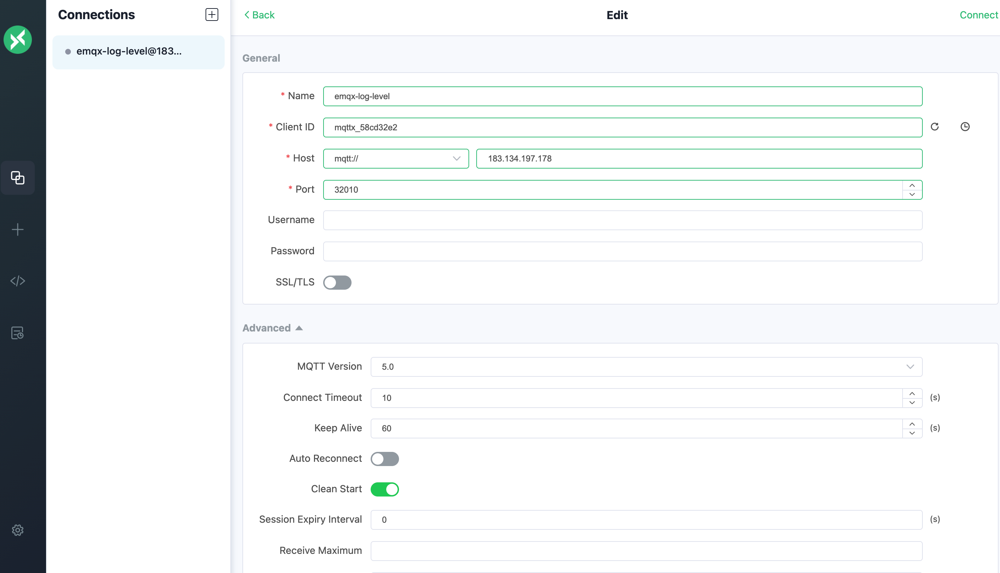
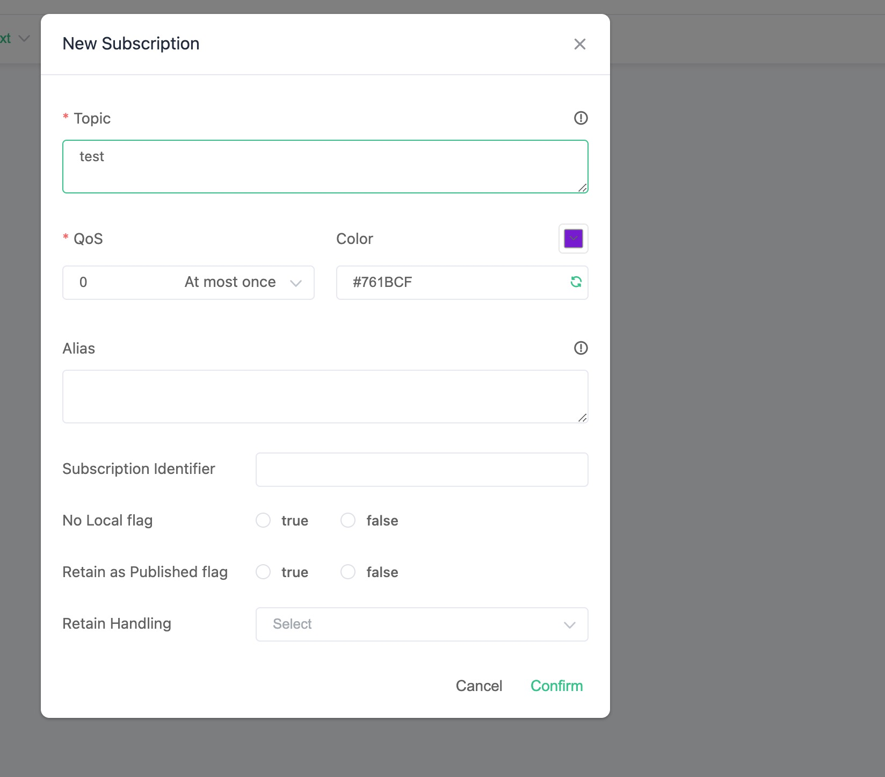
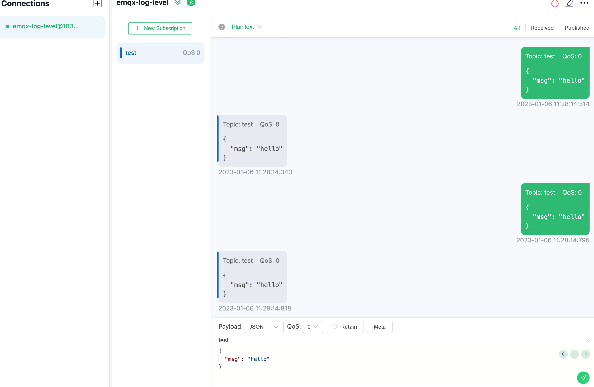
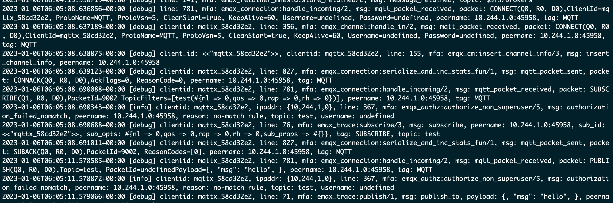

# 修改 EMQX 日志等级

## 任务目标

如何修改 EMQX 集群日志等级。

## 配置 EMQX 集群

下面是 EMQX Custom Resource 的相关配置，你可以根据希望部署的 EMQX 的版本来选择对应的 APIVersion，具体的兼容性关系，请参考[EMQX Operator 兼容性](../README.md):

:::: tabs type:card 
::: tab v2alpha1

EMQX CRD 支持使用 `.spec.bootstrapConfig` 来配置 EMQX 集群日志等级，bootstrapConfig 的配置可以参考文档：[bootstrapConfig](https://www.emqx.io/docs/zh/v5.0/admin/cfg.html)。这个字段只允许在创建 EMQX 集群的时候配置，不支持更新。**注意：** 如果在创建 EMQX 之后需要修改集群日志等级，请通过 EMQX Dashboard 进行修改。

```yaml
apiVersion: apps.emqx.io/v2alpha1
kind: EMQX
metadata:
  name: emqx
spec:
  image: emqx5.0
  bootstrapConfig: |
    log {
       console_handler {
          level  =  debug
        } 
    }
```

> `.spec.bootstrapConfig` 字段配置 EMQX 集群日志等级为 `debug`。

将上述内容保存为：`emqx.yaml`，并执行如下命令部署 EMQX 集群：

```bash
$ kubectl apply -f emqx.yaml

emqx.apps.emqx.io/emqx created
```

检查 EMQX 集群状态，请确保 `STATUS` 为 `Running`，这可能需要一些时间等待 EMQX 集群准备就绪。

```bash
$ kubectl get emqx emqx

NAME   IMAGE      STATUS    AGE
emqx   emqx:5.0   Running   10m
```

:::
::: tab v1beta4

EMQX 企业版在 EMQX Operator 里面对应的 CRD 为 EmqxEnterprise，EmqxEnterprise 支持通过 `.spec.template.spec.emqxContainer.emqxConfig` 字段配置 EMQX 集群日志等级。emqxConfig 字段的具体描述可以参考：[emqxConfig](https://github.com/emqx/emqx-operator/blob/main-2.1/docs/en_US/reference/v1beta4-reference.md#emqxtemplatespec)。

```yaml
apiVersion: apps.emqx.io/v1beta4
kind: EmqxEnterprise
metadata:
  name: emqx-ee
spec:
  template:
    spec:
      emqxContainer:
        image:
          repository: emqx/emqx-ee
          version: 4.4.14
        emqxConfig:
          log.level: debug
```

> `.spec.template.spec.emqxContainer.emqxConfig` 字段配置 EMQX 集群日志等级为 `debug`。

将上述内容保存为：emqx.yaml，执行如下命令部署 EMQX 集群：

```bash
$ kubectl apply -f emqx.yaml

emqxenterprise.apps.emqx.io/emqx-ee created
```

检查 EMQX 集群状态，请确保 `STATUS` 为 `Running`，这可能需要一些时间等待 EMQX 集群准备就绪。

```bash
$ kubectl get emqxenterprises

NAME      STATUS   AGE
emqx-ee   Running  8m33s
```

:::
::::

## 验证 EMQX 集群日志等级配置是否生效

- 使用 MQTT X 连接 EMQX 集群发送消息

在 MQTT X 页面点击创建新连接的按钮，按照如图所示配置 EMQX 集群节点信息，在配置好连接信息之后，点击 connect 按钮连接 EMQX 集群：



然后点击订阅按钮新建订阅，如图所示 MQTT X 已成功连接 EMQX 集群并且已经成功创建订阅：



在成功连接 EMQX 集群并创建订阅之后，我们就可以向 EMQX 集群发送消息，如下图所示：



-  使用命令行查看 EMQX 集群日志信息

```bash
kubectl logs emqx-core-0 -c emqx 
```

输出如下图所示：



从图中可以看到刚才使用 MQTT 连接 EMQX 集群建立连接以及发送消息的 debug 日志信息。
