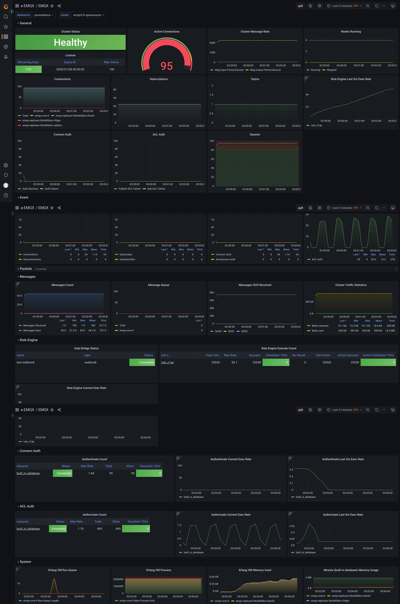

# 使用 Prometheus+Grafana 监控 EMQX 集群

## 任务目标
部署 [EMQX Exporter](https://github.com/emqx/emqx-exporter) 并通过 Prometheus 和 Grafana 监控 EMQX 集群。

## 部署 Prometheus 和 Grafana

Prometheus 部署文档可以参考：[Prometheus](https://github.com/prometheus-operator/prometheus-operator)
Grafana 部署文档可以参考：[Grafana](https://grafana.com/docs/grafana/latest/setup-grafana/installation/kubernetes/)

## 部署 EMQX 集群

下面是 EMQX Custom Resource 的相关配置，你可以根据希望部署的 EMQX 的版本来选择对应的 APIVersion，具体的兼容性关系，请参考[EMQX Operator 兼容性](../index.md):

:::: tabs type:card
::: tab v2beta1

EMQX 支持通过 http 接口对外暴露指标，集群下所有统计指标数据可以参考文档：[集成 Prometheus](https://www.emqx.io/docs/zh/v5.1/observability/prometheus.html#%E9%9B%86%E6%88%90-prometheus)

```yaml
apiVersion: apps.emqx.io/v2beta1
kind: EMQX
metadata:
  name: emqx
spec:
  image: emqx:5.1
  coreTemplate:
    spec:
      ports:
        # prometheus monitor requires the pod must name the target port
        - name: dashboard
          containerPort: 18083
  replicantTemplate:
    spec:
      ports:
        - name: dashboard
          containerPort: 18083
```

将上述内容保存为：`emqx.yaml`，并执行如下命令部署 EMQX 集群：

```bash
$ kubectl apply -f emqx.yaml

emqx.apps.emqx.io/emqx created
```

检查 EMQX 集群状态，请确保 `STATUS` 为 `Running`，这可能需要一些时间等待 EMQX 集群准备就绪。

```bash
$ kubectl get emqx emqx

NAME   IMAGE      STATUS    AGE
emqx   emqx:5.1   Running   10m
```

:::
::: tab v1beta4

EMQX 支持通过 http 接口对外暴露指标，集群下所有统计指标数据可以参考文档：[HTTP API](https://www.emqx.io/docs/zh/v4.4/advanced/http-api.html#%E7%BB%9F%E8%AE%A1%E6%8C%87%E6%A0%87)
```yaml
apiVersion: apps.emqx.io/v1beta4
kind: EmqxEnterprise
metadata:
  name: emqx-ee
spec:
  template:
    spec:
      emqxContainer:
        image:
          repository: emqx/emqx-ee
          version: 4.4.16
        ports:
          # prometheus monitor requires the pod must name the target port
          - name: dashboard
            containerPort: 18083
```

将上述内容保存为：emqx.yaml，执行如下命令部署 EMQX 集群：

```bash
$ kubectl apply -f emqx.yaml

emqxenterprise.apps.emqx.io/emqx-ee created
```

检查 EMQX 集群状态，请确保 `STATUS` 为 `Running`，这可能需要一些时间等待 EMQX 集群准备就绪。

```bash
$ kubectl get emqxenterprises

NAME      STATUS   AGE
emqx-ee   Running  8m33s
```

如果你部署的是 EMQX 4.4 开源版, 则需要通过 `EmqxPlugin` CRD 开启`emqx_prometheus` 插件:

```shell
cat << "EOF" | kubectl apply -f -
apiVersion: apps.emqx.io/v1beta4
kind: EmqxPlugin
metadata:
  name: emqx-prometheus
spec:
  selector:
    # EMQX pod labels
    ${replace_with_your_emqx_pod_label} : label_value
  pluginName: emqx_prometheus
```

:::
::::

## 创建 API Secret
emqx-exporter 和 Prometheus 通过访问 EMQX dashboard API 拉取监控指标，因此需要提前登录 dashboard 创建 API 密钥。

注意，EMQX 5 和 EMQX 4.4 创建 API 密钥的方式有所不同。
* **EMQX 5** 创建一个新的 [API 密钥](https://www.emqx.io/docs/zh/v5.1/dashboard/system.html#api-%E5%AF%86%E9%92%A5)
* **EMQX 4.4** 创建一个新的用户

## 部署 [EMQX Exporter](https://github.com/emqx/emqx-exporter)

The `emqx-exporter` is designed to expose partial metrics that are not included in the EMQX Prometheus API. It is compatible with EMQX 4.4 and EMQX 5, both open-source and enterprise.

```yaml
apiVersion: v1
kind: Service
metadata:
  labels:
    app: emqx-exporter
  name: emqx-exporter-service
spec:
  ports:
    - name: metrics
      port: 8085
      targetPort: metrics
  selector:
    app: emqx-exporter
---
apiVersion: apps/v1
kind: Deployment
metadata:
  name: emqx-exporter
  labels:
    app: emqx-exporter
spec:
  selector:
    matchLabels:
      app: emqx-exporter
  replicas: 1
  template:
    metadata:
      labels:
        app: emqx-exporter
    spec:
      securityContext:
        runAsUser: 1000
      containers:
        - name: exporter
          image: emqx-exporter:latest
          imagePullPolicy: IfNotPresent
          args:
            # "emqx-dashboard-service-name" is the service name that creating by operator for exposing 18083 port
            - --emqx.nodes=${emqx-dashboard-service-name}:18083
            - --emqx.auth-username=${paste_your_new_api_key_here}
            - --emqx.auth-password=${paste_your_new_secret_here}
          securityContext:
            allowPrivilegeEscalation: false
            runAsNonRoot: true
          ports:
            - containerPort: 8085
              name: metrics
              protocol: TCP
          resources:
            limits:
              cpu: 100m
              memory: 100Mi
            requests:
              cpu: 100m
              memory: 20Mi
```

> 参数"--emqx.nodes" 为暴露18083端口的 service name。不同的 EMQX 版本的 service name 不一样，可以通过命令 `kubectl get svc` 查看。

将上述内容保存为`emqx-exporter.yaml`，同时使用你新创建的 API 密钥（EMQX 4.4 则为用户名密码）替换其中的`--emqx.auth-username`以及`--emqx.auth-password`，并执行如下命令：

```bash
kubectl apply -f emqx-exporter.yaml
```

检查 emqx-exporter 状态，请确保 `STATUS` 为 `Running`。

```bash
$ kubectl get po -l="app=emqx-exporter"

NAME      STATUS   AGE
emqx-exporter-856564c95-j4q5v   Running  8m33s
```

## 配置 Prometheus Monitor
Prometheus-operator 使用 [PodMonitor](https://github.com/prometheus-operator/prometheus-operator/blob/main/Documentation/design.md#podmonitor) 和 [ServiceMonitor](https://github.com/prometheus-operator/prometheus-operator/blob/main/Documentation/design.md#servicemonitor) CRD 定义如何动态的监视一组 pod 或者 service。

:::: tabs type:card
::: tab v2beta1

```yaml
apiVersion: monitoring.coreos.com/v1
kind: PodMonitor
metadata:
  name: emqx
  labels:
    app.kubernetes.io/name: emqx
spec:
  podMetricsEndpoints:
  - interval: 5s
    path: /api/v5/prometheus/stats
    # the name of emqx dashboard containerPort
    port: dashboard
    relabelings:
      - action: replace
        # user-defined cluster name, requires unique
        replacement: emqx5
        targetLabel: cluster
      - action: replace
        # fix value, don't modify
        replacement: emqx
        targetLabel: from
      - action: replace
        # fix value, don't modify
        sourceLabels: ['pod']
        targetLabel: "instance"
  selector:
    matchLabels:
      # the label in emqx pod
      apps.emqx.io/instance: emqx
      apps.emqx.io/managed-by: emqx-operator
  namespaceSelector:
    matchNames:
     # modify the namespace if your EMQX cluster deployed in other namespace
      #- default
---
apiVersion: monitoring.coreos.com/v1
kind: ServiceMonitor
metadata:
  name: emqx-exporter
  labels:
    app: emqx-exporter
spec:
  selector:
    matchLabels:
      # the label in emqx exporter svc
      app: emqx-exporter
  endpoints:
  - port: metrics
    interval: 5s
    path: /metrics
    relabelings:
      - action: replace
        # user-defined cluster name, requires unique
        replacement: emqx5
        targetLabel: cluster
      - action: replace
        # fix value, don't modify
        replacement: exporter
        targetLabel: from
      - action: replace
        # fix value, don't modify
        sourceLabels: ['pod']
        regex: '(.*)-.*-.*'
        replacement: $1
        targetLabel: "instance"
      - action: labeldrop
        # fix value, don't modify
        regex: 'pod'
  namespaceSelector:
    matchNames:
      # modify the namespace if your exporter deployed in other namespace
      #- default
```

<p> `path` 表示指标采集接口路径，在 EMQX 5 里面路径为：`/api/v5/prometheus/stats`。`selector.matchLabels` 表示匹配 Pod 的 label。</p>
<p> 每个集群的 Monitor 配置中都需要为当前集群打上特定的标签，其中`targetLabel`为`cluster`的值表示当前集群的名字，需确保每个集群的名字唯一。</p>

:::
::: tab v1beta4

```yaml
apiVersion: monitoring.coreos.com/v1
kind: PodMonitor
metadata:
  name: emqx
  labels:
    app.kubernetes.io/name: emqx
spec:
  podMetricsEndpoints:
  - interval: 5s
    params:
      type:
      - prometheus
    path: /api/v4/emqx_prometheus
    # the name of emqx dashboard containerPort
    port: dashboard
    relabelings:
      - action: replace
        # user-defined cluster name, requires unique
        replacement: emqx4
        targetLabel: cluster
      - action: replace
        # fix value, don't modify
        replacement: emqx
        targetLabel: from
      - action: replace
        # fix value, don't modify
        sourceLabels: ['pod']
        targetLabel: "instance"
  selector:
    matchLabels:
      # the label is the same as the label of emqx pod
      apps.emqx.io/instance: emqx
      apps.emqx.io/managed-by: emqx-operator
  namespaceSelector:
    matchNames:
      # modify the namespace if your EMQX cluster deployed in other namespace
      #- default
---
apiVersion: monitoring.coreos.com/v1
kind: ServiceMonitor
metadata:
  name: emqx-exporter
  labels:
    app: emqx-exporter
spec:
  selector:
    matchLabels:
      # the label is the same as the label of emqx-exporter svc
      app: emqx-exporter
  endpoints:
    - port: metrics
      interval: 5s
      path: /metrics
      relabelings:
        - action: replace
          # user-defined cluster name, requires unique
          replacement: emqx4
          targetLabel: cluster
        - action: replace
          # fix value, don't modify
          replacement: exporter
          targetLabel: from
        - action: replace
          # fix value, don't modify
          sourceLabels: ['pod']
          regex: '(.*)-.*-.*'
          replacement: $1
          targetLabel: "instance"
        - action: labeldrop
          # fix value, don't modify
          regex: 'pod'
  namespaceSelector:
    matchNames:
      # modify the namespace if your exporter deployed in other namespace
      #- default
```

> `path` 表示指标采集接口路径，在 EMQX 4.4 里面路径为：`/api/v4/emqx_prometheus`。`selector.matchLabels` 表示匹配 Pod 的 label： `apps.emqx.io/instance: emqx-ee`。
> 每个集群的 Monitor 配置中都需要为当前集群打上特定的标签，其中`targetLabel`为`cluster`的值表示当前集群的名字，需确保每个集群的名字唯一。

:::
::::

将上述内容保存为`monitor.yaml`，并执行如下命令：

```bash
kubectl apply -f monitor.yaml
```

## 访问 Prometheus 查看 EMQX 集群的指标

打开 Prometheus 的界面，切换到 Graph 页面，输入 emqx 显示如下图所示：


切换到 **Status** → **Targets** 页面，显示如下图，可以看到集群中所有被监控的 EMQX Pod 信息：


## 导入 Grafana 模板
导入所有 dashboard [模板](https://github.com/emqx/emqx-exporter/tree/main/config/grafana-template)。

集群的整体监控状态位于 **EMQX** 看板中。


