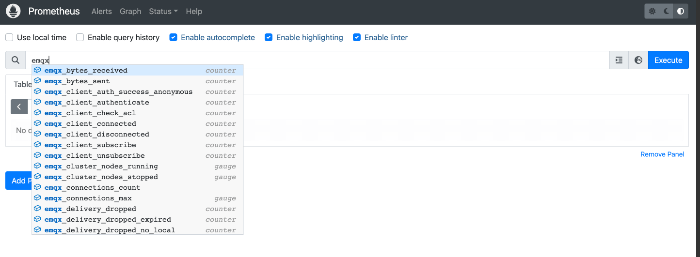
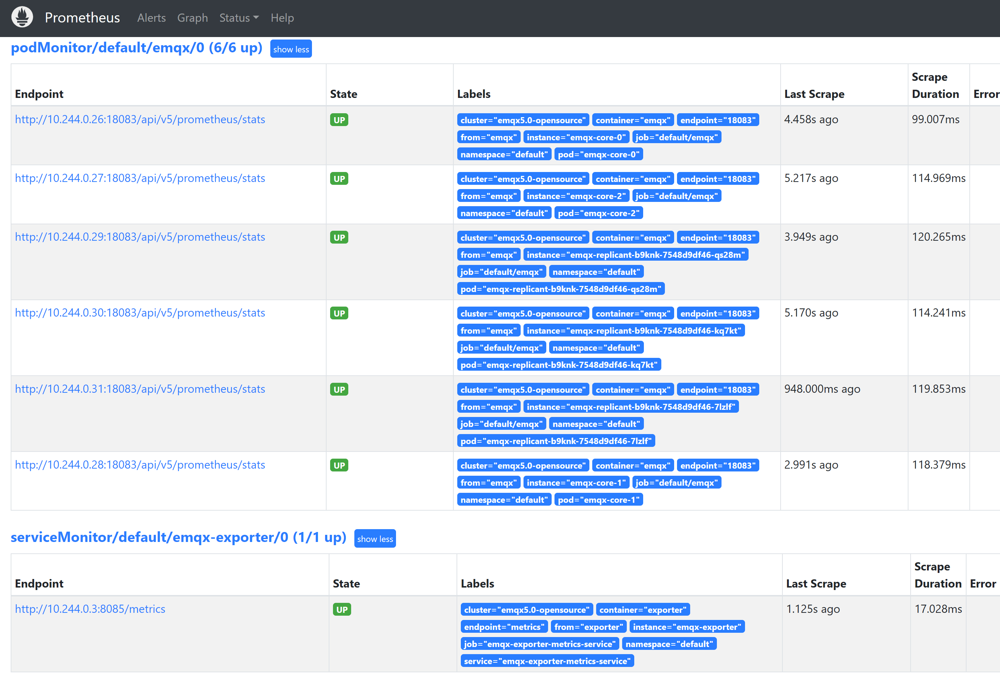

# 配置 Prometheus 监控 EMQX 集群

## 任务目标

- 如何通过 Prometheus 监控 EMQX 集群。

## 部署 Prometheus 

Prometheus 部署文档可以参考：[Prometheus](https://github.com/prometheus-operator/prometheus-operator)

## 部署 EMQX 集群

:::: tabs type:card 
::: tab v2alpha1

EMQX 支持通过 http 接口对外暴露指标，集群下所有统计指标数据可以参考文档：[HTTP API](https://www.emqx.io/docs/zh/v5.0/observability/prometheus.html) 

```yaml
apiVersion: apps.emqx.io/v2alpha1
kind: EMQX
metadata:
  name: emqx
spec:
  image: emqx/emqx:5.0.14
  imagePullPolicy: IfNotPresent    
  coreTemplate:
    spec:
      replicas: 3
      ports:
        - name: http-dashboard
          containerPort: 18083
  replicantTemplate:
    spec:
      replicas: 1
      ports:
        - name: http-dashboard
          containerPort: 18083
```

:::
::: tab v1beta4

EMQX 支持通过 http 接口对外暴露指标，集群下所有统计指标数据可以参考文档：[HTTP API](https://www.emqx.io/docs/zh/v4.4/advanced/http-api.html#%E7%BB%9F%E8%AE%A1%E6%8C%87%E6%A0%87) 

```yaml
apiVersion: apps.emqx.io/v1beta4
kind: EmqxEnterprise
metadata:
  name: emqx-ee
spec:
  replicas: 3
  template:
    spec:
      emqxContainer:
        image: 
          repository: emqx/emqx-ee
          version: 4.4.14
        ports:
          - name: http-management
            containerPort: 8081
```

:::
::: tab v1beta3

EMQX 支持通过 http 接口对外暴露指标，集群下所有统计指标数据可以参考文档：[HTTP API](https://www.emqx.io/docs/zh/v4.4/advanced/http-api.html#%E7%BB%9F%E8%AE%A1%E6%8C%87%E6%A0%87) 

```yaml
apiVersion: apps.emqx.io/v1beta3
kind: EmqxEnterprise
metadata:
  name: emqx-ee
spec:
  replicas: 3
  emqxTemplate:
      image: emqx/emqx-ee:4.4.14
```

:::
::::

将上述内容保存为：emqx.yaml，并执行如下命令部署 EMQX 集群：

```bash
kubectl apply -f emqx.yaml
```

输出类似于：

```
emqx.apps.emqx.io/emqx created
```

- 检查 EMQX 集群是否就绪


:::: tabs type:card 
::: tab v2alpha1

```bash
kubectl get emqx emqx -o json | jq '.status.conditions[] | select( .type == "Running" and .status == "True")'
```

输出类似于：

```bash
{
  "lastTransitionTime": "2023-03-01T02:17:03Z",
  "lastUpdateTime": "2023-03-01T02:17:03Z",
  "message": "Cluster is running",
  "reason": "ClusterRunning",
  "status": "True",
  "type": "Running"
}
```

::: 
::: tab v1beta4

```bash
kubectl get emqxEnterprise emqx-ee -o json | jq '.status.conditions[] | select( .type == "Running" and .status == "True")'
```

输出类似于：

```bash
{
  "lastTransitionTime": "2023-03-01T02:49:22Z",
  "lastUpdateTime": "2023-03-01T02:49:23Z",
  "message": "All resources are ready",
  "reason": "ClusterReady",
  "status": "True",
  "type": "Running"
}
```

::: 
::: tab v1beta3

```bash
kubectl get emqxEnterprise emqx-ee -o json | jq '.status.conditions[] | select( .type == "Running" and .status == "True")'
```

输出类似于：

```bash
{
  "lastTransitionTime": "2023-03-01T02:49:22Z",
  "lastUpdateTime": "2023-03-01T02:49:23Z",
  "message": "All resources are ready",
  "reason": "ClusterReady",
  "status": "True",
  "type": "Running"
}
```

::: 
::::

## 配置 Prometheus Monitor 

:::: tabs type:card 
::: tab v2alpha1

PodMonitor 自定义资源定义 (CRD) 允许以声明方式定义应如何监视一组动态服务。使用标签选择来定义选择哪些服务以使用所需配置进行监视，其文档可以参考：[PodMonitor](https://github.com/prometheus-operator/prometheus-operator/blob/main/Documentation/design.md#podmonitor)

```yaml
apiVersion: monitoring.coreos.com/v1
kind: PodMonitor
metadata:
  name: emqx
  namespace: default
  labels:
    app.kubernetes.io/name: emqx
spec:
  jobLabel: emqx-scraping
  namespaceSelector:
    matchNames:
    - default
  podMetricsEndpoints:
  - basicAuth:
      password:
        key: password
        name: emqx-basic-auth
      username:
        key: username
        name: emqx-basic-auth
    interval: 10s
    params:
      type:
      - prometheus
    path: /api/v5/prometheus/stats
    port: http-dashboard
    scheme: http
  selector:
    matchLabels:
      apps.emqx.io/instance: emqx
```

> `path` 表示指标采集接口路径，在 EMQX 5 里面路径为：`/api/v5/prometheus/stats`。`selector.matchLabels` 表示匹配 Pod 的 label： `apps.emqx.io/instance: emqx`。

:::
::: tab v1beta4

PodMonitor 自定义资源定义 (CRD) 允许以声明方式定义应如何监视一组动态服务。使用标签选择来定义选择哪些服务以使用所需配置进行监视，其文档可以参考：[PodMonitor](https://github.com/prometheus-operator/prometheus-operator/blob/main/Documentation/design.md#podmonitor)

```yaml
apiVersion: monitoring.coreos.com/v1
kind: PodMonitor
metadata:
  name: emqx
  namespace: default
  labels:
    app.kubernetes.io/name: emqx
spec:
  jobLabel: emqx-scraping
  namespaceSelector:
    matchNames:
    - default
  podMetricsEndpoints:
  - basicAuth:
      password:
        key: password
        name: emqx-basic-auth
      username:
        key: username
        name: emqx-basic-auth
    interval: 10s
    params:
      type:
      - prometheus
    path: /api/v4/emqx_prometheus
    port: http-management
    scheme: http
  selector:
    matchLabels:
      apps.emqx.io/instance: emqx-ee
```

> `path` 表示指标采集接口路径，在 EMQX 4 里面路径为：`/api/v4/emqx_prometheus`。`selector.matchLabels` 表示匹配 Pod 的 label： `apps.emqx.io/instance: emqx-ee`。

:::
::: tab v1beta3

ServiceMonitor 自定义资源定义 (CRD) 允许以声明方式定义应如何监视一组动态服务。使用标签选择来定义选择哪些服务以使用所需配置进行监视，其文档可以参考：[ServiceMonitor](https://github.com/prometheus-operator/prometheus-operator/blob/main/Documentation/design.md#servicemonitor)

```yaml
apiVersion: monitoring.coreos.com/v1
kind: ServiceMonitor
metadata:
  name: emqx
  namespace: default
  labels:
    app.kubernetes.io/name: emqx
spec:
  jobLabel: emqx-scraping
  namespaceSelector:
    matchNames:
    - default
  ServiceMetricsEndpoints:
  - basicAuth:
      password:
        key: password
        name: emqx-basic-auth
      username:
        key: username
        name: emqx-basic-auth
    interval: 10s
    params:
      type:
      - prometheus
    path: /api/v4/emqx_prometheus
    port: http-management-8081
    scheme: http
  selector:
    matchLabels:
      apps.emqx.io/instance: emqx-ee
```

> `path` 表示指标采集接口路径，在 EMQX 4 里面路径为：`/api/v4/emqx_prometheus`。`selector.matchLabels` 表示匹配 Service 的 label： `apps.emqx.io/instance: emqx-ee`。

::: 
::::

将上述内容保存为：monitor.yaml 并执行如下命令：

```bash
kubectl apply -f monitor.yaml
```

使用 basicAuth 为 Monitor 提供访问 EMQX 接口需要密码账号信息

```yaml
apiVersion: v1
kind: Secret
metadata:
  name: emqx-basic-auth
  namespace: default
type: kubernetes.io/basic-auth
stringData:
  username: admin
  password: public
```

将上述内容保存为：secret.yaml 并创建 Secret

```bash
kubectl apply -f secret.yaml
```

## 访问 Prometheus 查看 EMQX 集群的指标

打开 Prometheus 的界面，切换到 Graph 页面，输入 emqx 显示如下图所示：



切换到 Status → Targets 页面，显示如下图，可以看到集群中所有被监控的 EMQX Pod 信息：


