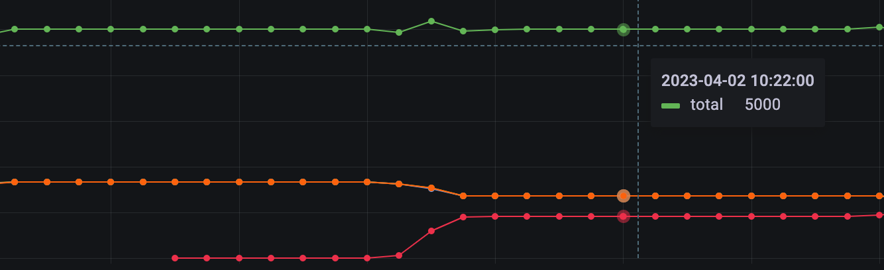

# 配置重平衡（EMQX 企业版）

## 任务目标

如何通过重平衡功能平衡 EMQX 集群节点负载。

## 为什么需要节点重平衡

集群负载重平衡是分布式系统中用于平衡集群中节点之间负载的过程。它涉及在集群中重新分配连接和会话，以确保所有节点都在其容量限制内运行并且负载均匀分布。

在集群负载重平衡期间，连接和会话从高负载节点迁移到低负载节点，以确保所有节点都得到有效利用。该过程是自动化的，并计算需要迁移的连接数以实现节点平衡。然后将相应数量的连接和会话从高负载节点迁移到低负载节点，实现节点间的负载均衡。

新节点加入集群后或节点重启后通常需要集群负载重新平衡。这是因为添加新节点时，工作负载并未均匀分布在所有节点中。 同样，当一个节点重新启动时，工作负载将转移到其余节点，直到重新启动的节点重新上线。通过执行重平衡，集群可以高效地运行，为运行在其上的应用程序或服务提供高可用性和可扩展性。

关于 EMQX 集群负载重平衡可以参考文档：[重平衡](https://docs.emqx.com/zh/enterprise/v4.4/advanced/rebalancing.html#%E9%87%8D%E5%B9%B3%E8%A1%A1)。

:::tip

集群负载重平衡功能仅在 EMQX 企业版 4.4.12 版本才开放。

:::

- 如何使用重平衡功能

集群重平衡功能在 EMQX Operator 里面对应的 CRD 为 Rebalance，其示例如下所示：

```yaml
apiVersion: apps.emqx.io/v1beta4
kind: Rebalance
metadata:
  name: rebalance-sample
spec:
  instanceName: emqx-ee
  rebalanceStrategy:
    connEvictRate: 5
    sessEvictRate: 5
    waitTakeover: 5
    waitHealthCheck: 10
    absConnThreshold: 10
    absSessThreshold: 10
    relConnThreshold: "1.2"
    relSessThreshold: "1.2"      
```

> instanceName 表示将要执行 Rebalance 任务的 EMQX 集群实例名称 ，waitTakeover 表示迁移 session 之前等待的时间（单位为 second），connEvictRate 表示迁移连接的速率（单位为：count/second），sessEvictRate 表示迁移 session 的速率（单位为：count/second），waitHealthCheck 表示等待 LoadBalancer 将源节点从活跃的后端节点列表中移除的时间（单位为 秒），超过指定等待时间后，重平衡任务将启动。absConnThreshold 表示 用于检查连接平衡的绝对阈值，relConnThreshold 表示用于检查连接平衡的相对阈值，absSessThreshold 表示用于检查会话连接平衡的绝对阈值，relSessThreshold 表示用于检查会话连接平衡的相对阈值。

## 测试 EMQX 企业版集群重平衡功能

- 部署 EMQX 集群

```yaml
apiVersion: apps.emqx.io/v1beta4
kind: EmqxEnterprise
metadata:
  name: emqx-ee
spec:
  replicas: 3
  template:
    spec:
      emqxContainer:
        image: 
          repository: emqx/emqx-ee
          version: 4.4.14
        ports:
          - name: "http-management"
            containerPort: 1883
  serviceTemplate:
    spec:
      type: LoadBalancer
      ports:
        - name: "mqtt-tcp-1883"
          protocol: "TCP"
          port: 1883
          targetPort: 1883
```

> 推荐使用最小连接数负载均衡算法，在这种负载均衡策略下，Rebalance 任务仅需执行一次，客户端最多断连一次就可以让集群负载重新平衡。

将上述内容保存为：emqx.yaml，执行如下命令部署 EMQX 集群：

```bash
$ kubectl apply -f emqx.yaml
emqxenterprise.apps.emqx.io/emqx-ee created
```

检查 EMQX 集群状态，请确保 `STATUS` 为 `Running`，这可能需要一些时间等待 EMQX 集群准备就绪。

```bash
$ kubectl get emqxenterprises
NAME      STATUS   AGE
emqx-ee   Running  8m33s
```

- 使用 MQTT X CLI 连接 EMQX 集群

MQTT X CLI 是一个开源的，支持自动重连的 MQTT 5.0 CLI Client，也是一个纯命令行模式的 MQTT X。旨在帮助更快地开发和调试 MQTT 服务和应用程序，而无需使用图形界面。关于 MQTT X CLI 的文档可以参考：MQTTX CLI。

执行如下命令连接 EMQX 集群：

```bash
$ mqttx bench  conn -h $host -p $port   -c 5000
[10:05:21 AM] › ℹ  Start the connect benchmarking, connections: 5000, req interval: 10ms
✔  success   [5000/5000] - Connected
[10:06:13 AM] › ℹ  Done, total time: 31.113s
```

> -h 表示 EMQX LoadBalancer IP，-p 表示 EMQX MQTT 服务端口（默认为1883），-c 表示创建的连接数。

执行如下命令对 EMQX 进行扩容，扩容之后新节点的连接负载为0，随后我们将提交 Rebalance 任务来重新平衡节点负载。

```bash
$ kubectl scale emqxenterprise  emqx-ee  --replicas=4
emqxenterprise.apps.emqx.io/emqx-ee scaled
```

**注意：** 扩容之后需要等待集群就绪，再提交 Rebalance 任务。

- 提交 Rebalance 任务

```yaml
apiVersion: apps.emqx.io/v1beta4
kind: Rebalance
metadata:
  name: rebalance-sample
spec:
  instanceName: emqx-ee
  rebalanceStrategy:
    connEvictRate: 5
    sessEvictRate: 5
    waitTakeover: 5
    waitHealthCheck: 10
    absConnThreshold: 10
    absSessThreshold: 10
    relConnThreshold: "1.2"
    relSessThreshold: "1.2"      
```

将上述内容保存为：rebalance.yaml，并执行如下提交 Rebalance 任务：

```bash
$ kubectl apply -f rebalance.yaml
rebalance.apps.emqx.io/rebalance-sample created
```

执行如下命令查看 EMQX 集群重平衡状态：

```bash
$ kubectl get rebalances rebalance-sample -o json | jq '.status.rebalances'
{
    "state": "wait_health_check",
    "session_eviction_rate": 5,
    "recipients":[
        "emqx-ee@emqx-ee-3.emqx-ee-headless.default.svc.cluster.local",
        "emqx-ee@emqx-ee-4.emqx-ee-headless.default.svc.cluster.local"
    ],
    "node": "emqx-ee@emqx-ee-0.emqx-ee-headless.default.svc.cluster.local",
    "donors":[
        "emqx-ee@emqx-ee-0.emqx-ee-headless.default.svc.cluster.local",
        "emqx-ee@emqx-ee-1.emqx-ee-headless.default.svc.cluster.local",
        "emqx-ee@emqx-ee-2.emqx-ee-headless.default.svc.cluster.local"
    ],
    "coordinator_node": "emqx-ee@emqx-ee-0.emqx-ee-headless.default.svc.cluster.local",
    "connection_eviction_rate": 5
}
```

执行如下命令查看 Rebalance 任务状态：

```bash
$ kubectl get rebalances rebalance-sample 
NAME               STATUS      AGE
rebalance-sample   Completed   42s
```

> Rebalance 的状态有三种，分别是：Processing，Completed 以及 Failed。Processing 表示重平衡任务正在进行， Completed 表示重平衡任务已经完成，Failed 表示重平衡任务失败。

## 使用 Grafana + Prometheus 监控重平衡过程中集群节点连接情况



从图中可以看出提交 Rebalance 任务之后，EMQX 三个旧节点的连接按照配置的速率断开并迁移到负载为0的新节点上，当集群负载达到平衡状态之后，重平衡任务结束，各个节点的负载也将保持稳定状态。