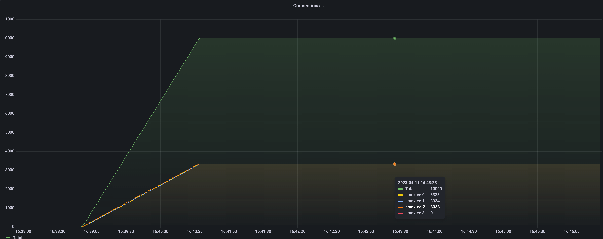

# 集群负载重平衡（EMQX 企业版）

## 任务目标

如何重平衡 MQTT 连接。

## 为什么需重平衡

集群负载重平衡是将客户端连接与会话从一组节点强行迁移到其他节点的行为。它将自动计算得到到达成节点平衡所需迁移的连接数量，然后将对应数量的连接和会话数从高负载节点迁移到低负载节点，从而在节点之间实现负载均衡。通常在新加入节点或节点重启后，需要此操作来达成平衡。

重平衡的价值主要有以下两点：

- 提升系统扩展性：由于 MQTT 连接是基于 TCP/IP 协议的长连接，当集群扩容后，旧节点的连接不会自动迁移到新节点上。如果希望新节点承载旧节点上部分负载，可以通过重平衡功能，将旧节点上的负载平滑地迁移到新节点上，从而使整个集群负载更加均衡，提高系统的吞吐量，响应速度以及资源利用率，使系统更好地扩展。

- 降低运维成本：如果系统中某些节点负载过高或过低，需要对这些节点进行手动调整，而通过重平衡，可以自动调整节点的负载，降低运维成本。

关于 EMQX 集群负载重平衡可以参考文档：[重平衡](https://docs.emqx.com/zh/enterprise/v4.4/advanced/rebalancing.html#%E9%87%8D%E5%B9%B3%E8%A1%A1)。

:::tip

集群负载重平衡功能仅在 EMQX 企业版 4.4.12 版本才开放。

:::

- 如何使用重平衡

集群重平衡在 EMQX Operator 里面对应的 CRD 为 `Rebalance`，其示例如下所示：

```yaml
apiVersion: apps.emqx.io/v1beta4
kind: Rebalance
metadata:
  name: rebalance-sample
spec:
  instanceName: emqx-ee
  rebalanceStrategy:
    connEvictRate: 10
    sessEvictRate: 10
    waitTakeover: 10
    waitHealthCheck: 10
    absConnThreshold: 100
    absSessThreshold: 100
    relConnThreshold: "1.1"
    relSessThreshold: "1.1"
```

> 关于 Rebalance 配置可以参考文档：[Rebalance reference](../reference/v1beta4-reference.md#rebalancestrategy)。

## 测试集群负载重平衡

### 集群负载情况（重平衡前）

在之前执行 Rebalance 前，我们构建了一个负载不均衡的集群。并使用 Grafana + Prometheus 监控 EMQX 集群负载的情况：



从图中可以看出，当前集群共有四个 EMQX 节点，其中三个节点承载了 10000 的连接，剩余一个节点的连接数为 0 。接下来我们将演示如何进行重平衡操作，使得四个节点的负载达到均衡状态。接下来我们将演示如何进行重平衡操作，使得四个节点的负载达到均衡状态。

- 提交 Rebalance 任务

```yaml
apiVersion: apps.emqx.io/v1beta4
kind: Rebalance
metadata:
  name: rebalance-sample
spec:
  instanceName: emqx-ee
  rebalanceStrategy:
    connEvictRate: 10
    sessEvictRate: 10
    waitTakeover: 10
    waitHealthCheck: 10
    absConnThreshold: 100
    absSessThreshold: 100
    relConnThreshold: "1.1"
    relSessThreshold: "1.1"
```

将上述内容保存为：rebalance.yaml，并执行如下命令提交 Rebalance 任务：

```bash
$ kubectl apply -f rebalance.yaml
rebalance.apps.emqx.io/rebalance-sample created
```

执行如下命令查看 EMQX 集群重平衡状态：

```bash
$ kubectl get rebalances rebalance-sample -o json | jq '.status.rebalanceStates'
{
    "state": "wait_health_check",
    "session_eviction_rate": 10,
    "recipients":[
        "emqx-ee@emqx-ee-3.emqx-ee-headless.default.svc.cluster.local",
    ],
    "node": "emqx-ee@emqx-ee-0.emqx-ee-headless.default.svc.cluster.local",
    "donors":[
        "emqx-ee@emqx-ee-0.emqx-ee-headless.default.svc.cluster.local",
        "emqx-ee@emqx-ee-1.emqx-ee-headless.default.svc.cluster.local",
        "emqx-ee@emqx-ee-2.emqx-ee-headless.default.svc.cluster.local"
    ],
    "coordinator_node": "emqx-ee@emqx-ee-0.emqx-ee-headless.default.svc.cluster.local",
    "connection_eviction_rate": 10
}
```

> 关于 rebalanceStates 字段的详细描述可以参考文档：[rebalanceStates reference](../reference/v1beta4-reference.md#rebalancestate)。

等待 Rebalance 任务完成:

```bash
$ kubectl get rebalances rebalance-sample
NAME               STATUS      AGE
rebalance-sample   Completed   62s
```

> Rebalance 的状态有三种，分别是：Processing，Completed 以及 Failed。Processing 表示重平衡任务正在进行， Completed 表示重平衡任务已经完成，Failed 表示重平衡任务失败。

### 集群负载情况（重平衡后）


上图是 Rebalance 完成后，集群负载情况。从图形上可以看出整个 Rebalance 过程非常平滑。从数据上可以看出，集群总连接数还是 10000，与 Rebalance 前一致。四个节点的连接数已经发生了变化，其中三个节点有部分连接迁移到了新扩容的节点上。重平衡结束后，四个节点的负载保持稳定状态，连接数都接近2500左右，不再变化。

根据集群达到平衡的条件：

```
avg(源节点连接数) < avg(目标节点连接数) + abs_conn_threshold
或
avg(源节点连接数) < avg(目标节点连接数) * rel_conn_threshold
```

代入配置的 Rebalance 参数和连接数可以计算出 `avg(2553 + 2553+ 2554) < 2340 * 1.1`，因此当前集群负载已经达到平衡状态，Rebalance 任务成功实现了集群负载的重新平衡。
