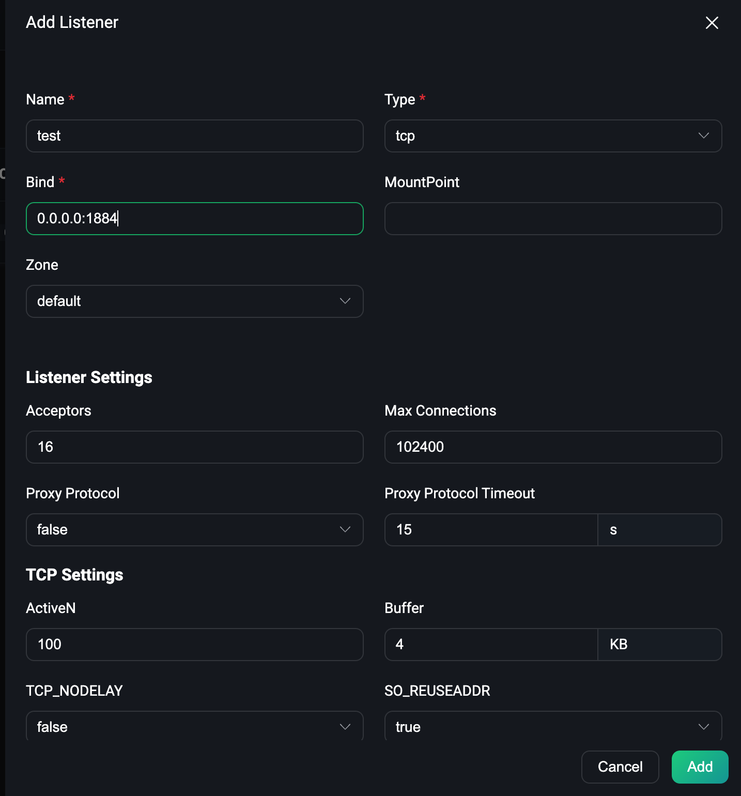
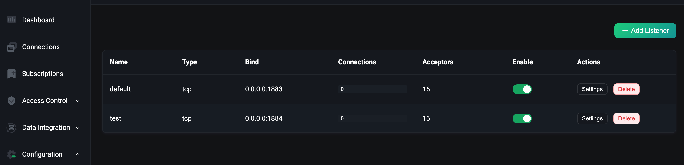

# 通过 Kubernetes Service 访问 EMQX 集群

## 任务目标

 通过 LoabBalancer 类型的 Service 访问 EMQX 集群

## 配置 EMQX 集群

下面是 EMQX Custom Resource 的相关配置，你可以根据希望部署的 EMQX 的版本来选择对应的 APIVersion，具体的兼容性关系，请参考[EMQX Operator 兼容性](../README.md):

:::: tabs type:card 
::: tab v2alpha1

EMQX CRD 支持使用 `.spec.dashboardServiceTemplate` 配置 EMQX 集群 Dashboard Service ，使用 `.spec.listenersServiceTemplate` 配置 EMQX 集群 listener Service，其文档可以参考：[Service](https://github.com/emqx/emqx-operator/blob/main-2.1/docs/en_US/reference/v2alpha1-reference.md)。

```yaml
apiVersion: apps.emqx.io/v2alpha1
kind: EMQX
metadata:
  name: emqx
spec:
  image: emqx/emqx:5.0.14
  listenersServiceTemplate:
    spec:
      type: LoabBalancer
```

> EMQX 默认会开启一个 MQTT TCP 监听器 `tcp-default` 对应的端口为1883 以及 Dashboard 监听器 `dashboard-listeners-http-bind` 对应的端口为18083 。用户可以通过 `.spec.bootstrapConfig` 字段或者 EMQX Dashboard 增加新的监听器。EMQX Operator 在创建 Service 时会将缺省的监听器信息自动注入到 Service 里面，但是当用户配置的 Service 和 EMQX 配置的监听器有冲突时（name 或者 port 字段重复），EMQX Operator 会以用户的配置为准。

将上述内容保存为：`emqx.yaml`，并执行如下命令部署 EMQX 集群：

```bash
$ kubectl apply -f emqx.yaml

emqx.apps.emqx.io/emqx created
```

检查 EMQX 集群状态，请确保 `STATUS` 为 `Running`，这可能需要一些时间等待 EMQX 集群准备就绪。

```bash
$ kubectl get emqx emqx

NAME   IMAGE      STATUS    AGE
emqx   emqx:5.0   Running   10m
```

:::
::: tab v1beta4

EMQX 企业版在 EMQX Operator 里面对应的 CRD 为 EmqxEnterprise，EmqxEnterprise 支持通过 `.spec.serviceTemplate` 字段配置 EMQX 集群 Service 。serviceTemplate 字段的具体描述可以参考：[serviceTemplate](https://github.com/emqx/emqx-operator/blob/main-2.1/docs/en_US/reference/v1beta4-reference.md#servicetemplate)。

```yaml
apiVersion: apps.emqx.io/v1beta4
kind: EmqxEnterprise
metadata:
  name: emqx-ee
spec:
  template:
    spec:
      emqxContainer:
        image:
          repository: emqx/emqx-ee
          version: 4.4.14
  serviceTemplate:
    spec:
      type: LoabBalancer 
```

> EMQX 默认会开启6个监听器，分别是：`mqtt-ssl-8883` 对应的端口为8883，`mqtt-tcp-1883` 对应的端口为1883，`http-dashboard-18083` 对应的端口为18083，`http-management-8081` 对应的端口为8081，`mqtt-ws-8083` 对应的端口为8083，`mqtt-wss-8084` 对应的端口为8084。EMQX Operator 在创建 Service 时会将缺省的监听器信息自动注入到 Service 里面，但是当用户配置的 Service 和 EMQX 配置的监听器有冲突时（ name 或者 port 字段重复），EMQX Operator 会以用户的配置为准。

将上述内容保存为：emqx.yaml，执行如下命令部署 EMQX 集群：

```bash
$ kubectl apply -f emqx.yaml

emqxenterprise.apps.emqx.io/emqx-ee created
```

检查 EMQX 集群状态，请确保 `STATUS` 为 `Running`，这可能需要一些时间等待 EMQX 集群准备就绪。

```bash
$ kubectl get emqxenterprises

NAME      STATUS   AGE
emqx-ee   Running  8m33s
```

:::
::::

## 使用 MQTTX 连接 EMQX Cluster

检查 EMQX Service 

```bash
$ kubectl get svc -l apps.emqx.io/instance=emqx

NAME             TYPE       CLUSTER-IP       EXTERNAL-IP            PORT(S)                          AGE
emqx-dashboard   NodePort   10.101.225.238   183.134.197.178        18083:32012/TCP                  32s
emqx-listeners   NodePort   10.97.59.150     183.134.197.178        1883:32010/TCP                   10s
```

通过 MQTT X Cli 连接 EMQX 集群

```
$ mqttx conn -h broker.emqx.io
[11:16:40] › …  Connecting...
[11:16:41] › ✔  Connected
```

## 通过 EMQX Dashboard 增加新的监听器

打开浏览器，输入 EMQX Pod 所在宿主机 `IP` 和 端口 `32012` 登录 EMQX 集群 Dashboard（Dashboard 默认用户名为：admin ，默认密码为：public），进入 Dashboard 点击 Configuration → Listeners 进入监听器的页面，我们先点击 Add Listener 的按钮添加一个名称为 test，端口为1884的监听器，如下图所示：

 

然后点击 Add 按钮创建监听器，如下图所示：



从图中可以看出，我们创建的 test 监听器已经生效。

- 查看新增的监听器是否注入 Service 

```bash
kubectl get svc -l apps.emqx.io/instance=emqx
```

输出类似于：

```bash
NAME             TYPE       CLUSTER-IP       EXTERNAL-IP   PORT(S)                                         AGE
emqx-dashboard   NodePort   10.105.110.235   <none>        18083:32012/TCP                                 13m
emqx-listeners   NodePort   10.106.1.58      <none>        1883:32010/TCP,1884:30763/TCP                   12m
```

从输出结果可以看到，刚才新增加的监听器1884已经注入到 `emqx-listeners` 这个 Service 里面。

