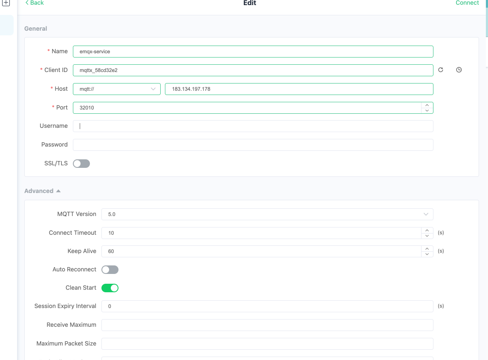
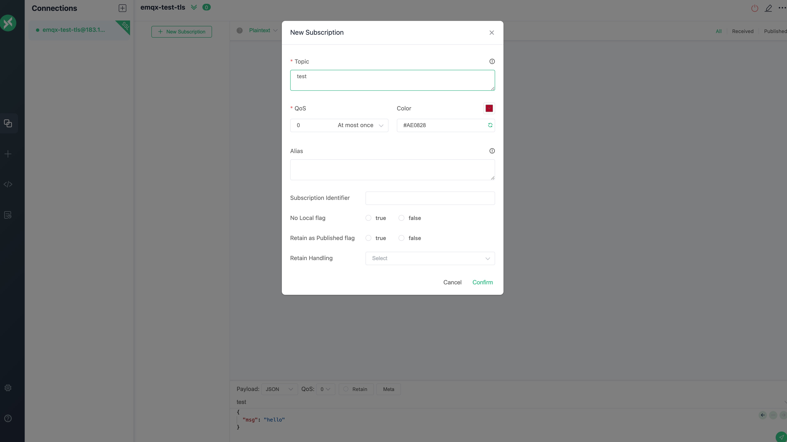
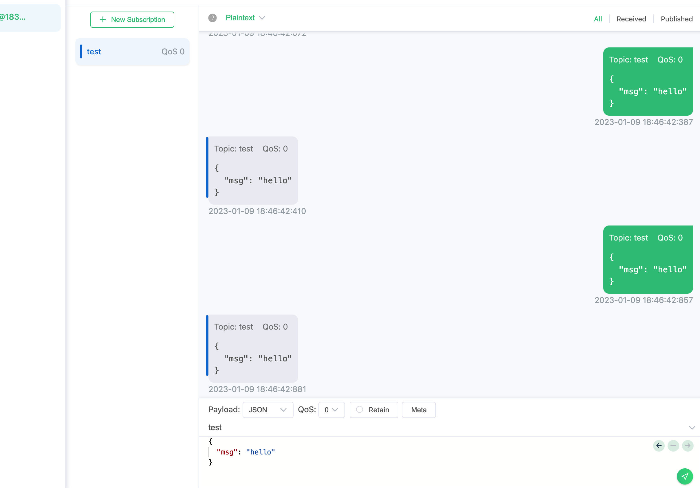

# 配置 EMQX Service

## 任务目标

- 如何配置 EMQX 集群 Service。

## 配置 EMQX 集群

:::: tabs type:card 
::: tab v2alpha1

EMQX CRD 支持使用 `.spec.dashboardServiceTemplate` 配置 EMQX 集群 Dashboard Service ，使用 `.spec.listenersServiceTemplate` 配置 EMQX 集群 listener Service，其文档可以参考：[Service](https://github.com/emqx/emqx-operator/blob/main-2.1/docs/en_US/reference/v2alpha1-reference.md)。

```yaml
apiVersion: apps.emqx.io/v2alpha1
kind: EMQX
metadata:
  name: emqx
spec:
  image: emqx/emqx:5.0.9
  imagePullPolicy: IfNotPresent
  bootstrapConfig: |
    listeners.quic.default {
      enabled = true
      bind = "0.0.0.0:14567"
      keyfile = "/opt/emqx/etc/certs/key.pem"
      certfile = "/opt/emqx/etc/certs/cert.pem"
    }
  coreTemplate:
    spec:
      replicas: 3
  replicantTemplate:
    spec:
      replicas: 0
  dashboardServiceTemplate:
    spec:
      type: NodePort
      ports:
        - name: "dashboard-listeners-http-bind"
          protocol: TCP
          port: 18083
          targetPort: 18083
          nodePort: 32009
  listenersServiceTemplate:
    spec:
      type: NodePort
      ports:
        - name: "tcp-default"
          protocol: TCP
          port: 1883
          targetPort: 1883
          nodePort: 32010
        - name: quic-default
          protocol: UDP
          port: 14567
          targetPort: 14567
          nodePort: 32011
```

**说明：** EMQX 默认会开启一个 MQTT TCP 监听器 `tcp-default` 对应的端口为1883 以及 Dashboard 监听器 `dashboard-listeners-http-bind` 对应的端口为18083 。用户可以通过 `.spec.bootstrapConfig` 字段或者 EMQX Dashboard 增加新的监听器。EMQX Operator 在创建 Service 时会将缺省的监听器信息自动注入到 Service 里面，但是当用户配置的 Service 和 EMQX 配置的监听器有冲突时（name 或者 port 字段重复），EMQX Operator 会以用户的配置为准。

:::
::: tab v1beta4

EMQX 企业版在 EMQX Operator 里面对应的 CRD 为 EmqxEnterprise，EmqxEnterprise 支持通过 `.spec.serviceTemplate` 字段配置 EMQX 集群 Service 。serviceTemplate 字段的具体描述可以参考：[serviceTemplate](https://github.com/emqx/emqx-operator/blob/main-2.1/docs/en_US/reference/v1beta4-reference.md#servicetemplate)。

```yaml
apiVersion: apps.emqx.io/v1beta4
kind: EmqxEnterprise
metadata:
  name: emqx-ee
spec:
  template:
    spec:
      emqxContainer:
        image:
          repository: emqx/emqx-ee
          version: 4.4.8
  serviceTemplate:
    spec:
      type: NodePort
      ports:
        - name: "http-management-8081"
          port: 8081
          protocol: "TCP"
          targetPort: 8081
        - name: "http-dashboard-18083"
          port: 18083
          protocol: "TCP"
          targetPort: 18083
        - name: "mqtt-tcp-1883"
          protocol: "TCP"
          port: 1883
          targetPort: 1883
```

**说明：** EMQX 默认会开启6个监听器，分别是：`mqtt-ssl-8883` 对应的端口为8883，`mqtt-tcp-1883` 对应的端口为1883，`http-dashboard-18083` 对应的端口为18083，`http-management-8081` 对应的端口为8081，`mqtt-ws-8083` 对应的端口为8083，`mqtt-wss-8084` 对应的端口为8084。EMQX Operator 在创建 Service 时会将缺省的监听器信息自动注入到 Service 里面，但是当用户配置的 Service 和 EMQX 配置的监听器有冲突时（ name 或者 port 字段重复），EMQX Operator 会以用户的配置为准。

:::
::: tab v1beta3

EMQX 企业版在 EMQX Operator 里面对应的 CRD 为 EmqxEnterprise，EmqxEnterprise 支持通过 `.spec.emqxTemplate.serviceTemplate` 字段配置集群 Service 。serviceTemplate 字段的描述可以参考文档：[serviceTemplate](https://github.com/emqx/emqx-operator/blob/main-2.1/docs/en_US/reference/v1beta3-reference.md#servicetemplate)

```yaml
apiVersion: apps.emqx.io/v1beta3
kind: EmqxEnterprise
metadata:
  name: emqx-ee
spec:
  emqxTemplate:
    image: emqx/emqx-ee:4.4.8
    serviceTemplate:
      spec:
        type: NodePort
        ports:
          - name: "http-management-8081"
            port: 8081
            protocol: "TCP"
            targetPort: 8081
          - name: "http-dashboard-18083"
            port: 18083
            protocol: "TCP"
            targetPort: 18083
          - name: "mqtt-tcp-1883"
            protocol: "TCP"
            port: 1883
            targetPort: 1883
```

**说明：** EMQX 默认会开启6个监听器，分别是：`mqtt-ssl-8883` 对应的端口为8883，`mqtt-tcp-1883` 对应的端口为1883，`http-dashboard-18083` 对应的端口为18083，`http-management-8081` 对应的端口为8081，`mqtt-ws-8083` 对应的端口为8083，`mqtt-wss-8084` 对应的端口为8084。EMQX Operator 在创建 Service 时会将缺省的监听器信息自动注入到 Service 里面，但是当用户配置的 Service 和 EMQX 配置的监听器有冲突时（ name 或者 port 字段重复），EMQX Operator 会以用户的配置为准。

:::
::::

将上述内容保存为：emqx-service.yaml，并执行如下命令部署 EMQX 集群：

```bash
kubectl apply -f emqx-service.yaml
```

输出类似于：

```
emqx.apps.emqx.io/emqx created
```

- 检查 EMQX 集群是否就绪

:::: tabs type:card 
::: tab v2alpha1

```bash
kubectl get emqx emqx -o json | jq ".status.emqxNodes"
```

输出类似于：

```
[
  {
    "node": "emqx@emqx-core-0.emqx-headless.default.svc.cluster.local",
    "node_status": "running",
    "otp_release": "24.2.1-1/12.2.1",
    "role": "core",
    "version": "5.0.9"
  },
  {
    "node": "emqx@emqx-core-1.emqx-headless.default.svc.cluster.local",
    "node_status": "running",
    "otp_release": "24.2.1-1/12.2.1",
    "role": "core",
    "version": "5.0.9"
  },
  {
    "node": "emqx@emqx-core-2.emqx-headless.default.svc.cluster.local",
    "node_status": "running",
    "otp_release": "24.2.1-1/12.2.1",
    "role": "core",
    "version": "5.0.9"
  }
]
```

**说明：** node 表示 EMQX 节点在集群的唯一标识。node_status 表示 EMQX 节点的状态。otp_release 表示 EMQX 使用的 Erlang 的版本。role 表示 EMQX 节点角色类型。version 表示 EMQX 版本。EMQX Operator 默认创建包含三个 core 节点和三个 replicant 节点的 EMQX 集群，所以当集群运行正常时，可以看到三个运行的 core 节点和三个 replicant 节点信息。如果你配置了 `.spec.coreTemplate.spec.replicas` 字段，当集群运行正常时，输出结果中显示的运行 core 节点数量应和这个 replicas 的值相等。如果你配置了 `.spec.replicantTemplate.spec.replicas` 字段，当集群运行正常时，输出结果中显示的运行 replicant 节点数量应和这个 replicas 的值相等。

::: 
::: tab v1beta4

```bash
kubectl get emqxenterprise emqx-ee -o json | jq ".status.emqxNodes"
```
输出类似于：

```
[
  {
    "node": "emqx-ee@emqx-ee-0.emqx-ee-headless.default.svc.cluster.local",
    "node_status": "Running",
    "otp_release": "24.1.5/12.1.5",
    "version": "4.4.8"
  },
  {
    "node": "emqx-ee@emqx-ee-1.emqx-ee-headless.default.svc.cluster.local",
    "node_status": "Running",
    "otp_release": "24.1.5/12.1.5",
    "version": "4.4.8"
  },
  {
    "node": "emqx-ee@emqx-ee-2.emqx-ee-headless.default.svc.cluster.local",
    "node_status": "Running",
    "otp_release": "24.1.5/12.1.5",
    "version": "4.4.8"
  }
]
```

**说明：** node 表示 EMQX 节点在集群的唯一标识。node_status 表示 EMQX 节点的状态。otp_release 表示 EMQX 使用的 Erlang 的版本。version 表示 EMQX 版本。EMQX Operator 默认会拉起三个节点的 EMQX 集群，所以当集群运行正常时，可以看到三个运行的节点信息。如果你配置了 `.spec.replicas` 字段，当集群运行正常时，输出结果中显示的运行节点数量应和 replicas 的值相等。

::: 
::: tab v1beta3

```bash
kubectl get emqxenterprise emqx-ee -o json | jq ".status.emqxNodes"
```

输出类似于：

```
[
  {
    "node": "emqx-ee@emqx-ee-0.emqx-ee-headless.default.svc.cluster.local",
    "node_status": "Running",
    "otp_release": "24.1.5/12.1.5",
    "version": "4.4.8"
  },
  {
    "node": "emqx-ee@emqx-ee-1.emqx-ee-headless.default.svc.cluster.local",
    "node_status": "Running",
    "otp_release": "24.1.5/12.1.5",
    "version": "4.4.8"
  },
  {
    "node": "emqx-ee@emqx-ee-2.emqx-ee-headless.default.svc.cluster.local",
    "node_status": "Running",
    "otp_release": "24.1.5/12.1.5",
    "version": "4.4.8"
  }
]
```

**说明：** node 表示 EMQX 节点在集群的唯一标识。node_status 表示 EMQX 节点的状态。otp_release 表示 EMQX 使用的 Erlang 的版本。version 表示 EMQX 版本。EMQX Operator 默认会拉起三个节点的 EMQX 集群，所以当集群运行正常时，可以看到三个运行的节点信息。如果你配置了 `.spec.replicas` 字段，当集群运行正常时，输出结果中显示的运行节点数量应和 replicas 的值相等。

::: 
::::

## 查看 EMQX Service 是否就绪 

-  使用命令行查看 EMQX 集群 Service 

```bash
kubectl get svc -l apps.emqx.io/instance=emqx
```

输出类似于：

```
NAME             TYPE       CLUSTER-IP       EXTERNAL-IP   PORT(S)                          AGE
emqx-dashboard   NodePort   10.101.225.238   <none>        18083:32012/TCP                  32s
emqx-listeners   NodePort   10.97.59.150     <none>        1883:32010/TCP,14567:32011/UDP   10s
```

- 使用 MQTT X 连接 EMQX 集群发送消息

在 MQTT X 页面点击创建新连接的按钮，按照如图所示配置 EMQX 集群节点信息，在配置好连接信息之后，点击 connect 按钮连接 EMQX 集群：



然后点击订阅按钮新建订阅，如图所示 MQTT X 已成功连接 EMQX 集群并且已经成功创建订阅：



在成功连接 EMQX 集群并创建订阅之后，我们就可以向 EMQX 集群发送消息，如下图所示：



- 通过 EMQX Dashboard 增加新的监听器

打开浏览器，输入 EMQX Pod 所在宿主机 `IP` 和 端口 `32012` 登录 EMQX 集群 Dashboard（Dashboard 默认用户名为：admin ，默认密码为：public），进入 Dashboard 点击 Configuration → Listeners 进入监听器的页面，我们先点击 Add Listener 的按钮添加一个名称为 test，端口为1884的监听器，如下图所示：


然后点击 Add 按钮创建监听器，如下图所示：


从图中可以看出，我们创建的 test 监听器已经生效。

- 查看新增的监听器是否注入 Service 

```bash
kubectl get svc -l apps.emqx.io/instance=emqx
```

输出类似于：

```
NAME             TYPE       CLUSTER-IP       EXTERNAL-IP   PORT(S)                                         AGE
emqx-dashboard   NodePort   10.105.110.235   <none>        18083:32012/TCP                                 13m
emqx-listeners   NodePort   10.106.1.58      <none>        1883:32010/TCP,14567:32011/UDP,1884:30763/TCP   12m
```

从输出结果可以看到，刚才新增加的监听器1884已经注入到 `emqx-listeners` 这个 Service 里面。

